import { File, Folder, Files } from 'fumadocs-ui/components/files';
import { Callout } from 'fumadocs-ui/components/callout';
import { Step, Steps } from 'fumadocs-ui/components/steps';
import { Card, Cards } from 'fumadocs-ui/components/card';

## 概述

本章节总结了使用 Chronos 动作系统时的最佳实践，帮助你设计出流畅、平衡、有趣的战斗系统。

---

## 状态组规划

合理划分状态组，便于条件检查和状态管理。

### 推荐的状态组划分

| 状态组      | 说明        | 包含状态示例       |
|----------|-----------|--------------|
| **攻击**   | 普通攻击、技能攻击 | 攻击1段、攻击2段、重击 |
| **闪避**   | 闪避、翻滚     | 前闪、后闪、侧闪     |
| **格挡**   | 格挡、招架     | 格挡、完美格挡      |
| **受控**   | 受击、眩晕、击飞  | 受击、硬直、倒地     |
| **特殊运动** | 冲刺、跳跃攻击   | 冲刺斩、跳劈       |

### 配置示例

``` yaml
state:
  攻击1段:
    group: "攻击"
    conditions:
      blocked_group:
        - "受控"        # 受控时无法攻击
        - "特殊运动"    # 特殊运动时无法普通攻击
  
  闪避:
    group: "闪避"
    conditions:
      blocked_group:
        - "受控"        # 受控时无法闪避
  
  受击:
    group: "受控"
    # 受控状态一般没有 blocked_group，因为它是被动进入的
```

<Callout type="info">
**设计建议：** 状态组的划分应该反映动作的"类型"，而不是具体的动作名称。这样可以更容易地添加新动作，而不需要修改现有的条件配置。
</Callout>

---

## 窗口时机设计

窗口的时机设计直接影响战斗的手感和节奏。

### 典型攻击状态时间线

```mermaid
gantt
    title 典型攻击状态时间线 (500ms)
    dateFormat X
    axisFormat %L ms
    
    section 阶段
    前摇期 (不可打断)     :0, 100
    判定期 (攻击判定)     :crit, 100, 150
    持续期               :150, 300
    后摇期               :300, 500
    
    section 窗口
    霸体窗口             :active, 100, 200
    派生窗口             :active, 300, 450
    取消窗口             :350, 500
```



### 配置示例

``` yaml
攻击1段:
  duration: "500"
  windows:
    # 霸体保护攻击动作
    super_armor:
      start: 100
      end: 200
    # 派生窗口在后摇期
    derive:
      start: 300
      end: 450
    # 取消窗口略晚于派生窗口开始
    cancel:
      start: 350
      end: 500
  execute:
    攻击判定:
      at: 150
      expression: "self.castMythicMobSkill('attack1_damage', 1.0)"
```

### 闪避状态时间线

```mermaid
gantt
    title 典型闪避状态时间线 (400ms)
    dateFormat X
    axisFormat %L ms
    
    section 阶段
    起手期               :0, 50
    无敌期               :active, 50, 250
    恢复期               :250, 400
    
    section 窗口
    无敌帧               :crit, 50, 250
    派生窗口             :active, 250, 380
    取消窗口             :380, 400
```



### 配置示例

``` yaml
闪避:
  duration: "400"
  windows:
    invincible:
      start: 50
      end: 250
      invincible_tag_duration: 500  # 完美闪避标记
    derive:
      start: 250
      end: 380
    cancel:
      start: 380
      end: 400
```

<Callout type="info">
**设计建议：**
- 前摇期应该足够短，让玩家感觉响应迅速
- 无敌帧不要太长，否则会降低难度
- 派生窗口应该在动作自然的衔接点
</Callout>

---

## 输入缓冲调优

输入缓冲参数会显著影响战斗的手感。

### 快节奏战斗

适用于：快速连击、高APM操作

``` yaml
setting:
  input_buffer:
    enabled: true
    max_size: 3      # 允许较多预输入
    lifetime: 200    # 较短的有效期，要求快速输入
```

### 稳重型战斗

适用于：策略性战斗

``` yaml
setting:
  input_buffer:
    enabled: true
    max_size: 2      # 限制预输入数量
    lifetime: 400    # 较长的有效期，容错性更高
```

<Callout type="info">
**调优建议：**
- `max_size` 越大，连招越容易衔接，但也可能导致误操作
- `lifetime` 越长，预输入窗口越宽松，对新手更友好
- 注意，如果你使用了组合条件，则需要有对等数量的缓冲大小。比如你有一个组合键有三个按键条件，缓冲区大小至少为3
</Callout>

---

## 连招深度建议

合理的连招深度可以让战斗既有深度又不失可操作性。

### 推荐深度

| 类型        | 推荐深度     | 说明            |
|-----------|----------|---------------|
| **普通攻击链** | 3-5段     | 太短缺乏变化，太长难以记忆 |
| **技能分支**  | 每段0-2个分支 | 提供选择而不造成困惑    |
| **搓招技能**  | 2-4个输入序列 | 平衡难度和可执行性     |

### 普通攻击链示例

``` yaml
combo:
  攻击1段:
    input:
      type: MOUSE_CLICK
      value: LEFT
    derive:
      攻击2段:
        input:
          type: MOUSE_CLICK
          value: LEFT
        derive:
          攻击3段:
            input:
              type: MOUSE_CLICK
              value: LEFT
            derive:
              # 终结技分支
              上挑:
                input:
                  type: MOUSE_CLICK
                  value: RIGHT
              攻击4段:
                input:
                  type: MOUSE_CLICK
                  value: LEFT
          # 中途分支
          横扫:
            input:
              type: MOUSE_HOLD
              value: LEFT
```

<Callout type="info">
**设计建议：**
- 让玩家能够在任何时候取消到防御性动作（闪避、格挡）
- 提供明显不同的派生路线（如：快速连击 vs 重击终结）
- 终结技应该有更高的伤害或特殊效果作为奖励
</Callout>

---

## 性能优化

在配置复杂的动作系统时，注意以下性能优化建议：

### 表达式优化

避免在 `expression` 中使用复杂计算：

``` yaml
# ❌ 不推荐：复杂计算
conditions:
  expression: "Math.sqrt(self.getPosX() * self.getPosX() + self.getPosZ() * self.getPosZ()) < 100"

# ✅ 推荐：简单判断
conditions:
  expression: "self.getFood() >= 3 && !self.isFlying()"
```

### 缓冲点优化

合理设置 `buffer_at`，减少无效的预输入检查：

``` yaml
state:
  攻击1段:
    duration: "500"
    # 在派生窗口开始时才检查预输入
    buffer_at: 300  # 对应 derive.start
    windows:
      derive:
        start: 300
        end: 450
```

### 状态组优化

使用状态组进行批量条件阻止，而不是逐个列出状态：

``` yaml
# ❌ 不推荐：逐个列出
conditions:
  blocked_states:
    - "受击"
    - "眩晕"
    - "击飞"
    - "倒地"

# ✅ 推荐：使用状态组
conditions:
  blocked_group:
    - "受控"
```

---

## 常见问题排查

### 动作无法触发

<Callout type="warn">
**检查清单：**
1. 确认状态已在 `state` 节点中声明
2. 确认状态已在 `combo` 节点中配置输入
3. 检查 `conditions.expression` 是否返回 `true`
4. 检查是否被 `blocked_group` 阻止
5. 检查冷却是否已结束
</Callout>

### 派生无法衔接

<Callout type="warn">
**检查清单：**
1. 确认当前时间在 `derive` 窗口内
2. 确认输入类型和值配置正确
3. 如果使用组合输入，检查 `mode` 是否正确
4. 检查派生的 `condition` 表达式
</Callout>

### 输入被"吞掉"

<Callout type="warn">
**可能原因：**
1. `input_buffer.lifetime` 设置过短
2. `input_buffer.max_size` 设置过小
3. `buffer_at` 时间点设置不合理
</Callout>

---

## 总结

设计一个优秀的动作系统需要平衡多个因素：

1. **响应性** - 让玩家感觉动作立即响应
2. **可读性** - 动作反馈清晰，玩家知道发生了什么
3. **深度** - 提供足够的选择和技巧空间
4. **平衡** - 风险与收益成正比

不断测试和迭代是关键。建议先从简单的配置开始，逐步添加复杂性，并持续收集玩家反馈。
