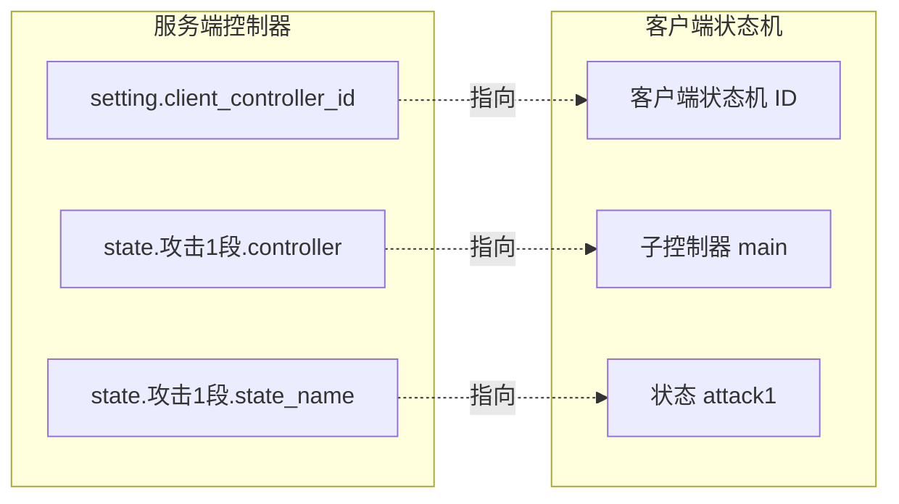
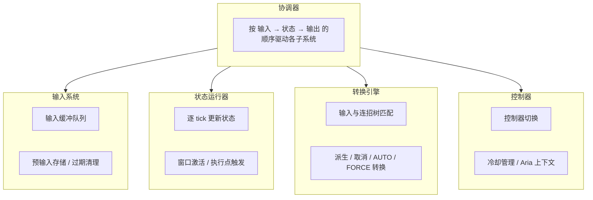
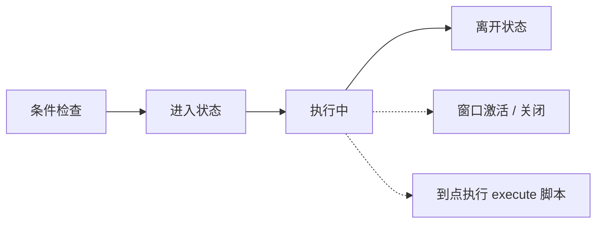
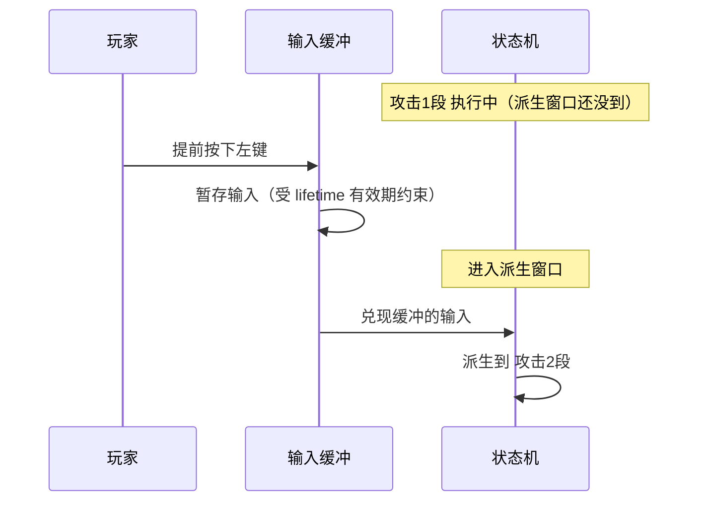

import { Callout } from 'fumadocs-ui/components/callout';
import { Step, Steps } from 'fumadocs-ui/components/steps';
import { Card, Cards } from 'fumadocs-ui/components/card';

# 说明

Chronos 是 ArcartX 生态中的**玩家动作引擎**。它把一套「动作游戏式」的战斗手感搬进 Minecraft：连招、派生、闪避无敌帧、霸体、蓄力、冷却……这些原本要写大量代码才能实现的机制，在 Chronos 里通过配置文件即可轻松完成。

- 这是一款**付费闭源插件**，需要购买授权后使用。
- 可在 [ArcartX 社区](https://arcartx.com/resources/arcartx-chronos-ke-luo-nuo-si.54/) 购买。

---

## Chronos 解决什么问题

原版 Minecraft 的攻击是「点一下、挥一下」，没有连段、没有前后摇、没有闪避判定。想做一个类魂、类动作游戏的战斗系统，你会立刻遇到一堆难题：

- 玩家连点三下鼠标，怎么区分这是「一段 → 二段 → 三段」而不是三次一段？
- 攻击动画播到一半，玩家能不能取消去闪避？哪一帧之后才允许？
- 闪避的哪几帧是无敌的？闪避成功后怎么接一记反击？
- 蓄力攒了多久，怎么换算成伤害？

Chronos 把这些都抽象成**状态机 + 连招树 + 时间窗口**。你只需要在 yml 里描述「有哪些动作、动作之间怎么衔接、每个动作的哪一段时间可以做什么」，剩下的输入识别、缓冲、判定、切换都由引擎完成。

**典型使用场景**：武器差异化的连招（单手剑三连、双手剑重击）、带无敌帧的翻滚闪避、蓄力斩、格挡反击、血量过低自动触发的处决动作等。

---

## 核心概念

在动手配置之前，先建立五个基本概念。它们是理解后续所有文档的地基：

| 概念                      | 说明                                       |
|-------------------------|------------------------------------------|
| **控制器 (Controller)**    | 一整套动作配置，通常对应一把武器或一种形态。玩家身上任意时刻只挂着一个控制器   |
| **状态 (State)**          | 一个具体动作，比如「攻击1段」「闪避」「蓄力斩」。控制器由许多状态组成      |
| **连招链 (Combo)**         | 一棵树，描述「在某个状态里、收到某种输入、就派生到哪个状态」           |
| **窗口 (Window)**         | 状态生命周期里的一段特殊时间，比如「派生窗口」「无敌帧」，决定这段时间内能做什么 |
| **输入缓冲 (Input Buffer)** | 把玩家「提前按下」的输入暂存起来，等窗口打开再兑现，让连招衔接不卡手       |

<Callout type="info">
可以这样类比：**控制器**是一把武器的招式书，**状态**是书里的每一招，**连招链**是招与招之间的连接线，**窗口**规定了每一招在什么时机能接什么、能不能被打断。
</Callout>

---

## 前后端如何配合

Chronos 是**服务端**逻辑，它不会自己播放动画。动画由**客户端**的 ArcartX 本体播放。所以任何一个 Chronos 动作，实际上横跨两套状态机：

- **服务端控制器**：Chronos 插件 `controllers/*.yml` 定义的状态机。负责识别输入、判断条件、管理冷却、决定进入哪个状态。
- **客户端状态机**：ArcartX 本体（Mod 端）负责的状态机，真正播放模型动画、原版动作、视觉效果。

两者靠三个字符串对接：

| 服务端字段                          | 指向客户端的                       |
|--------------------------------|------------------------------|
| `setting.client_controller_id` | 一个**客户端状态机**的 ID             |
| `state.<状态>.controller`        | 该客户端状态机下的**子控制器名**（如 `main`） |
| `state.<状态>.state_name`        | 子控制器下的**状态名**（如 `attack1`）   |

<Callout type="warn">
这三个字段都是字符串，需要与客户端资源里的名称一一对应。Chronos 在加载时会做交叉校验：**拼错只会打印 WARN 警告，不会阻断加载**，但玩家会「有逻辑没动画」。设置控制器后没看到动作，第一件事就是回来核对这三个名字。
</Callout>

---

## 引擎架构

Chronos 内部由一个协调器统领四个子系统，各司其职：

| 子系统   | 职责                                      |
|-------|-----------------------------------------|
| 输入系统  | 维护输入缓冲队列、暂存预输入、清理过期输入                   |
| 状态运行器 | 管理状态生命周期，刻更新，激活当前窗口、触发执行点               |
| 转换引擎  | 把输入与连招树比对，执行派生、取消、AUTO 自动衔接与 FORCE 强制衔接 |
| 控制器   | 管理控制器切换、维护冷却时间、持有该玩家的 Aria 脚本上下文        |

---

## 状态生命周期

理解一个状态从进入到离开经历了什么，是配置窗口和执行点的前提：

<Callout type="info">
- **条件检查**：判断能否进入——`conditions.expression`（Aria 布尔表达式）、冷却是否就绪、是否被 `blocked_group` 挡住。全部通过才进入。
- **进入状态**：初始化本次状态，通知客户端播放对应动画，触发 `PlayerEnterStateEvent`。
- **执行中**：每 tick 推进时间线，按 `windows` 开关各窗口、按 `execute` 的 `at` 时刻执行脚本、持续判定派生与 FORCE 衔接。
- **离开状态**：自然结束、被派生、被打断、被强制清空都算离开，触发 `PlayerLeaveStateEvent`（与 Enter 严格成对），并处理 AUTO 自动衔接。
</Callout>

---

## 输入缓冲机制

输入缓冲是「手感」的关键。玩家往往会在动作还没播完时就按下一击，如果引擎直接丢弃这次输入，连招就会「吞键」。Chronos 的做法是先把输入存进缓冲，等派生窗口打开再兑现：

缓冲队列的容量和有效期由控制器的 `setting.input_buffer` 控制（`max_size` 容量、`lifetime` 有效期毫秒）。超过有效期还没兑现的输入会被丢弃，避免「几秒前的误触」突然触发。

<Callout type="info">
输入缓冲是「窗口没开就先存着」；如果你还想更精细地控制**兑现的时刻**（例如让松手蓄力有个固定的落地点做「预输入」手感），可在状态上配置 `buffer_at`。详见 [服务端控制器](/docs/chronos/7_controller)。
</Callout>

---

> **官方 QQ 交流群：832063293**
