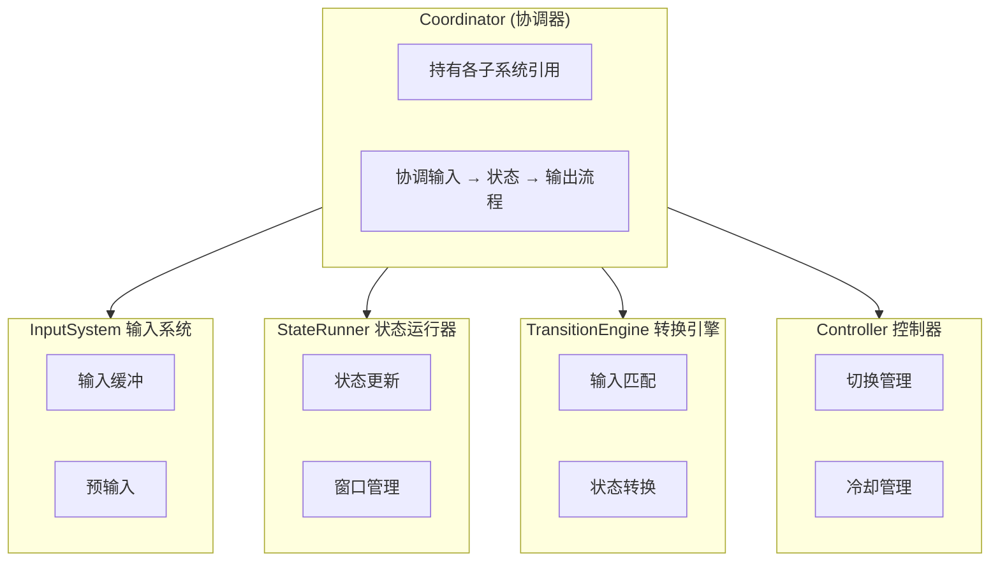
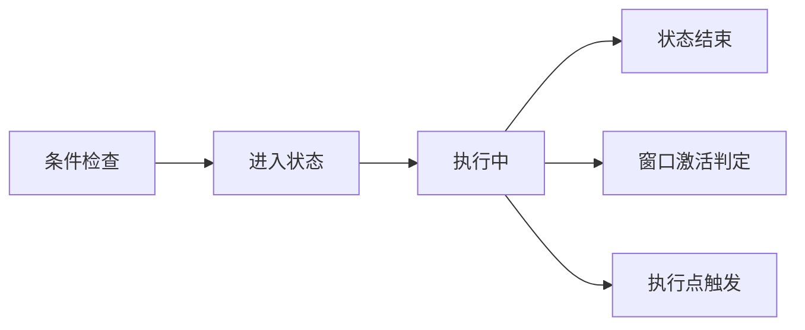
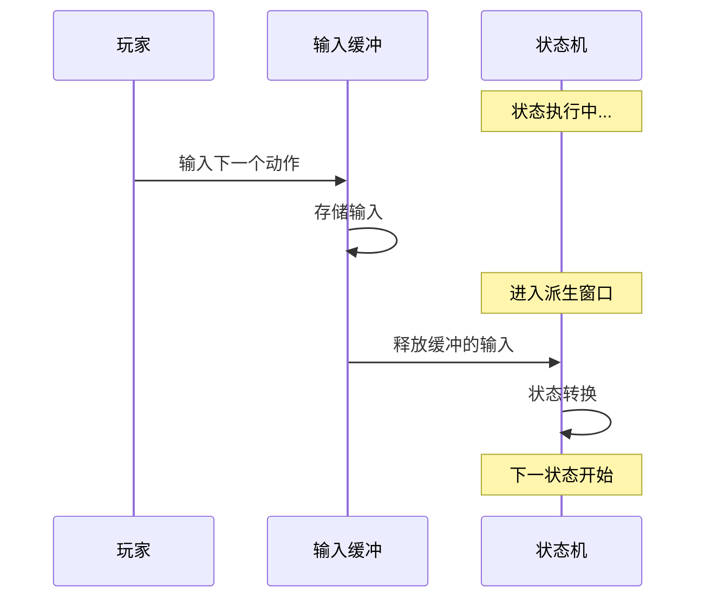

import { Callout } from 'fumadocs-ui/components/callout';
import { Step, Steps } from 'fumadocs-ui/components/steps';
import { Card, Cards } from 'fumadocs-ui/components/card';

# 说明

- ArcartX-Chronos 隶属于 ArcartX 生态系统。它是一个高级玩家动作状态控制器，用于实现类似动作游戏中的连击系统、战斗技能派生、状态机控制等功能。

- 这是一款付费插件，你需要购买后才能使用。

- 你可以在[ArcartX社区](https://arcartx.com/resources/arcartx-chronos-ke-luo-nuo-si.54/)购买。

---

## 什么是 Chronos？

Chronos 是一个专为 Minecraft + ArcartX 服务器设计的**高级动作控制器系统**。它模拟了动作游戏的战斗机制，为你的服务器带来更舒适的动作系统体验：

| 特性           | 说明                |
|--------------|-------------------|
| ⚔️ **连招系统**  | 支持多段连击、分支派生       |
| 🛡️ **窗口机制** | 取消窗口、派生窗口、无敌帧、霸体  |
| 🎮 **输入缓冲**  | 预输入支持，提升操作手感      |
| ⌨️ **组合输入**  | 支持组合键、多种触发方式、搓招系统 |
| 🔄 **状态机**   | 完整的状态生命周期管理       |

---

## 核心概念

在开始使用 Chronos 之前，你需要理解以下核心概念：

| 概念                      | 说明                    |
|-------------------------|-----------------------|
| **控制器 (Controller)**    | 一套完整的动作配置，通常对应一种武器或角色 |
| **状态 (State)**          | 一个具体的动作，如"攻击1段"、"闪避"  |
| **连招链 (Combo Chain)**   | 状态之间的输入派生关系           |
| **窗口 (Window)**         | 状态执行过程中的特殊时间段         |
| **输入缓冲 (Input Buffer)** | 临时存储玩家输入，用于预输入        |

<Callout type="info">
**理解这些概念非常重要！** 控制器就像是一把武器的"技能书"，里面定义了所有可能的动作（状态），以及这些动作之间如何衔接（连招链）。
</Callout>

---

## 架构设计

### 分层子系统架构

Chronos 采用分层子系统设计：



### 子系统职责

| 子系统                         | 职责                            |
|-----------------------------|-------------------------------|
| **InputSystem (输入系统)**      | 管理输入缓冲队列、处理预输入存储、清理过期输入       |
| **StateRunner (状态运行器)**     | 管理状态生命周期、执行状态更新、管理当前激活的窗口     |
| **TransitionEngine (转换引擎)** | 处理输入匹配、执行状态转换、处理 AUTO 自动衔接    |
| **Controller (控制器)**        | 管理控制器切换、维护冷却时间、管理 Glimmer 上下文 |

---

## 功能一览

### 1. 状态控制器
- 为每个玩家配置独立的状态控制器
- 每个控制器包含多个状态 (State)，如攻击、防御、闪避等
- 状态之间可以进行派生 (Derive) 和 取消 (Cancel) 转换
- 支持控制器继承，子控制器可以继承父控制器的状态配置

### 2. 连招链
- 配置复杂的连击派生路径
- 支持预输入 - 玩家可在当前动作结束前输入下一个动作
- 支持窗口期机制 - 包括派生窗口、取消窗口、霸体窗口、无敌窗口
- 配置衔接时间点来控制动作之间的衔接节奏

### 3. 输入系统
- 支持键盘按键（可自定义绑定）
- 支持鼠标操作 - 区分点击 (Click) 和长按 (Hold)
- **OR 模式** - 多种触发方式任选其一
- **AND 模式** - 组合键同时按下
- **SEQUENCE 模式** - 搓招系统，按顺序输入

### 4. Glimmer 脚本
- 集成了 Glimmer 脚本系统，深度定制每一步的效果

### 5. 高级机制
- 每个状态可配置进入条件
- 支持冷却时间 (Cooldown) 控制
- 支持蓄力机制 (Charge)
- 支持无敌窗口格挡成功通过条件派生完美闪避反击/处决

---

## 状态生命周期

理解状态的生命周期对于正确配置动作至关重要：



<Callout type="info">
- **条件检查**: 检查玩家是否满足进入状态的条件（表达式、冷却、被阻止的状态组等）
- **进入状态**: 初始化状态，发送客户端动画同步
- **执行中**: 每Tick检查窗口激活、触发执行点
- **状态结束**: 清理状态，处理自动衔接
</Callout>

---

## 输入缓冲机制

输入缓冲是提升操作手感的关键机制，让玩家的操作更加流畅：



<Callout type="info">
**什么是输入缓冲？** 玩家可以在当前动作还没结束时就输入下一个动作，这个输入会被暂时存储起来，等到进入派生窗口时自动执行。这就像格斗游戏中的"预输入"机制，让连招更加顺畅。
</Callout>

---

## 前后端状态机

<Callout type="warn">
**重要概念：前后端状态机的配合**
</Callout>

- **服务端状态机**: Chronos 提供的状态机，负责处理输入、条件判断、状态转换逻辑
- **客户端状态机**: ArcartX 提供的状态机，负责播放动画、处理视觉效果、原版动作播放

你需要结合前后端状态机，才能实现完整的功能：

1. 服务端状态 `stateName: "attack1"` 对应客户端控制器中的状态
2. 当服务端进入某个状态时，会通知客户端播放对应的动画
3. 服务端的 `duration` 应与客户端动画时长匹配

---

## 快速开始

<Steps>
    <Step>
        ### 创建控制器配置文件

        在 `plugins/ArcartX_Chronos/controllers/` 目录下创建配置文件：

        ```yaml
        # my_weapon.yml
        setting:
        client_controller_id: "my_weapon"
        input_buffer:
        enabled: true
        max_size: 3
        lifetime: 300

        state:
        攻击1段:
        controller: "main"
        stateName: "attack1"
        speed: "1"
        duration: "500"
        group: "攻击"
        windows:
        derive:
        start: 300
        end: 450

        combo:
        攻击1段:
        input:
        type: MOUSE_CLICK
        value: LEFT
        ```
    </Step>

    <Step>
        ### 为玩家设置控制器

        通过命令：

        - /chronos set 玩家 控制器ID

    </Step>

    <Step>
        ### 测试

        玩家点击鼠标左键，即可触发 "攻击1段" 状态！
    </Step>
</Steps>

---

> **官方QQ交流群：832063293**


