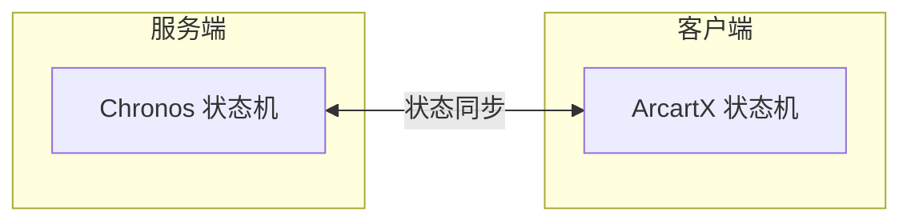

import { Callout } from 'fumadocs-ui/components/callout';
import { Step, Steps } from 'fumadocs-ui/components/steps';
import { Card, Cards } from 'fumadocs-ui/components/card';

## 安装须知

<Callout type="info">
**Chronos 的安装特点：** 与 ArcartX 的混合型架构不同，Chronos 只需要在**服务端**安装插件即可，无需客户端额外配置。
</Callout>

---

## 前后端状态机概念

在开始安装之前，请先理解以下概念：



| 状态机类型      | 提供者     | 职责                 |
|------------|---------|--------------------|
| **服务端状态机** | Chronos | 处理输入、条件判断、状态转换逻辑   |
| **客户端状态机** | ArcartX | 播放动画、处理视觉效果、原版状态播放 |

<Callout type="warn">
你需要结合前后端状态机，才能实现完整的动作系统功能。
</Callout>

---

## 前置要求

在安装 Chronos 之前，请确保满足以下条件：

| 要求                | 说明                                         |
|-------------------|--------------------------------------------|
| **ArcartX**       | 必须前置，需要先安装 ArcartX 插件                      |
| **Minecraft 服务端** | 支持 Spigot/Paper 及其分支                       |
| **授权码**           | 在 [ArcartX 社区](https://arcartx.com/) 购买后获取 |

---

## 安装流程

<Steps>
<Step>
### 获取插件文件

购买插件后，在 **许可证** 页面可以：
- 下载 `ArcartX_Chronos_Plugin-<版本号>.jar` 文件
- [查询你的授权码 ID 和 KEY](https://arcartx.com/resources/market-place-user/licenses)

<Callout type="info">
请通过官方渠道下载插件，避免使用来源不明的文件。
</Callout>
</Step>

<Step>
### 上传并生成配置

1. 将 `ArcartX_Chronos_Plugin-<版本号>.jar` 放入服务端的 `plugins` 目录
2. 重启服务器
3. 插件会自动生成 `ArcartX_Chronos` 配置文件夹

<Callout type="warn">
如果 `plugins` 目录内没有出现 `ArcartX_Chronos` 文件夹，请检查：
- 插件文件是否正确上传
- 服务端控制台是否有报错信息
- ArcartX 插件是否已正确安装
</Callout>
</Step>

<Step>
### 配置授权码

打开 `plugins/ArcartX_Chronos/license.yml` 文件：

```yaml
# 填写您的授权信息
licenseId: 114514          # 替换为您的授权码ID
licenseKey: KEY-xXxxXXx    # 替换为您的授权码KEY
```

<Callout type="info">
**编辑器推荐：** 使用 `Visual Studio Code`、`Notepad++` 或其他支持 YAML 语法高亮的编辑器。
</Callout>
</Step>

<Step>
### 重启验证

在服务端后台输入 `stop` 命令重启服务器，观察控制台输出：

```log
[03:13:26 INFO]:    ___           _ _____ _        _   _     _
[03:13:26 INFO]:   / __\_   _    / |___  /_\  _ __| |_(_)___| |_
[03:13:26 INFO]:  /__\// | | |   | |  / //_\\| '__| __| / __| __|
[03:13:26 INFO]: / \/  \ |_| |_  | | / /  _  \ |  | |_| \__ \ |_
[03:13:26 INFO]: \_____/\__, (_) |_|/_/\_/ \_/_|   \__|_|___/\__|
[03:13:26 INFO]:        |___/
[03:13:26 INFO]: ♦ ArcartX-Chronos | 信息: 欢迎使用 ArcartX-Chronos
[03:13:26 INFO]: ♦ ArcartX-Chronos | 信息: 开始加载
[03:13:26 INFO]: ♦ ArcartX-Chronos | 信息: 加载完成
```

如果看到 **加载完成** 的提示，说明安装成功！
</Step>
</Steps>

---

## 验证安装

安装成功后，你可以通过以下方式验证：

### 查看控制台输出

成功加载时，控制台会显示：
- 加载的按键配置数量
- 注册的控制器数量
- 注册的客户端按键

```log
[03:13:26 INFO]: ♦ ArcartX-Chronos | 信息: 按键分类: 克洛诺斯
[03:13:26 INFO]: ♦ ArcartX-Chronos | 信息: 加载1个按键配置
[03:13:26 INFO]: ♦ ArcartX-Chronos | 信息: 注册控制器idle
[03:13:26 INFO]: ♦ ArcartX-Chronos | 信息: 加载1个控制器配置
[03:13:26 INFO]: ♦ ArcartX-Chronos | 信息: 注册动作控制器-> idle
```

### 测试指令

在服务端或游戏内输入：

```
/ac
```

如果显示指令帮助列表，说明插件已正常运行。

---

## 常见问题

<Callout type="error">
**问题：插件未加载**

可能原因：
1. ArcartX 插件未安装
2. 服务端版本不支持
3. 授权码无效或已过期
</Callout>

<Callout type="error">
**问题：授权验证失败**

解决方案：
1. 检查 `licenseId` 和 `licenseKey` 是否正确
2. 确认服务器能够访问网络
3. 联系社区管理员确认授权状态
</Callout>

---

## 下一步

安装完成后，请继续阅读：

<Cards>
<Card title="配置目录结构" href="/docs/chronos/3_config">
了解插件的文件结构
</Card>
<Card title="基本设置" href="/docs/chronos/5_setting">
配置默认控制器和基本选项
</Card>
</Cards>
