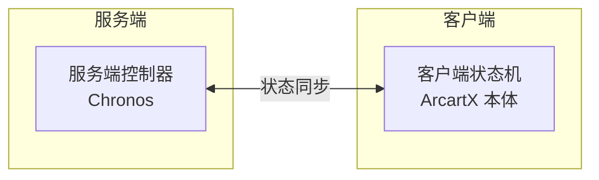

import { Callout } from 'fumadocs-ui/components/callout';
import { Step, Steps } from 'fumadocs-ui/components/steps';
import { Card, Cards } from 'fumadocs-ui/components/card';

## 安装须知

<Callout type="info">
Chronos 是**纯服务端插件**，只需在服务端安装，玩家客户端不需要为它单独装任何东西。但要前提是玩家客户端必须存在ArcartX Mod。
</Callout>

Chronos 的一个动作横跨两套状态机，安装前先记住它们的分工：



| 状态机        | 提供者        | 职责                                        |
|------------|------------|-------------------------------------------|
| **服务端控制器** | Chronos 插件 | 识别输入、判断条件、管理冷却、决定进入哪个状态（无特殊状态时仍由客户端/原版接管） |
| **客户端状态机** | ArcartX 本体 | 播放模型动画、原版动作、视觉效果                          |

---

## 前置要求

| 要求                 | 说明                                         |
|--------------------|--------------------------------------------|
| **ArcartX**        | 硬前置                                        |
| **Minecraft 服务端**  | Spigot / Paper 及其分支                        |
| **授权码**            | 在 [ArcartX 社区](https://arcartx.com/) 购买后获取 |
| **PlaceholderAPI** | 可选。仅当你要用 PAPI 触发器切换控制器时才需要，未安装不影响其它功能      |

---

## 安装流程

<Steps>
<Step>
### 获取插件文件

购买后，在**许可证**页面可以：
- 下载 `Chronos_Plugin-<版本号>.jar`
- [查询你的授权码 ID 和 KEY](https://arcartx.com/resources/market-place-user/licenses)

<Callout type="info">
请通过官方渠道下载，避免使用来源不明的文件。
</Callout>
</Step>

<Step>
### 上传并生成配置

1. 把 `Chronos_Plugin-<版本号>.jar` 放进服务端 `plugins` 目录
2. 重启服务器
3. 插件会自动生成 `plugins/Chronos/` 配置文件夹

<Callout type="warn">
如果没有出现 `Chronos` 文件夹，依次检查：插件是否真的上传成功、控制台有没有报错、ArcartX 本体插件是否已正确安装。
</Callout>
</Step>

<Step>
### 填写授权码

打开 `plugins/Chronos/license.yml`，填入你的授权信息：

```yaml
licenseId: 666          # 替换为你的授权码 ID
licenseKey: KEY-xXxxXXx    # 替换为你的授权码 KEY
```

</Step>

<Step>
### 重启验证

在后台执行 `stop` 重启服务器，观察控制台。出现下面这段 Banner 且以「加载完成」结尾，即为成功：

```log
[03:13:26 INFO]:    ___           _ _____ _        _   _     _
[03:13:26 INFO]:   / __\_   _    / |___  /_\  _ __| |_(_)___| |_
[03:13:26 INFO]:  /__\// | | |   | |  / //_\\| '__| __| / __| __|
[03:13:26 INFO]: / \/  \ |_| |_  | | / /  _  \ |  | |_| \__ \ |_
[03:13:26 INFO]: \_____/\__, (_) |_|/_/\_/ \_/_|   \__|_|___/\__|
[03:13:26 INFO]:        |___/
[03:13:26 INFO]: ♦ ArcartX-Chronos | 信息: 欢迎使用 ArcartX-Chronos
[03:13:26 INFO]: ♦ ArcartX-Chronos | 信息: 开始加载
[03:13:26 INFO]: ♦ ArcartX-Chronos | 信息: 加载完成
```
</Step>
</Steps>

---

## 验证安装

### 看控制台加载了什么

加载过程中，控制台会逐条打印按键分类、按键数量、注册的控制器等信息，可以用来确认配置是否被读到：

```log
[11:54:02 INFO]: ♦ ArcartX-Chronos | INFO: 开始加载
[11:54:02 INFO]: ♦ ArcartX-Chronos | INFO: 按键分类: 克洛诺斯
[11:54:02 INFO]: ♦ ArcartX-Chronos | INFO: 加载2个按键配置
[11:54:02 INFO]: ♦ ArcartX-Chronos | INFO: 注册控制器示例控制器
[11:54:02 INFO]: ♦ ArcartX-Chronos | INFO: 加载1个控制器配置
[11:54:02 INFO]: ♦ ArcartX-Chronos | INFO: 注册动作客户端按键-> 战技1
[11:54:02 INFO]: ♦ ArcartX-Chronos | INFO: 注册动作客户端按键-> 战技2
[11:54:02 INFO]: ♦ ArcartX-Chronos | INFO: 注册动作控制器-> 示例控制器
```

---
## 常见问题

<Callout type="error">
**插件没加载**

常见原因：ArcartX 本体未安装、服务端版本不支持、授权码无效或过期。先看控制台有没有对应报错。
</Callout>

<Callout type="error">
**授权验证失败**

1. 核对 `licenseId` 与 `licenseKey` 是否填对
2. 确认服务器能正常联网
3. 仍不行则联系社区管理员确认授权状态
4. 服务器时钟非标准时间
</Callout>


