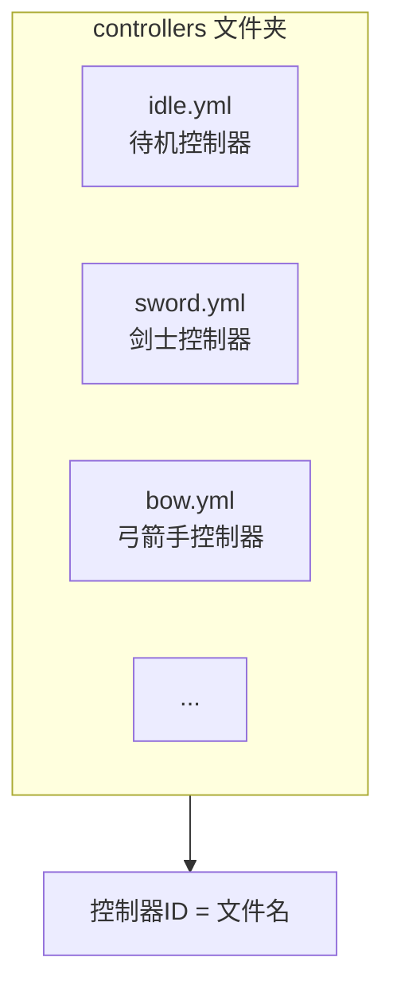
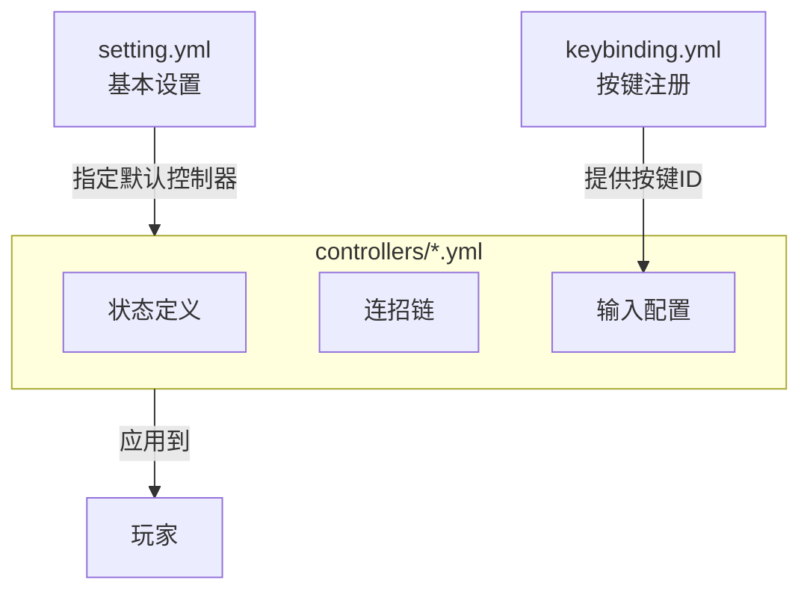

import { File, Folder, Files } from 'fumadocs-ui/components/files';
import { Callout } from 'fumadocs-ui/components/callout';
import { Step, Steps } from 'fumadocs-ui/components/steps';
import { Card, Cards } from 'fumadocs-ui/components/card';

## 目录结构

安装完成后，`plugins/ArcartX_Chronos` 目录结构如下：

<Files>
    <Folder name="ArcartX_Chronos" defaultOpen>
        <Folder name="controllers" defaultOpen>
            <File name="idle.yml" />
            <File name="sword.yml" />
            <File name="..." />
        </Folder>
        <File name="keybinding.yml" />
        <File name="license.yml" />
        <File name="setting.yml" />
    </Folder>
</Files>

---

## 文件说明

| 文件/文件夹                | 类型   | 作用           | 重要程度   |
|-----------------------|------|--------------|--------|
| **📁 controllers**    | 文件夹  | 存放动作控制器配置文件  | ⭐⭐⭐ 核心 |
| **📄 keybinding.yml** | 配置文件 | 注册自定义按键用于连招链 | ⭐⭐ 常用  |
| **📄 license.yml**    | 配置文件 | 许可证授权配置      | ⭐ 一次性  |
| **📄 setting.yml**    | 配置文件 | 基本设置（默认控制器等） | ⭐⭐ 常用  |

---

## 详细说明

### 📁 controllers 文件夹

这是 Chronos 最核心的配置目录。每个 `.yml` 文件都是一个独立的**动作控制器**配置。



<Callout type="info">
**控制器ID 就是文件名！** 例如创建 `sword.yml`，控制器ID 就是 `sword`。
</Callout>

**控制器配置包含：**
- 基础设置（模型、输入缓冲等）
- 状态声明（所有动作的定义）
- 连招链（动作之间的派生关系）

详细配置请参考 [动作控制器](/docs/chronos/7_controller)。

---

### 📄 keybinding.yml

注册自定义按键，用于连招链中的 `KEY_PRESS` 和 `KEY_HOLD` 输入类型。

```yaml
# 客户端按键分类名称
category: "克洛诺斯"

# 按键定义
keys:
  战技1: "X"    # 按键名称: 默认键位
  战技2: "Q"
  闪避: "SPACE"
```

<Callout type="info">
这里注册的按键允许玩家在客户端自定义绑定。
</Callout>

详细配置请参考 [注册按键](/docs/chronos/6_key)。

---

### 📄 license.yml

存放授权信息，安装时配置一次即可。

```yaml
licenseId: 114514
licenseKey: KEY-xXxxXXx
```

---

### 📄 setting.yml

插件的基本设置。

```yaml
# 默认控制器ID
default_controller: "idle"

# 通过主手物品自动切换控制器
switch_by_main_hand:
  enable: false
  path: "controller"

# 复合触发器（主手+副手+PAPI组合匹配）
triggers:
  enable: false
  list:
    触发器名称:
      controller: "控制器ID"
      main_hand:
        path: "nbt路径"
        value: "期望值"
      off_hand:
        path: "nbt路径"
        value: "期望值"
      papi: "%placeholder%"
      papi_value: "期望值"
```

详细配置请参考 [基本设置](/docs/chronos/5_setting)。

---

## 配置文件关系

理解各配置文件之间的关系：



---

## 快速导航

<Cards>
<Card title="基本设置" href="/docs/chronos/5_setting">
配置默认控制器和自动切换
</Card>
<Card title="注册按键" href="/docs/chronos/6_key">
定义自定义按键
</Card>
<Card title="动作控制器" href="/docs/chronos/7_controller">
核心配置：状态和连招链
</Card>
</Cards>
