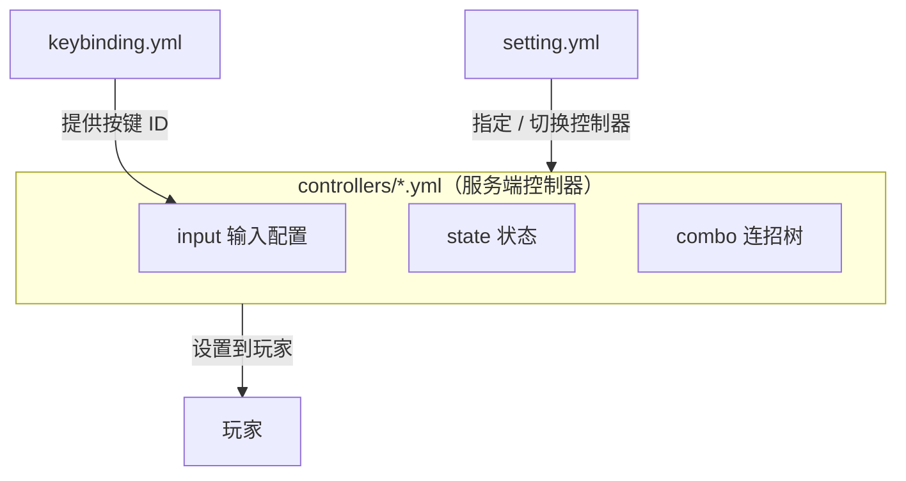

import { File, Folder, Files } from 'fumadocs-ui/components/files';
import { Callout } from 'fumadocs-ui/components/callout';
import { Step, Steps } from 'fumadocs-ui/components/steps';
import { Card, Cards } from 'fumadocs-ui/components/card';

## 目录一览

安装并首次启动后，`plugins/Chronos/` 的结构如下：

<Files>
    <Folder name="Chronos" defaultOpen>
        <Folder name="client">
        </Folder>
        <Folder name="controllers">
        </Folder>
        <File name="keybinding.yml" />
        <File name="license.yml" />
        <File name="setting.yml" />
    </Folder>
</Files>

| 文件 / 文件夹           | 作用                    | 常改动 |
|--------------------|-----------------------|-----|
| **client/**        | 存放客户端状态机配置            | 核心  |
| **controllers/**   | 存放服务端控制器配置            | 核心  |
| **setting.yml**    | 全局设置：默认控制器、控制器自动切换    | 常用  |
| **keybinding.yml** | 注册自定义按键，供连招链里的按键类输入使用 | 常用  |
| **license.yml**    | 授权信息，安装时填一次即可         | 一次性 |

---

## client 文件夹

存放**客户端状态机**配置——决定玩家模型此刻播哪个动画。**每个 `.yml` 文件是一套客户端状态机，文件名即它的 ID**，由服务端控制器 `setting.client_controller_id` 引用。

<Callout type="info">
服务端控制器管自定义状态、输入、连招链，客户端状态机管玩家客户端在此状态下客户端的动画播放以及行为，两者一对配套使用。完整写法（子控制器、状态属性、保留名、多控制器混合）见 [客户端状态机](/docs/chronos/7_client)。
</Callout>

---

## controllers 文件夹

这是 Chronos 最核心的目录。**每个 `.yml` 文件就是一个服务端控制器，文件名即控制器 ID。**

<Callout type="info">
新建 `sword.yml`，控制器 ID 就是 `sword`；给玩家设置时用的也是这个 ID：`/chronos set sword Steve`。改完配置记得 `/chronos reload`。
</Callout>

一个控制器文件由三大块组成：

- `setting`：控制器基础设置（对接的客户端状态机、模型/动画、输入缓冲、初始化脚本等）
- `state`：声明这个控制器拥有的所有状态（动作），以及每个状态的窗口、条件、冷却、执行脚本
- `combo`：连招树，描述状态之间「收到什么输入就派生到哪个状态」

完整字段说明见 [服务端控制器](/docs/chronos/7_controller)。

---

## setting.yml

全局设置文件，决定玩家默认设置哪个控制器、以及是否根据手持物品或外部条件自动切换控制器：

```yaml
# 默认控制器 ID
default_controller: "idle"

# 通过主手物品的 NBT 切换控制器
switch_by_main_hand:
  enable: false
  path: "controller"   # NBT 路径，其值即控制器 ID；多层用点号分隔

# 复合触发器：按 主手 / 副手 / PAPI 组合条件切换控制器
triggers:
  enable: false
  list:
    触发器ID:
      controller: "控制器ID"
      main_hand:
        path: "nbt路径"
        value: "期望值"
      off_hand:
        path: "nbt路径"
        value: "期望值"
      papi: "%placeholder%"
      papi_value: "期望值"
```

<Callout type="info">
三者的优先级：`switch_by_main_hand` 开启时用它；否则 `triggers` 开启时用触发器；都不满足则回落到 `default_controller`。完整讲解见 [基本设置](/docs/chronos/5_setting)。
</Callout>

---

## keybinding.yml

注册自定义按键，供连招链里的 `KEY_PRESS` / `KEY_HOLD` / `KEY_HOLD_RELEASE` 输入类型使用。这里注册的键会出现在客户端的按键设置里，玩家可以自行改绑：

```yaml
# 客户端按键设置里的分组名
category: "克洛诺斯"

# 按键 ID: 默认物理键
keys:
  战技1: "X"
  战技2: "Q"
```

其中的**按键 ID**（如 `战技1`）就是连招链里 `KEY_PRESS` 等输入的 `value`。详见 [注册按键](/docs/chronos/6_key)。

---

## license.yml

授权信息，安装时配置一次即可，一般不再改动：

```yaml
licenseId: 114514
licenseKey: KEY-xXxxXXx
```

---

## 各文件如何协作




