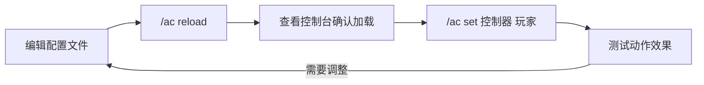

import { File, Folder, Files } from 'fumadocs-ui/components/files';
import { Callout } from 'fumadocs-ui/components/callout';
import { Step, Steps } from 'fumadocs-ui/components/steps';
import { Card, Cards } from 'fumadocs-ui/components/card';

## 指令概览

Chronos 提供了简洁的指令系统来管理玩家的动作控制器。

### 指令前缀

可以使用以下任意前缀：
- `/arcartx_chronos` - 完整前缀
- `/ac` - 简写前缀（推荐）

---

## 指令列表

| 指令                     | 作用       | 权限 |
|------------------------|----------|----|
| `/ac set <控制器ID> <玩家>` | 为玩家设置控制器 | OP |
| `/ac remove <玩家>`      | 移除玩家的控制器 | OP |
| `/ac reload`           | 重载所有配置文件 | OP |

在后台输入 `/ac` 可以查看指令帮助：

```log
[18:44:55 INFO]: ♦ ArcartX-Chronos | 信息: 指令列表
[18:44:55 INFO]: ♦ ArcartX-Chronos | 信息:  - /arcartx_chronos set - 设置玩家控制器
[18:44:55 INFO]: ♦ ArcartX-Chronos | 信息:  - /arcartx_chronos remove - 移除玩家控制器
[18:44:55 INFO]: ♦ ArcartX-Chronos | 信息:  - /arcartx_chronos reload - 重载
```

---

## 详细用法

### set - 设置控制器

为指定玩家设置动作控制器。

**语法：**
```
/ac set <控制器ID> <玩家名称>
```

**参数说明：**

| 参数      | 说明                                 |
|---------|------------------------------------|
| `控制器ID` | `controllers` 文件夹中的 yml 文件名（不含扩展名） |
| `玩家名称`  | 在线玩家的游戏名                           |

**示例：**
```bash
# 为玩家 Steve 设置剑士控制器
/ac set sword Steve

# 为玩家 Alex 设置弓箭手控制器
/ac set bow Alex
```

<Callout type="info">
**控制器ID 就是文件名！** 如果你的配置文件是 `controllers/sword.yml`，那么控制器ID 就是 `sword`。
</Callout>

---

### remove - 移除控制器

移除指定玩家的当前控制器。

**语法：**
```
/ac remove <玩家名称>
```

**示例：**
```bash
# 移除玩家 Steve 的控制器
/ac remove Steve
```

<Callout type="warn">
移除控制器后，玩家将无法使用 Chronos 的动作系统，直到重新设置控制器。
</Callout>

---

### reload - 重载配置

重新加载所有配置文件，无需重启服务器。

**语法：**
```
/ac reload
```

**重载后控制台输出示例：**
```log
[18:20:32 INFO]: ♦ ArcartX-Chronos | 信息: 加载1个控制器配置
[18:20:32 INFO]: ♦ ArcartX-Chronos | 信息: 注册动作客户端按键-> 战技1
[18:20:32 INFO]: ♦ ArcartX-Chronos | 信息: 注册动作客户端按键-> 战技2
[18:20:32 INFO]: ♦ ArcartX-Chronos | 信息: 注册动作控制器-> sword
[18:20:32 INFO]: ♦ ArcartX-Chronos | 信息: 注册动作控制器-> bow
```

<Callout type="info">
**调试技巧：** 重载后查看控制台输出，可以确认：
- 有多少个控制器被加载
- 注册了哪些按键
- 各控制器的ID
</Callout>

---

## 使用流程

典型的工作流程：



---

## 常见问题

<Callout type="error">
**问题：找不到控制器ID**

确认步骤：
1. 检查文件是否在 `controllers` 文件夹中
2. 检查文件扩展名是否为 `.yml`
3. 执行 `/ac reload` 重载配置
4. 查看控制台输出确认控制器已注册
</Callout>

<Callout type="error">
**问题：设置控制器后无效果**

可能原因：
1. 客户端未安装 ArcartX Mod
2. 服务端状态名与客户端控制器不匹配
3. 连招链配置有误
</Callout>

---

## 通过 API 使用

除了指令，你也可以通过 Java API 来管理控制器：

```java
// 获取 API
ChronosAPI api = ChronosAPI.getInstanceAPI();

// 为玩家设置控制器
api.setPlayerController(player, "sword");

// 获取玩家当前控制器ID
String controllerId = api.getPlayerControllerId(player);

// 移除玩家控制器
api.removePlayerController(player);
```

详细 API 请参考 [API/EVENT](/docs/chronos/9_api)。
