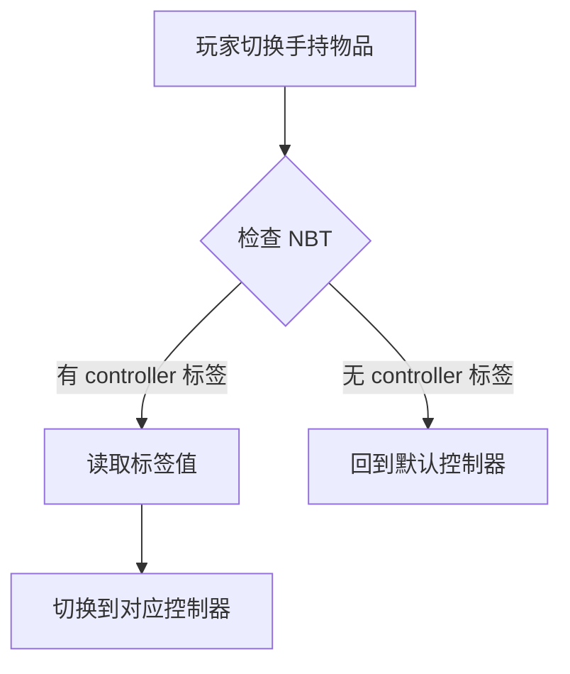
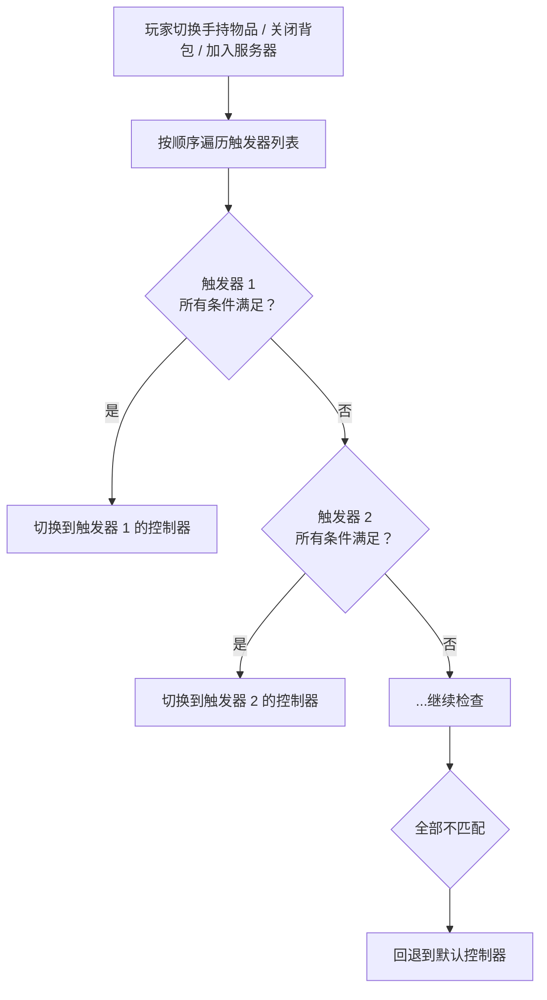
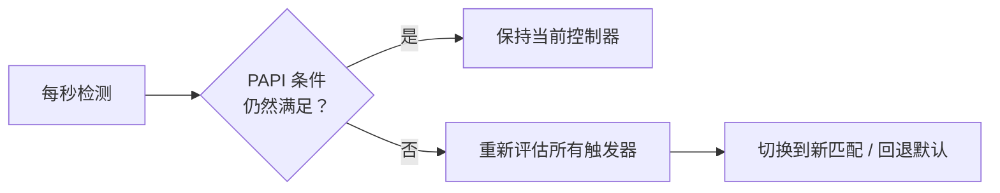

import { File, Folder, Files } from 'fumadocs-ui/components/files';
import { Callout } from 'fumadocs-ui/components/callout';
import { Step, Steps } from 'fumadocs-ui/components/steps';
import { Card, Cards } from 'fumadocs-ui/components/card';

## 配置文件

在插件目录下打开 `setting.yml` 文件：

```yaml
# 默认控制器ID
default_controller: "idle"

# 通过主手物品切换控制器
switch_by_main_hand:
  # 是否启用自动切换
  enable: false
  # NBT路径，多层使用点号分隔
  path: "controller"

# 复合触发器（与 switch_by_main_hand 互斥，后者优先）
triggers:
  enable: false
  list:
    触发器名称:
      controller: "控制器ID"
      main_hand:
        path: "nbt路径"
        value: "期望值"
      off_hand:
        path: "nbt路径"
        value: "期望值"
      papi: "%placeholder%"
      papi_value: "期望值"
```

---

## 配置项详解

### default_controller - 默认控制器

```yaml
default_controller: "idle"
```

| 属性      | 说明                          |
|---------|-----------------------------|
| **作用**  | 玩家登录服务器时自动应用的控制器            |
| **值**   | 控制器ID（controllers 文件夹中的文件名） |
| **默认值** | `idle`                      |

<Callout type="info">
**重要：** Chronos 的所有功能都建立在控制器之上。玩家必须拥有一个控制器，才能使用动作系统。
</Callout>

**示例配置：**

```yaml
# 所有玩家默认使用待机控制器
default_controller: "idle"

# 或者让所有玩家默认使用剑士控制器
default_controller: "sword"
```

---

### switch_by_main_hand - 自动切换控制器

通过玩家手持物品的 NBT 数据自动切换控制器。

```yaml
switch_by_main_hand:
  enable: false
  path: "controller"
```

| 属性         | 说明               |
|------------|------------------|
| **enable** | 是否启用此功能          |
| **path**   | NBT 数据路径，多层用点号分隔 |

**工作原理：**



**示例：**

假设你有一把剑，NBT 中包含：

```yaml
# 物品 NBT 结构
{
  controller: "sword"
}
```

当玩家手持这把剑时，会自动切换到 `sword` 控制器。

**多层路径：**

```yaml
switch_by_main_hand:
  enable: true
  path: "arcartx.weapon.controller"  # 多层NBT路径
```

对应的物品 NBT：
```yaml
{
  arcartx: {
    weapon: {
      controller: "sword"
    }
  }
}
```

---

### triggers - 复合触发器

通过主手物品、副手物品、PlaceholderAPI 占位符的组合条件来切换控制器。适用于需要根据双手装备搭配（如剑+盾）或外部插件状态来决定控制器的场景。

<Callout type="warn">
`triggers` 与 `switch_by_main_hand` 互斥。当 `switch_by_main_hand.enable` 为 `true` 时，`triggers` 不会生效。
</Callout>

```yaml
triggers:
  enable: true
  list:
    剑盾触发:
      controller: "sword_shield"
      main_hand:
        path: "weapon_type"
        value: "sword"
      off_hand:
        path: "weapon_type"
        value: "shield"
    双手剑触发:
      controller: "greatsword"
      main_hand:
        path: "weapon_type"
        value: "greatsword"
    战士弓箭触发:
      controller: "warrior_bow"
      main_hand:
        path: "weapon_type"
        value: "bow"
      papi: "%myrpg_class%"
      papi_value: "warrior"
```

| 属性         | 说明                      |
|------------|-------------------------|
| **enable** | 是否启用复合触发器               |
| **list**   | 触发器列表，key 为触发器名称（仅用于标识） |

每个触发器条目支持以下字段：

| 字段             | 必填 | 说明                                |
|----------------|----|-----------------------------------|
| **controller** | 是  | 匹配成功后切换到的控制器ID                    |
| **main_hand**  | 否  | 主手物品匹配条件                          |
| **off_hand**   | 否  | 副手物品匹配条件                          |
| **papi**       | 否  | PlaceholderAPI 占位符（如 `%xxx_xxx%`） |
| **papi_value** | 否  | 占位符的期望值                           |

`main_hand` 和 `off_hand` 的子字段：

| 字段        | 说明                  |
|-----------|---------------------|
| **path**  | 物品 NBT 数据路径，多层用点号分隔 |
| **value** | 期望的 NBT 值           |

**匹配规则：**

- 同一个触发器内的所有条件是 **AND（与）** 关系，必须全部满足才算匹配
- 触发器列表按**从上到下**的顺序匹配，第一个满足的生效
- 未配置的条件视为自动通过（例如只配了 `main_hand`，则不检查副手和 PAPI）
- 所有触发器都不匹配时，回退到 `default_controller`

**工作原理：**



**PAPI 周期检测：**

当触发器包含 `papi` 条件时，系统会每秒自动重新检测一次。如果玩家当前通过触发器进入了某个控制器，但 PAPI 条件不再满足，会自动退出并重新匹配。



<Callout type="info">
PAPI 周期检测仅对通过触发器进入的控制器生效。通过命令或 API 设置的控制器不受影响。
</Callout>

<Callout type="info">
如果服务器未安装 PlaceholderAPI，PAPI 条件会被自动跳过（视为通过），不会导致报错。
</Callout>

**实战示例 - 剑盾组合：**

玩家主手持剑、副手持盾时进入剑盾控制器，只拿剑不拿盾时进入单手剑控制器：

```yaml
triggers:
  enable: true
  list:
    剑盾:
      controller: "sword_shield"
      main_hand:
        path: "weapon_type"
        value: "sword"
      off_hand:
        path: "weapon_type"
        value: "shield"
    单手剑:
      controller: "sword"
      main_hand:
        path: "weapon_type"
        value: "sword"
```

<Callout type="info">
注意触发器的顺序很重要。上面的例子中，「剑盾」放在「单手剑」前面，这样主手剑+副手盾时会优先匹配到剑盾控制器，而不是单手剑。
</Callout>

**实战示例 - 结合职业插件：**

不同职业拿同一把武器时使用不同的控制器：

```yaml
triggers:
  enable: true
  list:
    战士持剑:
      controller: "warrior_sword"
      main_hand:
        path: "weapon_type"
        value: "sword"
      papi: "%myrpg_class%"
      papi_value: "warrior"
    法师持剑:
      controller: "mage_sword"
      main_hand:
        path: "weapon_type"
        value: "sword"
      papi: "%myrpg_class%"
      papi_value: "mage"
```

---

## 下一步

<Cards>
<Card title="注册按键" href="/docs/chronos/6_key">
配置自定义按键
</Card>
<Card title="动作控制器" href="/docs/chronos/7_controller">
创建你的第一个控制器
</Card>
</Cards>
