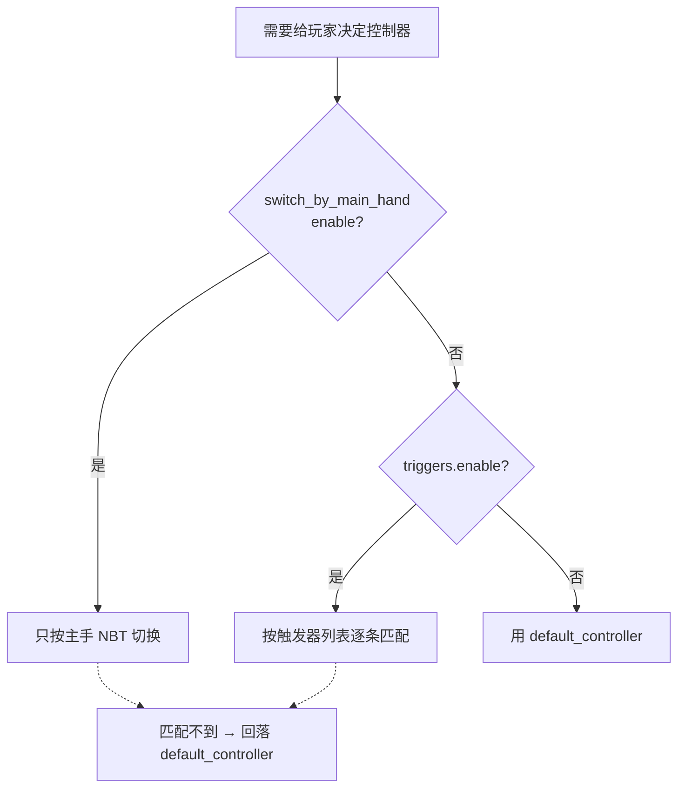

import { File, Folder, Files } from 'fumadocs-ui/components/files';
import { Callout } from 'fumadocs-ui/components/callout';
import { Step, Steps } from 'fumadocs-ui/components/steps';
import { Card, Cards } from 'fumadocs-ui/components/card';

## 这个文件解决什么问题

Chronos 的一切都建立在「玩家身上挂着哪个控制器」之上。`setting.yml` 就是用来从配置层面解决这个问题：

> 一名玩家在某个时刻，应该被自动挂上哪个控制器？

它提供了三种由弱到强的规则：

- **default_controller** —— 兜底。谁都没匹配上时用它。
- **switch_by_main_hand** —— 看主手物品的一个 NBT 标签，标签值就是控制器 ID。简单直接，适合「一把武器一个控制器」。
- **triggers（复合触发器）** —— 主手 + 副手 + PlaceholderAPI 的组合条件，适合「剑+盾」「同一把武器不同职业」这类需要多条件判断的场景。

> 实战中，`switch_by_main_hand` 和 `triggers`  选择一个开启，具体关系看本文尾部视图。
---

## 配置文件全貌

```yaml
# 兜底：谁都没匹配上时用这个控制器
default_controller: "idle"

# 规则一：按主手物品的 NBT 标签切换控制器
switch_by_main_hand:
  enable: false
  # NBT 路径，多层用点号分隔；该路径的值 = 控制器 ID
  path: "controller"

# 规则二：复合触发器（主手/副手 NBT + PAPI 组合条件）
triggers:
  enable: false
  list:
    名称(这个名字随便):
      controller: "控制器ID"
      main_hand:
        path: "nbt路径"
        value: "期望值"
      off_hand:
        path: "nbt路径"
        value: "期望值"
      papi: "%placeholder%"
      papi_value: "期望值"
```

<Callout type="warn">
默认发布的 `setting.yml` 里只有 `default_controller` 和 `switch_by_main_hand` 两段，**没有 `triggers` 段**。触发器功能代码是支持的，需要你手动把上面的 `triggers` 段补进去并 `enable: true`。
</Callout>

---

## default_controller —— 默认控制器

```yaml
default_controller: "idle"
```

玩家登录、或所有切换规则都没命中时，自动挂载这个控制器。值就是 `controllers/` 里的文件名（不含 `.yml`）。

<Callout type="info">
建议至少准备一个「待机 / 空手」控制器作为默认值。玩家没有控制器时 Chronos 对他完全不生效，或者你希望玩家确实存在空状态（比如生存模式？）。
</Callout>

如果把它留空，且没有任何切换规则命中，玩家将不被挂任何控制器。

---

## switch_by_main_hand —— 按主手物品切换

最简单的自动切换：读玩家**主手物品**上某个 NBT 标签，标签的**值直接当作控制器 ID**。

```yaml
switch_by_main_hand:
  enable: true
  path: "controller"
```

| 字段       | 说明                                                 |
|----------|----------------------------------------------------|
| `enable` | 是否启用                                               |
| `path`   | 要读取的 NBT 路径，多层用点号分隔（如 `arcartx.weapon.controller`） |

**说明**：给武器写一个 NBT 标签，值填控制器 ID。比如一把剑的 NBT 里有 `controller: "sword"`，玩家拿起它就会自动切到 `sword` 控制器。

**多层路径示例**：`path: "arcartx.weapon.controller"` 对应的物品 NBT 是

```text
arcartx → weapon → controller = "sword"
```

**匹配不到时的回退**：如果主手物品没有这个标签、或标签值不是一个存在的控制器 ID，则回落到 `default_controller`；连默认控制器都为空时，玩家的控制器会被清空。

触发时机：玩家切换手持栏位、关闭背包界面、以及加入服务器时都会重新读取一次主手物品。

---

## triggers —— 复合触发器

当「一个物品对一个控制器」不够用时，用触发器。它能同时判断**主手 NBT、副手 NBT、PlaceholderAPI 占位符**，全部满足才切换。

典型场景：

- 主手剑 + 副手盾 → 剑盾控制器；只拿剑 → 单手剑控制器
- 同一把武器，战士拿是一套连招，法师拿是另一套（靠职业插件的 PAPI 区分）

```yaml
triggers:
  enable: true
  list:
    剑盾:
      controller: "sword_shield"
      main_hand:
        path: "weapon_type"
        value: "sword"
      off_hand:
        path: "weapon_type"
        value: "shield"
    单手剑:
      controller: "sword"
      main_hand:
        path: "weapon_type"
        value: "sword"
```

### 每个触发器条目的字段

| 字段           | 必填 | 说明                                    |
|--------------|----|---------------------------------------|
| `controller` | 是  | 命中后切换到的控制器 ID                         |
| `main_hand`  | 否  | 主手物品匹配条件：`path`（NBT 路径）+ `value`（期望值） |
| `off_hand`   | 否  | 副手物品匹配条件：`path` + `value`             |
| `papi`       | 否  | PlaceholderAPI 占位符，如 `%myrpg_class%`  |
| `papi_value` | 否  | 占位符解析后应等于的值                           |

`list` 下每一项的键名（如 `剑盾`）只是给你自己看的标识，不参与逻辑。

### 匹配规则（务必记住）

- **条目内是 AND**：一个触发器里配了几个条件，就必须**全部满足**才算命中。
- **没配的条件视为通过**：只写了 `main_hand` 就只查主手，不管副手和 PAPI。
- **按列表顺序取第一个命中**：从上往下逐条判断，命中第一个就停下。所以**更具体的条目要放在更宽松的条目前面**——上面例子里「剑盾」必须排在「单手剑」之前，否则拿着剑+盾也会先被「单手剑」抢先命中。
- **全不命中就回落**：所有条目都不满足时，回到 `default_controller`。

<Callout type="info">
触发器的判定时机和主手切换一致：玩家切换手持栏位、关闭背包、加入服务器时检测。**含 PAPI 的条目**还会被周期性重新检测（见下）。
</Callout>

### PAPI 周期检测

物品变化能靠事件立刻感知，但 PAPI 的值（比如玩家职业、状态）可能在玩家没动任何物品的情况下改变。为此，只要触发器里存在 PAPI 条件，Chronos 会**每秒（每 20 tick）**重新检测一次。

<Callout type="info">
- 周期检测**只针对当前正通过触发器进入控制器的玩家**。用指令或 API 手动设置的控制器不会被周期检测覆盖掉。
- 若服务器**没装 PlaceholderAPI**，所有 `papi` 条件自动视为通过。
</Callout>

### 实战：结合职业插件

同一把剑，不同职业用不同控制器：

```yaml
triggers:
  enable: true
  list:
    战士持剑:
      controller: "warrior_sword"
      main_hand:
        path: "weapon_type"
        value: "sword"
      papi: "%myrpg_class%"
      papi_value: "warrior"
    法师持剑:
      controller: "mage_sword"
      main_hand:
        path: "weapon_type"
        value: "sword"
      papi: "%myrpg_class%"
      papi_value: "mage"
```

玩家转职（`%myrpg_class%` 变化）后，最迟一秒内就会自动切到对应控制器。

---

## 三种规则的关系



<Callout type="warn">
`switch_by_main_hand` 和 `triggers` **不会同时生效**。前者启用时后者被完全忽略。要用触发器，请先把 `switch_by_main_hand.enable` 关掉。
</Callout>


