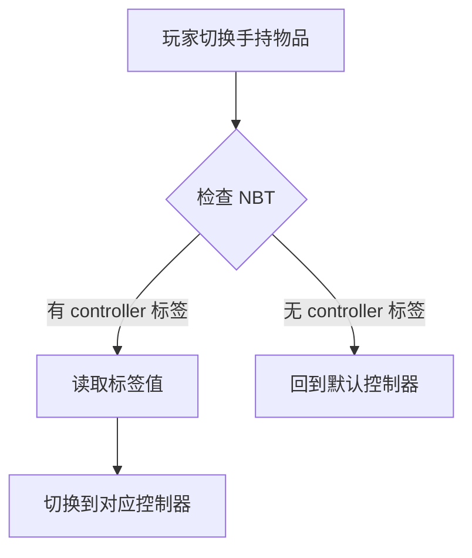

import { File, Folder, Files } from 'fumadocs-ui/components/files';
import { Callout } from 'fumadocs-ui/components/callout';
import { Step, Steps } from 'fumadocs-ui/components/steps';
import { Card, Cards } from 'fumadocs-ui/components/card';

## 配置文件

在插件目录下打开 `setting.yml` 文件：

```yaml
# 默认控制器ID
default_controller: "idle"

# 通过主手物品切换控制器
switch_by_main_hand:
  # 是否启用自动切换
  enable: false
  # NBT路径，多层使用点号分隔
  path: "controller"
```

---

## 配置项详解

### default_controller - 默认控制器

```yaml
default_controller: "idle"
```

| 属性      | 说明                          |
|---------|-----------------------------|
| **作用**  | 玩家登录服务器时自动应用的控制器            |
| **值**   | 控制器ID（controllers 文件夹中的文件名） |
| **默认值** | `idle`                      |

<Callout type="info">
**重要：** Chronos 的所有功能都建立在控制器之上。玩家必须拥有一个控制器，才能使用动作系统。
</Callout>

**示例配置：**

```yaml
# 所有玩家默认使用待机控制器
default_controller: "idle"

# 或者让所有玩家默认使用剑士控制器
default_controller: "sword"
```

---

### switch_by_main_hand - 自动切换控制器

通过玩家手持物品的 NBT 数据自动切换控制器。

```yaml
switch_by_main_hand:
  enable: false
  path: "controller"
```

| 属性         | 说明               |
|------------|------------------|
| **enable** | 是否启用此功能          |
| **path**   | NBT 数据路径，多层用点号分隔 |

**工作原理：**



**示例：**

假设你有一把剑，NBT 中包含：

```yaml
# 物品 NBT 结构
{
  controller: "sword"
}
```

当玩家手持这把剑时，会自动切换到 `sword` 控制器。

**多层路径：**

```yaml
switch_by_main_hand:
  enable: true
  path: "arcartx.weapon.controller"  # 多层NBT路径
```

对应的物品 NBT：
```yaml
{
  arcartx: {
    weapon: {
      controller: "sword"
    }
  }
}
```

---

## 下一步

<Cards>
<Card title="注册按键" href="/docs/chronos/6_key">
配置自定义按键
</Card>
<Card title="动作控制器" href="/docs/chronos/7_controller">
创建你的第一个控制器
</Card>
</Cards>
