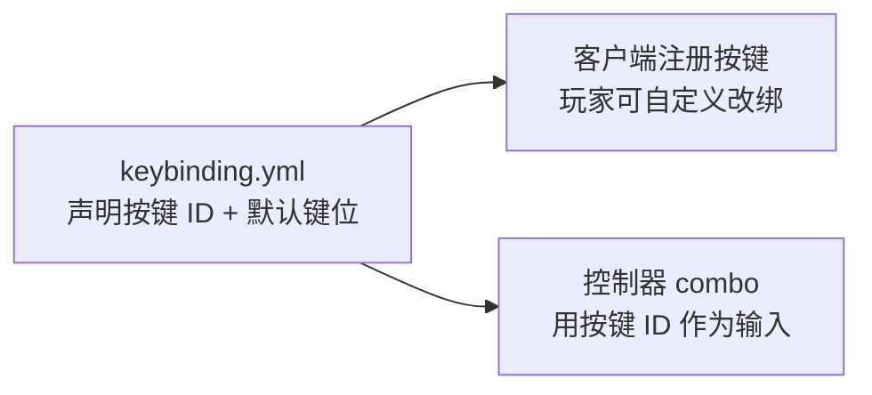

import { File, Folder, Files } from 'fumadocs-ui/components/files';
import { Callout } from 'fumadocs-ui/components/callout';
import { Step, Steps } from 'fumadocs-ui/components/steps';
import { Card, Cards } from 'fumadocs-ui/components/card';

## 说明

连招是靠玩家输入触发的。鼠标左右键、跳跃、潜行这些原版就有的输入，Chronos 直接能用；但「战技键」「闪避键」这类专属键，原版没有，需要你先注册出来。

`keybinding.yml` 是用来声明这些按键的：你在这里**声明一个按键 ID 和它的默认键位**，Chronos 会把它注册成客户端按键。之后：

- **玩家**能在客户端的「按键设置」里看到并自由改绑这个键；
- **你**能在控制器的连招里用 `KEY_PRESS` / `KEY_HOLD` / `KEY_HOLD_RELEASE` 引用这个按键 ID 作为触发输入。



---

## 配置文件

插件目录下的 `keybinding.yml`：

```yaml
# 客户端按键设置里，这些键归属的分类名
category: "克洛诺斯"

# 按键定义： 按键ID: 默认键位
keys:
  战技1: "X"
  战技2: "Q"
```

---

### category —— 按键分类名

```yaml
category: "克洛诺斯"
```

玩家打开客户端「按键设置」时，你注册的这些键会集中显示在这个分类下，方便查找和改绑。填任意字符串即可。

---

### keys —— 按键定义

```yaml
keys:
  战技1: "X"
  战技2: "Q"
  闪避: "LEFT_ALT"
  格挡: "V"
```

每一行是 `按键ID: 默认键位`：

| 部分           | 说明                                                            |
|--------------|---------------------------------------------------------------|
| **按键ID**（键名） | 你自定义的标识，如 `战技1`。**这就是连招里 `KEY_PRESS` 等输入的 `value`**，必须一字不差地对上 |
| **默认键位**（值）  | 该按键的默认物理键，如 `X`。它必须是一个合法的**客户端按键 ID**（见文末链接），玩家日后可自行改绑        |

<Callout type="info">
默认键位只是「出厂设置」。注册后玩家可以在客户端把 `战技1` 从 `X` 改成任何键——连招配置引用的是按键 ID `战技1`，与玩家实际绑到哪个物理键无关。
</Callout>

---

## 在连招里引用

注册好的按键 ID，在控制器的 `combo` 里作为输入的 `value` 使用：

```yaml
# keybinding.yml
keys:
  战技1: "X"

# 某个控制器的 combo
combo:
  战技A:
    input:
      type: KEY_PRESS     # 输入类型
      value: "战技1"       # 引用上面注册的按键 ID
```

<Callout type="warn">
`value` 必须与 `keys` 里的**按键 ID 完全一致**。拼错不会报致命错误，但那条输入永远不会被触发。`/ac reload` 后可在后台看到 `注册动作客户端按键-> 战技1` 一类日志，确认按键确实注册成功。
</Callout>

---

## 按键的三种输入类型

同一个按键 ID，配不同的 `type` 能做出点按、长按、长按后释放三种手感：

| 输入类型               | 触发时机            | 长按阈值           |
|--------------------|-----------------|----------------|
| `KEY_PRESS`        | 按下瞬间触发          | ——             |
| `KEY_HOLD`         | 按住足够久后触发        | 键盘 **≥ 500ms** |
| `KEY_HOLD_RELEASE` | 长按到阈值后**松开**时触发 | 键盘 **≥ 500ms** |

<Callout type="info">
长按阈值由客户端判定。**键盘是 500ms**；如果你用的是鼠标输入（`MOUSE_HOLD` 系列），阈值是 150ms。二者不同，别混用。
</Callout>

**示例——同一个键做三种技能：**

```yaml
combo:
  # 点按 X：普通技能
  普通技能:
    input:
      type: KEY_PRESS
      value: "战技1"

  # 按住 X 超过 500ms：进入蓄力
  蓄力技能:
    input:
      type: KEY_HOLD
      value: "战技1"

  # 长按后松开 X：释放蓄力
  释放技能:
    input:
      type: KEY_HOLD_RELEASE
      value: "战技1"
```

---

## 默认键位怎么填

`keys` 里的默认键位（如 `X`、`LEFT_ALT`、`SPACE`）必须是客户端认识的按键 ID。常见的字母、数字、功能键（F1~F12）、`SPACE`、`LEFT_SHIFT`、`LEFT_CONTROL`、`LEFT_ALT`、`TAB`、`ENTER`、小键盘 `NUMPAD_*` 等都可用。

<Callout type="info">
完整、权威的按键 ID 清单见：[客户端按键 ID 表](/docs/arcartx_v2/5_key/4_key_name)。填默认键位前请以该表为准。
</Callout>


