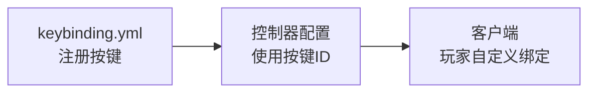

import { File, Folder, Files } from 'fumadocs-ui/components/files';
import { Callout } from 'fumadocs-ui/components/callout';
import { Step, Steps } from 'fumadocs-ui/components/steps';
import { Card, Cards } from 'fumadocs-ui/components/card';

## 概述

`keybinding.yml` 用于注册自定义按键，这些按键可以在连招链配置中使用。



---

## 配置文件

在插件目录下打开 `keybinding.yml` 文件：

```yaml
# 客户端中按键位于哪个分区
category: "克洛诺斯"

# 按键定义
keys:
  # 按键名称: 默认键位
  战技1: "X"
  战技2: "Q"
```

---

## 配置项详解

### category - 按键分类

```yaml
category: "克洛诺斯"
```

| 属性 | 说明 |
|------|------|
| **作用** | 在客户端按键设置中显示的分类名称 |
| **值** | 任意字符串 |

玩家在客户端的"按键设置"界面中，可以找到这个分类下的所有按键。

---

### keys - 按键定义

```yaml
keys:
  战技1: "X"
  战技2: "Q"
  闪避: "LEFT_ALT"
  格挡: "V"
```

| 格式 | 说明 |
|------|------|
| **按键名称** | 你自定义的名称，用于连招链配置中引用 |
| **默认键位** | 按键的默认绑定，玩家可以在客户端修改 |

<Callout type="info">
**注册的按键允许玩家在客户端自定义绑定。** 这意味着玩家可以根据自己的习惯修改这些按键。
</Callout>

---

## 在连招链中使用

注册的按键可以在控制器配置的连招链中使用：

```yaml
# keybinding.yml 中注册
keys:
  战技1: "X"

# 控制器配置中使用
combo:
  战技A:
    input:
      type: KEY_PRESS      # 或 KEY_HOLD
      value: "战技1"        # 引用按键名称
```

---

## 输入类型对比

按键支持3种输入类型：

| 输入类型               | 说明    | 触发条件            |
|--------------------|-------|-----------------|
| `KEY_PRESS`        | 按键点击  | 按下按键时立即触发       |
| `KEY_HOLD`         | 按键长按  | 按住按键 ≥100ms 后触发 |
| `KEY_HOLD_RELEASE` | 长按后释放 | 长按后松开时触发        |

**示例：**

```yaml
combo:
  # 点击 X 键触发普通技能
  普通技能:
    input:
      type: KEY_PRESS
      value: "战技1"
  
  # 长按 X 键触发蓄力技能
  蓄力技能:
    input:
      type: KEY_HOLD
      value: "战技1"
  
  # 长按后释放触发释放技能
  释放技能:
    input:
      type: KEY_HOLD_RELEASE
      value: "战技1"
```

---

## 可用键位

你可以使用以下键位作为默认绑定：

### 字母键
`A` `B` `C` `D` `E` `F` `G` `H` `I` `J` `K` `L` `M` `N` `O` `P` `Q` `R` `S` `T` `U` `V` `W` `X` `Y` `Z`

### 数字键
`0` `1` `2` `3` `4` `5` `6` `7` `8` `9`

### 功能键
`F1` `F2` `F3` `F4` `F5` `F6` `F7` `F8` `F9` `F10` `F11` `F12`

### 特殊键
| 键位              | 说明     |
|-----------------|--------|
| `SPACE`         | 空格键    |
| `LEFT_SHIFT`    | 左Shift |
| `RIGHT_SHIFT`   | 右Shift |
| `LEFT_CONTROL`  | 左Ctrl  |
| `RIGHT_CONTROL` | 右Ctrl  |
| `LEFT_ALT`      | 左Alt   |
| `RIGHT_ALT`     | 右Alt   |
| `TAB`           | Tab键   |
| `CAPS_LOCK`     | 大写锁定   |
| `ENTER`         | 回车键    |
| `BACKSPACE`     | 退格键    |

### 小键盘
`NUMPAD_0` 到 `NUMPAD_9`、`NUMPAD_ADD`、`NUMPAD_SUBTRACT` 等

<Callout type="info">
完整的键位列表请参考：[客户端按键ID表](/docs/arcartx_v1/core/5_key/4_key_name)
</Callout>

---

## 下一步

<Cards>
<Card title="动作控制器" href="/docs/chronos/7_controller">
在连招链中使用这些按键
</Card>
<Card title="客户端按键ID表" href="/docs/core/5_key/4_key_name">
查看完整的键位列表
</Card>
</Cards>
