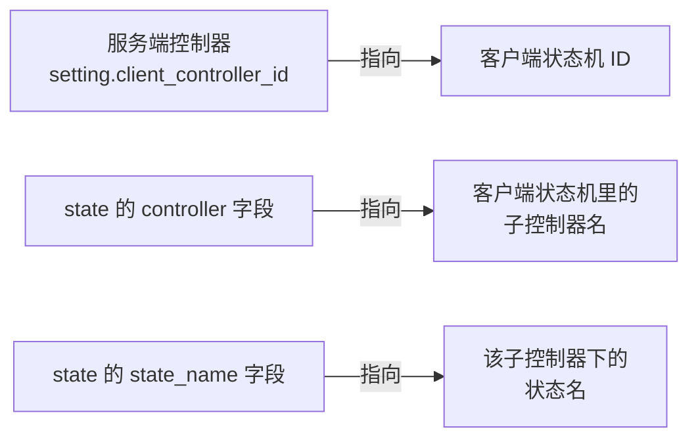
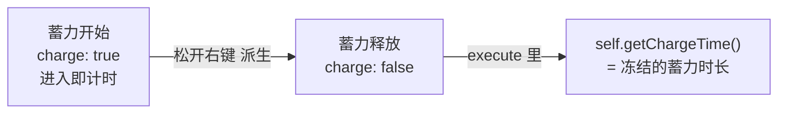
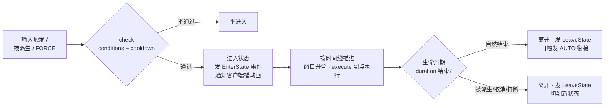

import { File, Folder, Files } from 'fumadocs-ui/components/files';
import { Callout } from 'fumadocs-ui/components/callout';
import { Step, Steps } from 'fumadocs-ui/components/steps';
import { Card, Cards } from 'fumadocs-ui/components/card';

## 这一章在讲什么

服务端控制器是 Chronos 的核心。在 `controllers/` 里写一份 YAML，就描述出了一整套战斗逻辑：玩家点了左键放第一段轻击，再点一下接第二段，长按右键蓄力，向后冲刺触发闪避……这些「什么输入 → 播什么动作 → 能接什么」的规则，全都写在这份文件里。

### 先分清两个「状态机」

服务端和客户端各有一套状态机，名字很像，务必分清楚：

<Callout type="info">
- **服务端控制器**（本章主角）：Chronos 插件里 `controllers/*.yml` 定义的状态机。它管的是**逻辑**——判定输入、跑连招、算伤害、控制冷却与窗口。
- **客户端状态机**：Mod 端负责**播放动画**的状态机，写在插件的 `client/` 文件夹里，详见 [客户端状态机](/docs/chronos/7_client)。
</Callout>

两者靠三个字符串对接。服务端每进入一个状态，就通知客户端「去播哪个动画」：



- `setting.client_controller_id`：整份控制器对接的客户端状态机 ID。
- 每个 state 的 `controller`：客户端状态机里的**子控制器名**（例如 `main`）。
- 每个 state 的 `state_name`：该子控制器下的**状态名**（例如 `attack1`）。

三者都是字符串。Chronos 在加载时会做交叉校验，拼错了会打印 WARN 提醒，但**不会阻断加载**——所以动作不播时，第一件事就是回来核对这三个字符串。

## 注册一个控制器

在插件目录的 `controllers/` 文件夹里随便建一个 `xxx.yml`，它就会被注册成一个控制器。**文件名（去掉 `.yml`）就是控制器 ID**。

<Files>
  <Folder name="controllers" defaultOpen>
    <File name="太刀.yml" />
    <File name="法杖.yml" />
    <File name="默认控制器.yml" />
  </Folder>
</Files>

一份控制器文件由三大块组成，下面逐块拆解：

```yaml
setting:   # 控制器级别的全局设置
state:     # 声明这个控制器里所有可能用到的状态
combo:     # 连招链：定义状态之间怎么衔接
```

---

## setting：控制器全局设置

`setting` 管的是「设上这个控制器时」以及「整个控制器共享」的东西。

```yaml
setting:
  # 对接的客户端状态机 ID（动画从哪套状态机里找）
  client_controller_id: "太刀动画"

  # 继承另一个控制器的全部 state（可选，支持多层，有环检测）
  extends: ""

  # —— model 与 animation 二选一 ——
  # 设上该控制器时给玩家换模型；留空 = 不操作（不会移除玩家已有的模型）
  model: "katana_player"
  model_scale: 1.0
  # 给玩家设置动画包 ID；仅当 model 为空时才生效（玩家模型路径）
  animation: ""

  # 是否放行原版左右键（原版攻击 / 交互）。做动作系统一般关掉，
  # 否则点左键会同时触发连招和原版挥砍
  enable_use: false

  # 输入缓冲：玩家手速比动画快时，先把输入存起来，到点再兑现
  input_buffer:
    enabled: true    # 是否启用
    max_size: 3      # 最多缓冲几个输入
    lifetime: 300    # 输入有效期(ms)，超时丢弃

  # 动作脚本，可写多个；init 在「设上该控制器时」执行一次
  action:
    init: |-
      var.combo = 0
```

### model 与 animation 是二选一的

这是最容易踩的点：`model` 和 `animation` 走的是**两条不同的路径**。

- `model`：直接给玩家换一个**模型**（换皮）。
- `animation`：给玩家设置一个**动画包 ID**（不换模型，只换这套动作动画 -> 玩家原版模型路径）。

代码里的规则是：**只有当 `model` 为空时，`animation` 才会生效**。所以如果你两个都填了，`animation` 会被忽略。想用动画包路径，就把 `model` 留空。

<Callout type="warn">
- `model` 留空**不等于**「移除模型」，而是「这一项什么都不做」。如果玩家之前被别的控制器设过模型，这里留空并不会把它还原。需要还原时请显式指定要换回的模型。
- 如果您完全不使用原版玩家模型+玩家动作，而是使用模型直接替代玩家模型，您如需实现时装之类的功能需要自行对接API：Chronos不管任何玩家模型或者动画包设置，而是由您的外观系统+职业系统进行设置。
</Callout>

### input_buffer：输入缓冲

动作游戏里玩家的手速经常比动画快——第一段还没播完就已经点了第二下。如果直接丢弃这个「早到」的输入，手感会很卡。输入缓冲就是把这些输入**暂存**起来，等状态进入可以派生的时机再兑现。

- `max_size`：最多缓冲几个输入（一般 2~3 个就够）。
- `lifetime`：输入的有效期（毫秒）。超过这个时间还没兑现的输入会被丢掉，避免玩家几秒前的误触突然生效。

它也是 `AND` / `SEQUENCE` 组合输入判定的基础（见后文连招链）。

### action：触发器

当前Chronos支持的触发器较少，我们逐个讲解：

#### init -> 初始化

每个玩家被设上一个控制器时，Chronos 会为他新建一个**独立的 Aria 上下文**。你可以在里面用 `var.` 存各种自定义状态，供后续的条件判断、伤害计算使用。`init` 就是在设上控制器的那一刻执行一次，通常用来给这些变量赋初值：

```yaml
action:
  init: |-
    var.combo = 0
    var.rage = 0
```

之后在任何 state 的 `execute`、`conditions` 里，都能读写 `var.combo{:aria}`、`var.rage{:aria}`。

#### damage -> 受伤

顾名思义，玩家受伤的时候触发


---

## state：声明状态

`state` 节点下声明这个控制器里**所有可能用到的状态**。顺序无所谓，这里只是声明；它们之间怎么衔接由后面的 `combo` 决定。

先看一个状态的骨架，再逐字段展开：

```yaml
state:
  轻击1:                      # 状态 ID（后续被 combo 引用，别重复）
    controller: "main"        # 客户端子控制器名
    state_name: "attack1"     # 客户端子控制器下的状态名
    speed: "1"                # 播放速度（Aria 表达式）
    duration: "500"           # 持续时长 ms（Aria 表达式）
    buffer_at: -1             # 预输入衔接时间点
    group: "攻击"             # 所属分组
    charge: false             # 是否蓄力
    move_cancel: -1           # 移动取消解锁点(ms)
    conditions:               # 进入条件（见下）
    cooldown:                 # 冷却（见下）
    windows:                  # 窗口：取消 / 派生 / 无敌 / 霸体（见下）
    execute:                  # 到点执行的脚本（见下）
```

### 基础三件套：controller / state_name / speed / duration

| 字段           | 含义                         |
|--------------|----------------------------|
| `controller` | 客户端子控制器名，例如 `main`。        |
| `state_name` | 该子控制器下的动画状态名，例如 `attack1`。 |
| `speed`      | 播放速度，Aria 表达式。             |
| `duration`   | 状态持续时长（毫秒），Aria 表达式。       |

<Callout type="warn">
**`state_name` 取代了旧的 `stateName`。** 旧键名 `stateName` 仍能读（向下兼容），但新配置一律用 `state_name`。
</Callout>

`speed` 有个关键副作用要记住：**它会同时缩放这个状态里所有的窗口时间和执行时间线**。比如某个窗口写的是 `start: 0, end: 100`，当 `speed` 设为 `2` 时，实际生效的窗口是 0~50ms。因为它是 Aria 表达式，你可以写成动态的，例如按玩家属性加速：

```yaml
speed: "1 + var.rage / 100"
```

### buffer_at：做「预输入」手感

`buffer_at`（默认 `-1`）决定「在派生窗口内收到输入后，什么时候真正衔接到下一个动作」：

- **`-1`**：在派生窗口内收到输入就**立即**衔接。实际手感稍差。
- **`>= 0`**：把输入先存成**预输入**，一直等到状态生命周期的第 `buffer_at` 毫秒才落地衔接。

后者用来做「预输入」——玩家可以提前把下一段的键按下去，动作会卡在一个固定的节奏点才接上，让整套连段的节奏稳定、不会因玩家手速忽快忽慢而错乱。

<Callout type="info">
`buffer_at` 会影响蓄力读数：如果一个 `charge: true` 的状态配了 `buffer_at >= 0`，玩家松手会走预输入、到点才落地，于是读到的最小蓄力时长约等于 `buffer_at`。想要精确的松手时长，就把蓄力状态的 `buffer_at` 设成 `-1`。
</Callout>

### group：状态分组

`group` 给状态贴一个分组标签。它被两个地方引用：

- `conditions.blocked_group`：玩家正处于某些组的状态时，禁止进入本状态。
- `cooldown.group`：同组状态共享冷却。

比如把所有闪避动作都归到 `闪避` 组，就能让它们共享冷却、也能被别的状态用「处于闪避组时不可进入」来排斥。

### charge：跨状态的蓄力

蓄力是本版本需要重点讲清的语义。`charge: true` 的状态从**进入的那一刻**开始实时计时；当它**离开时**（被派生、被打断、或自然结束）冻结这一次的蓄力时长。此后的状态用 `self.getChargeTime(){:aria}` 读到的就是这个**冻结值**（毫秒），直到下一次再进入某个 `charge` 状态才清零。

换句话说，蓄力时长是「上一个蓄力状态攒下来的」，要在**下一个**状态里读。典型流程是「蓄力开始 → 蓄力释放」两个状态：

v1迁移说明：以上是对蓄力的完整描述，相较于旧版，新版的蓄力机制更加“正确”，属于不得不做的调整。


```yaml
state:
  # 蓄力开始：长按右键，进入后实时计时
  蓄力开始:
    controller: "main"
    state_name: "charge"
    duration: "3000"
    charge: true          # ← 开始计时
    buffer_at: -1         # 想精确读松手时长，务必 -1，大于0之后，蓄力时间最小值为这里设置的值。
    windows:
      derive:             # 整个蓄力过程都开着派生窗口，随时能松手释放
        start: 0
        end: 3000

  # 蓄力释放：松开右键派生到这里，在这里读蓄了多久
  蓄力释放:
    controller: "main"
    state_name: "charge_release"
    duration: "600"
    charge: false         # ← 离开「蓄力开始」时时长被冻结
    execute:
      结算:
        at: 100
        # self.getChargeTime() 读到的就是玩家实际蓄了多久(ms)，用来分档 / 乘伤害
        expression: "var.chargeDamage = 10 + self.getChargeTime() / 100"
```



连招部分（后文）会把「蓄力开始」的输入配成 `MOUSE_HOLD` `RIGHT`（长按右键），把「蓄力释放」的输入配成 `MOUSE_HOLD_RELEASE` `RIGHT`（松开右键）。

### move_cancel：允许移动打断

`move_cancel`（默认 `-1`）控制「玩家能不能靠移动打断当前状态」：

- **`-1` 或省略**：该状态**不可**被移动打断。
- **正数 N**：状态开始 N 毫秒后，允许玩家**主动移动**来打断当前状态。

<Callout type="warn">
**`move_cancel` 是整数毫秒。想让一个 300ms 后可以走位取消的动作，就写 `move_cancel: 300`。
</Callout>

配套的 `move_cancel_fresh_input`（默认 `false`）决定解锁点之后怎样算「一次移动」：

- `false`：一直**按住**方向键，到解锁点即触发取消（动作游戏惯例，收招时按着方向就自然走位）。
- `true`：要求解锁点之后出现**新的**移动输入（先松开、再按一次方向键）才取消，避免「按住前进砍完自动往前冲」。

### conditions：进入条件

只有条件满足才能进入这个状态：

```yaml
conditions:
  # Aria 布尔表达式，默认 "true"
  expression: "self.getFood() >= 6 && !self.isFlying()"
  # 玩家正处于这些组的状态时，不可进入本状态
  blocked_group:
    - "受控"
    - "特殊运动"
```

- `expression`：一段返回布尔的 Aria 表达式，可以读玩家属性、`var.` 变量等。
- `blocked_group`：一组组名。玩家当前状态属于其中任何一组时，本状态进不去——常用来防止「被击飞/硬直期间还能出招」。

### cooldown：冷却

```yaml
cooldown:
  enable: false     # 是否开启冷却
  time: "5000"      # 冷却时长 ms，Aria 表达式
  group: "闪避"     # 冷却组，"-" 表示独立
```

`group` 是关键：**同一冷却组的状态共享同一份冷却**。比如四个方向的闪避都写 `group: "闪避"`，那玩家不管往哪个方向闪，都会一起进冷却，不能瞬间四连闪。`time` 是 Aria 表达式，可以按玩家属性动态计算。

### windows：四种窗口

窗口是「在状态生命周期的某段时间里，开启某种特性」。它是动作手感的灵魂——什么时候能取消、什么时候能接下一段、什么时候无敌，全部依靠这里设置。

<Callout type="info">
- 时间都是**相对状态开始**的毫秒数，`start` 到 `end` 之间为该窗口生效区间。
- 所有窗口时间都会被 `speed` 缩放（比如 `speed: 2` 时窗口时间减半）。
- 不需要的窗口直接不写即可。
</Callout>

| 窗口            | 作用                                                                 |
|---------------|--------------------------------------------------------------------|
| `cancel`      | **取消窗口**：这段时间内，玩家可以用「发起其它连招根节点的输入」来取消当前状态。常用于重击前摇——摇到一半发现要挨打，赶紧闪掉。 |
| `derive`      | **派生窗口**：这段时间内接收输入，沿 `combo` 的 derive 分支转移到下一个状态。连段能不能接下去，就看这个窗口。  |
| `invincible`  | **无敌帧**：这段时间内免疫伤害，用来做闪避。                                           |
| `super_armor` | **霸体**：这段时间内不会被拉入受控状态（不被击退 / 打断）。                                  |

**单段**窗口直接写 `start` / `end`：

```yaml
windows:
  derive:
    start: 300
    end: 450
```

**多段**窗口用 `ranges`（一个状态里某种特性分成好几段生效）：

```yaml
windows:
  invincible:
    ranges:
      - start: 0
        end: 100
      - start: 400
        end: 500
    # 成功免伤后，给玩家挂多久的「完美闪避」标签(ms)，供 self.isInvincibleTag() 读取
    invincible_tag_duration: 1000
```

`invincible` 窗口独有一个 `invincible_tag_duration`：当无敌帧成功挡下一次伤害后，会给玩家挂上一个持续这么久的「完美闪避」标签，让 `self.isInvincibleTag(){:aria}` 返回 `true`。你可以在派生分支的条件里读它，做「完美闪避后才能触发的反击 / 处决」。

下面这张时间线能直观看出各窗口在一次闪避（`duration: 400`）里的分布：

```mermaid
gantt
    title 闪避状态窗口时间线 (duration 400ms)
    dateFormat X
    axisFormat %L
    section 无敌帧
    无敌1 :active, 0, 100
    无敌2 :active, 400, 500
    section 派生窗口
    派生 :crit, 200, 400
    section 取消窗口
    取消 :150, 400
```



<Callout type="info">
**取消窗口 vs 派生窗口，别混。** 派生窗口走的是**当前连招树里预先定义好的分支**（接自己的下一段）；取消窗口允许你**跳出当前连招、从头发起另一棵连招树的根节点**（比如轻击摇到一半，直接闪避取消掉）。
</Callout>

### execute：到点执行脚本

`execute` 让你在状态生命周期的某个时刻执行一段 Aria 脚本——出手判定、位移都靠它。每个步骤有一个 `at`（毫秒）和一段 `expression`：

```yaml
execute:
  前冲: # 这个名字随便，方便你记忆即可
    at: 50
    # 到 50ms 时给自己一个位移（水平 1.5，垂直 0.3）
    expression: "self.dash(1.5, 0.3)"
  出手:
    at: 200
    expression: "var.combo = var.combo + 1"
```

<Callout type="warn">
**`at` 不能重复。** 同一状态里两个步骤用了同一个 `at`，后者会覆盖前者，并在加载期打印告警。步骤名（如 `前冲` / `出手`）只是给你自己看的注释，真正决定顺序的是 `at`。
</Callout>

<Callout type="info">
一个状态被**打断**时，它还没执行到的 `execute` 步骤（尚未出手的伤害 / 位移）会随打断一并取消，不会补跑。
</Callout>

### 状态生命周期一览

把上面的字段放到一条时间轴上，一个状态大致是这样运转的：



---

## combo：连招链

`state` 只是把状态登记下来，真正让它们「连起来」的是 `combo`。在 `combo` 里为每个**根状态**定义一个触发输入，再用 `derive` 一层层往下挂能接的后续状态——这就构成了一棵**连招树**。

```yaml
combo:
  轻击1:                    # 根节点：对应一个 state ID
    input:                  # 什么输入能触发它
      type: MOUSE_CLICK
      value: LEFT
    derive:                 # 它在派生窗口里能接哪些状态
      轻击2:
        input:
          type: MOUSE_CLICK
          value: LEFT
        derive:
          轻击3:
            input:
              type: MOUSE_CLICK
              value: LEFT
```

玩家点左键 → 进「轻击1」→ 在它的派生窗口里再点左键 → 进「轻击2」→ 再点 → 「轻击3」。这就是最基础的三连击。

### 输入类型总表

`input.type` 决定这个节点被什么触发：

| 类型                   | 含义                    | value 取值                                                           |
|----------------------|-----------------------|--------------------------------------------------------------------|
| `MOUSE_CLICK`        | 鼠标点击                  | `LEFT` / `RIGHT`                                                   |
| `MOUSE_HOLD`         | 鼠标长按（≥150ms）          | `LEFT` / `RIGHT`                                                   |
| `MOUSE_HOLD_RELEASE` | 鼠标长按后释放               | `LEFT` / `RIGHT`                                                   |
| `KEY_PRESS`          | 按键点击                  | keybinding 里的按键 ID，如 `战技1`                                         |
| `KEY_HOLD`           | 按键长按（≥500ms）          | 同上                                                                 |
| `KEY_HOLD_RELEASE`   | 按键长按后释放               | 同上                                                                 |
| `ACTION`             | 玩家动作                  | `JUMP` `SNEAK` `SPRINT` `SPRINT_LEFT` `SPRINT_RIGHT` `SPRINT_BACK` |
| `AUTO`               | 自动衔接（上一状态**播完**后自动进入） | 无                                                                  |
| `FORCE`              | 强制衔接（满足条件即**打断**接上）   | 无                                                                  |

<Callout type="warn">
**长按阈值由客户端判定：鼠标 150ms、键盘 500ms。**
</Callout>

`ACTION` 的冲刺分前后左右四个方向；但在第三人称自由相机非锁定期间，只会触发向前的 `SPRINT`。

### 组合输入：AND / OR / SEQUENCE

单个 `input` 只能配一种触发。想要「同时按」「多种触发」「搓招」这类，就用 `mode` + `inputs` 列表：

**OR —— 任一满足即可（多种触发方式）。** 让玩家往任意方向冲刺都能触发闪避：

```yaml
闪避:
  input:
    mode: OR
    inputs:
      - { type: ACTION, value: SPRINT }
      - { type: ACTION, value: SPRINT_LEFT }
      - { type: ACTION, value: SPRINT_RIGHT }
      - { type: ACTION, value: SPRINT_BACK }
```

**AND —— 所有输入同时按下（组合键）。** 潜行 + 长按右键才触发蓄力重击：

```yaml
蓄力重击:
  input:
    mode: AND
    inputs:
      - { type: ACTION, value: SNEAK }
      - { type: MOUSE_HOLD, value: RIGHT }
```

**SEQUENCE —— 在时间窗口内按顺序完成（搓招）。** 格斗游戏味的升龙拳，必须在 `time_window` 毫秒内依次输入：

```yaml
升龙拳:
  input:
    mode: SEQUENCE
    time_window: 500      # 500ms 内完成整个序列
    inputs:
      - { type: ACTION, value: SPRINT_BACK }   # 后退
      - { type: ACTION, value: SPRINT }        # 前冲
      - { type: MOUSE_CLICK, value: LEFT }     # 攻击
```

<Callout type="info">
`AND` 和 `SEQUENCE` 都依赖 `setting.input_buffer`——它们要在缓冲区里回看最近的几个输入才能判定，所以别把 `input_buffer` 关掉。这两种模式至少要写 2 个 `inputs`，否则加载期会告警。
</Callout>

### AUTO 与 FORCE：两种「不用玩家输入」的衔接

`AUTO` 和 `FORCE` 都不需要玩家再按键就能进入下一段，但触发时机完全不同，这是最容易混的地方：

|         | 触发时机                                                      | 典型用途                    |
|---------|-----------------------------------------------------------|-------------------------|
| `AUTO`  | 上一状态**自然播完后**才衔接                                          | 收招、蓄力起手状态到达超时阈值未进行释放输入时 |
| `FORCE` | 上一状态**进行期间**，每 tick 持续判定目标状态的 `conditions`，一满足就**立即打断**接上 | 血量低于阈值自动接处决、进入某种状态自动变招  |

**AUTO** —— 冲刺斩播完，自动接收招动作，无需玩家操作：

```yaml
combo:
  冲刺斩:
    input:
      type: ACTION
      value: SPRINT
    derive:
      冲刺斩收招:
        input:
        type: AUTO # 冲刺斩播完后自动进入
```

**FORCE** —— 条件驱动的强制衔接（本版本新增）。它不看玩家输入，而是在前一状态运行期间**每 tick 持续判定 FORCE 目标状态的 `conditions`**，一旦满足就立刻强制释放，**不必等前一个动作播完**。所以触发条件写在**目标 state 的 `conditions` 里**：

```yaml
state:
  # 处决：只有当被锁定目标血量很低时才允许进入
  处决:
    controller: "main"
    state_name: "execution"
    duration: "1200"
    conditions:
      # 这段条件就是 FORCE 的触发开关：目标血量低于 20% 时为真
      expression: "条件表达式"

combo:
  轻击3:
    input:
      type: MOUSE_CLICK
      value: LEFT
    derive:
      处决:
        input:                # 无需输入；轻击3 期间只要条件满足就强制接处决
          type: FORCE
        force_window: derive  # 可选：只在轻击3的派生窗口内判定条件
```

<Callout type="info">
`force_window` 是 FORCE 独有的可选项：
- **不写**（默认）：在前一状态的**整个生命周期**持续判定条件，自由度最高。
- **填 `derive` / `cancel`** 这类窗口类型：只在前一状态的**指定窗口内**才判定条件，便于把强制变招限制在特定节奏点。

引擎对 FORCE 连跳有递归深度保护（上限 16），不用担心 `A → force → B → force → A` 这类环无限循环。
</Callout>

### goto 与 back：复用节点、成环

一棵连招树经常需要「回到前面某一段」形成循环（比如三连击的第三段打完又回到第一段）。硬写会无限展开，所以有两个复用手段：

**`goto`** —— 跳到**同一棵连招树里已经声明过的节点**，实现复用 / 成环：

```yaml
combo:
  轻击1:
    input:
        type: MOUSE_CLICK
        value: LEFT
    derive:
      轻击2:
        input:
            type: MOUSE_CLICK
            value: RIGHT
        goto: 轻击1          # 轻击2 之后又能接回轻击1，形成循环连段
      轻击2-1:  # 这里示例一个不做goto的分支，这个分支继续往下走到 轻击3 而不是和上面这个一样回到第一段
        input:
            type: MOUSE_CLICK
            value: LEFT
        derive:
          轻击3:
            input:
                type: MOUSE_CLICK
                value: LEFT
```

**`back`** —— 当一个节点**没有任何 derive**时，`back: true` 会把它直接接回**根节点**，做最简单的循环：

```yaml
combo:
  斩击:
    input:
        type: MOUSE_CLICK
        value: LEFT
    derive:
      斩击2:
        input:
            type: MOUSE_CLICK
            value: LEFT
        back: true           # 收招播完回到「斩击」根节点
```

<Callout type="info">
`goto` 和 `back` 只在当前节点**没有显式 derive 子节点**时才接管衔接。也就是说，一旦你给节点写了 `derive`，`goto` / `back` 就不生效——优先走你手写的派生分支。
</Callout>

### 派生优先级

同一层的多个派生分支按**配置顺序**从上往下判定，命中第一个满足条件的就进入。所以要把「更严格 / 更特殊」的分支写在前面。比如「完美闪避后的反击」要排在「普通反击」之前：

```yaml
derive:
  完美闪避反击:
    input:
      type: MOUSE_CLICK
      value: LEFT
    # 目标 state 的 conditions 里写 self.isInvincibleTag()，只有完美闪避后才进得来
  普通反击:
    input:
      type: MOUSE_CLICK
      value: LEFT
    # 条件宽松，作为兜底
```
