import { File, Folder, Files } from 'fumadocs-ui/components/files';
import { Callout } from 'fumadocs-ui/components/callout';
import { Step, Steps } from 'fumadocs-ui/components/steps';
import { Card, Cards } from 'fumadocs-ui/components/card';

## 概念

客户端控制器是一个状态机，它会根据玩家的状态来切换不同的动画。

关于这一部分就不在这里赘述了，详细介绍你可以在 [客户端动作控制器](/docs/arcartx_v1/core/10_controller/1_controller) 中了解。

<Callout type="info">
  * Chronos 为你提供了状态机，在后文中我们会称其为 `服务端状态机`
  * ArcartX 同样提供了状态机，但我们会称其为 `客户端状态机`
  * 你需要结合前后端状态机，才能实现完整的功能。
</Callout>

## 注册控制器

你可以在插件目录下的 `📁controllers` 文件夹中随意创建 `xxx.yml` 文件。

**每一个**文件都会被 Chronos 加载，并注册为一个动作控制器。

控制器ID 就是你创建的 `xxx.yml` 文件的文件名。

Chronos 为你提供了一个默认配置文件以供参考学习。

但是由于文件太长了，我们分段展示。

---
### 基础设置

这里几乎没有什么可以讲的，配置文件的注释已经非常详细。

``` yaml
# 控制器基础设置
setting:
  # 客户端控制器ID
  client_controller_id: "idle"
  # 继承某个控制器的所有状态（可选）支持多层继承
  extends: ""
  # 设为该控制器后设置玩家模型，如果不需要则留空或者删除该项
  # 不过请注意，这个留空并非是不启用模型，而是不进行任何操作，如果你之前设置过模型，这里留空将不会移除之前的模型
  model: "steve"
  model_scale: 1.0
  # 启用原版左右键效果[不建议开启，这个开了将允许原版左键攻击和右键交互]
  enable_use: false
  # 输入缓冲设置
  input_buffer:
    enabled: true      # 是否启用
    max_size: 3        # 最大缓冲数量
    lifetime: 300      # 输入有效期(ms)
  # 触发器
  action:
    # 初始化 （这里顺便讲一下，每个玩家设置新的控制器会新建一个独立的上下文，你可以存储各种状态来辅助上下文条件判断等）
    init: |-
      var.attackTag = false

```

<Callout type="info">
**输入缓冲参数说明：**
- `enabled`: 是否启用输入缓冲
- `max_size`: 最多缓冲多少个输入
- `lifetime`: 输入的有效期（毫秒），超过这个时间的输入会被丢弃
</Callout>

---
### 状态声明

在文件中，你需要声明你控制器中所有可能会用到的状态。

状态声明必须位于 `state` 节点下。

顺序不分先后，这里只是注册状态，后续你可以在连招链中引用这些状态。

示例：
``` yaml
    ...
    # 省略基本配置项，你可以参考上面的示例
state:
  状态ID:
    # 客户端控制器对应的子控制器名称
    controller: "main"
    # 客户端子控制器下的状态名称
    stateName: "attack1"
    # 播放速度 支持Glimmer【注意，速度会影响所有时间窗口以及执行时间线】
    speed: "1"
    # 持续时间[ms] 支持Glimmer
    duration: "500"
    # 缓冲释放衔接时间点[ms]，-1表示在派生窗口内立即衔接（默认），>=0表示存储预输入并在到达该时间点时衔接
    # 例如: buffer_at 400 表示在400ms时如果有预输入则衔接，这样可以实现"预输入"效果
    buffer_at: -1
    # 状态所属分组
    group: "攻击"
    # 是否开启蓄力 开启后动作结束将对玩家上下文赋值蓄力时间[ms] 通过self.getChargeTime() 获取
    charge: false

```

### 状态进入条件

每个状态都可以配置进入条件，只有满足条件时才能进入该状态：

``` yaml
state:
  状态ID:
    ...
    # 状态进入条件
    conditions:
      # Glimmer 表达式 返回布尔类型
      expression: "self.getFood() >= 6 && !self.isFlying()"
      # 如果处于以下组的状态时，无法进入该状态
      blocked_group:
        - "受控"
        - "特殊运动"
```

<Callout type="info">
- `expression`: 使用 Glimmer 表达式进行动态判断
- `blocked_group`: 当玩家当前处于这些状态组时，无法进入该状态
</Callout>

---
### 冷却时间
``` yaml
# 状态声明
state:
  # 注意这个名字不要重复，后续作为状态ID
  状态ID:
    ...
    # 省略基本配置项，你可以参考上面的示例

    # 冷却设置
    cooldown:
      # 是否开启冷却
      enable: false
      # 冷却时间 支持Glimmer
      time: "0"
      # 冷却组
      group: "-"
```

<Callout type="info">
**冷却组的作用：** 同一个冷却组的状态共享冷却时间。例如，所有闪避动作可以放在 "dodge" 组，这样玩家无论用哪种方式闪避，都会进入同一个冷却。
</Callout>

---
### 窗口期

指在一个状态的生命周期内，玩家可以在哪个时间段内位于窗口。

<Callout type="info">

- **生命周期**：状态基本设置中的 `duration` 结束之前都是 `生命周期` 内的时间。
- **开始时间**：窗口子属性中的 `start`，表示窗口开始的时间点。
- **结束时间**：窗口子属性中的 `end`，表示窗口结束的时间点。
- **时间段**：从 `开始时间[ms]` 到 `结束时间[ms]` 之间的这段时间。
- **注意，这些周期都会被speed属性影响。**
</Callout>

**可用窗口表**：

| 窗口名称        | 翻译  | 作用                         |
|-------------|-----|----------------------------|
| cancel      | 取消  | 比如重击前摇 此时可以通过发起其它连招链的输入来取消 |
| derive      | 派生  | 此时状态会接收下一步输入，来判断下一步转换为哪个状态 |
| invincible  | 无敌帧 | 这个时间内是无敌的，可用于闪避            |
| super_armor | 霸体  | 这个时间内不会进入受控状态              |

<Callout type="info">
`invincible` 无敌帧有一个额外的属性 `invincible_tag_duration`，用于设置成功规避伤害标签持续时间，用于做完美闪避反击动作，当无敌窗口期成功阻止伤害，会对玩家添加该持续时间的标签，使 `self.isInvincibleTag()` 的返回值为true。
</Callout>

#### 单时间段配置

最基础的窗口配置方式，设置一个开始时间和结束时间：

``` yaml
windows:
  derive:
    start: 300    # 开始时间 (ms)
    end: 450      # 结束时间 (ms)
```

#### 多时间段配置

支持在一个状态中设置多个激活时间段，适用于复杂的动作设计：

``` yaml
windows:
  # 取消窗口 - 开始和结束时都可取消
  cancel:
    ranges:
      - start: 0
        end: 100
      - start: 400
        end: 500
  
  # 无敌帧 - 多段无敌
  invincible:
    ranges:
      - start: 50
        end: 200
      - start: 300
        end: 350
    invincible_tag_duration: 500  # 无敌标记持续时间
```

#### 窗口时间线示例

理解窗口在状态生命周期中的分布：

```mermaid
gantt
    title 闪避状态窗口时间线 (duration: 400ms)
    dateFormat X
    axisFormat %L ms
    
    section 无敌帧
    无敌1     :active, 50, 200
    无敌2     :active, 300, 350
    
    section 派生窗口
    派生      :crit, 300, 380
    
    section 取消窗口
    取消      :380, 400
```



#### 完整窗口配置示例

``` yaml
# 状态声明
state:
  # 注意这个名字不要重复，后续作为状态ID
  状态ID:
    ...
    # 省略基本配置项，你可以参考上面的示例

    # 窗口阶段【如果不需要哪个窗口阶段，直接删除对应阶段的配置项】
    windows:
      # 取消窗口期 【比如重击前摇 此时可以通过发起其它连招链的输入来取消】
      cancel:
        # 开始时间[ms]（对于该状态生命周期)
        start: 0
        # 结束时间[ms] 同上，这个开始结束时间，会结合运算上方设置的speed的结果，比如设置的速度是2，那么此时这个窗口期是0-50毫秒
        end: 100
      # 派生状态窗口期【此时状态会接收下一步输入，来判断下一步转换为哪个状态】
      derive:
        start: 300
        end: 450
      # 无敌帧【这个时间内是无敌的，用于闪避】
      invincible:
        start: 0
        end: 50
        # 成功规避伤害标签持续时间，用于做完美闪避反击动作，当无敌窗口期成功阻止伤害，会对玩家添加该持续时间的标签，使 self.isInvincibleTag() 的返回值为true
        invincible_tag_duration: 1000
      # 霸体【这个期间不会进入受控状态】
      super_armor:
        start: 0
        end: 50
```

---
### 执行设置

在这里定义一些执行步骤，每个步骤都有一个开始时间 `at`，表示在这个时间点执行对应的表达式 `expression`。

你可以在这里定义多个节点，分类给自己看。

<Callout type="warn">
- 执行设置中的 `at` 节点表示开始时间，单位为毫秒。
- 执行设置中的 `at` 节点不能重复，重复的时间会相互覆盖，谁活下来就看运气了。
</Callout>

表达式：
- 支持Glimmer表达式，你可以在表达式中使用 `self` 来调用玩家上下文的方法。
- 例如：`self.dash(1.5, 0.3)` 表示设置自身的速度向量为水平轴1.5，垂直轴0.3。

示例：
``` yaml
# 状态声明
state:
  # 注意这个名字不要重复，后续作为状态ID
  状态ID:
    ...
    # 省略基本配置项，你可以参考上面的示例

    # 执行设置
    execute:
      # 这里可以设置多个步骤 会按照设置的at(开始时间)顺序执行
      默认:
        # 开始时间
        at: 6
        # 执行表达式 Glimmer
        expression: ""
```

---
### 完整实例

``` yaml
  # 注意这个名字不要重复，后续作为状态ID
  近战1段:
    # 客户端控制器对应的子控制器名称
    controller: "main"
    # 客户端子控制器下的状态名称
    stateName: "attack1"
    # 播放速度 支持Glimmer
    speed: "1"
    # 持续时间[ms] 支持Glimmer
    duration: "500"
    # 缓冲释放衔接时间点[ms]，-1表示在派生窗口内立即衔接（默认），>=0表示存储预输入并在到达该时间点时衔接
    # 例如: buffer_at 400 表示在400ms时如果有预输入则衔接，这样可以实现"预输入"效果
    buffer_at: -1
    # 状态所属分组
    group: "攻击"
    # 是否开启蓄力 开启后动作结束将对玩家上下文赋值蓄力时间[ms] 通过self.getChargeTime() 获取
    charge: false
    # 状态进入条件
    conditions:
      # Glimmer 表达式 返回布尔类型
      expression: "true"
      # 如果处于以下组的状态时，无法进入该状态
      blocked_group:
        - "受控"
        - "特殊运动"
    # 冷却设置
    cooldown:
      # 是否开启冷却
      enable: false
      # 冷却时间 支持Glimmer
      time: "0"
      # 冷却组
      group: "-"
    # 窗口阶段【如果不需要哪个窗口阶段，直接删除对应阶段的配置项】
    windows:
      # 取消窗口期 【比如重击前摇 此时可以通过发起其它连招链的输入来取消】
      cancel:
        # 开始时间[ms]（对于该状态生命周期)
        start: 0
        # 结束时间[ms] 同上，这个开始结束时间，会结合运算上方设置的speed的结果，比如设置的速度是2，那么此时这个窗口期是0-50毫秒
        end: 100
      # 派生状态窗口期【此时状态会接收下一步输入，来判断下一步转换为哪个状态】
      derive:
        start: 300
        end: 450
      # 无敌帧【这个时间内是无敌的，用于闪避】
      invincible:
        start: 0
        end: 50
        # 成功规避伤害标签持续时间，用于做完美闪避反击动作，当无敌窗口期成功阻止伤害，会对玩家添加该持续时间的标签，使 self.isInvincibleTag() 的返回值为true
        invincible_tag_duration: 1000
      # 霸体【这个期间不会进入受控状态】
      super_armor:
        start: 0
        end: 50
    # 执行设置
    execute:
      # 这里可以设置多个步骤 会按照设置的at(开始时间)顺序执行
      默认:
        # 开始时间
        at: 6
        # 执行表达式 Glimmer
        expression: ""
```

---

## 连招链

在 `combo` 节点下为状态定义一个输入类型，以及可以衔接到的下一个状态。

动作如何播放就取决于你设置状态的的输入类型。

### 输入类型

| 输入类型               | 翻译      | 作用                | 示例                                                                 |
|--------------------|---------|-------------------|--------------------------------------------------------------------|
| MOUSE_CLICK        | 鼠标点击    | 点击鼠标左键或右键         | `LEFT` `RIGHT`                                                     |
| MOUSE_HOLD         | 鼠标长按    | 长按鼠标左键或右键（≥100ms） | `LEFT` `RIGHT`                                                     |
| MOUSE_HOLD_RELEASE | 鼠标长按后释放 | 长按鼠标后释放           | `LEFT` `RIGHT`                                                     |
| KEY_PRESS          | 按键按下    | 按下设定中的按键          | 对应 `keybinding` 中的 `keys` 字段，例如 `战技1` `战技2`                        |
| KEY_HOLD           | 按键长按    | 长按设定中的按键（≥100ms）  | 同上                                                                 |
| KEY_HOLD_RELEASE   | 按键长按后释放 | 长按按键后释放           | 同上                                                                 |
| ACTION             | 动作判断    | 跳跃、冲刺、下蹲等         | `JUMP` `SNEAK` `SPRINT` `SPRINT_LEFT` `SPRINT_RIGHT` `SPRINT_BACK` |
| AUTO               | 自动衔接    | 状态结束后自动进入下一个状态    | -                                                                  |

<Callout type="info">
- `combo` 总节点，你的连招链需要写在这个节点下面。

- `input` 节点，对应了该连招会被什么触发。

- `cancel` 节点，对应了你在注册状态时写下的窗口期；表示取消连招，进入下一个链条。

- `derive` 节点，对应了你在注册状态时写下的窗口期；表示衔接哪些动作。
</Callout>

### 基础连招配置

最简单的连招链配置，按顺序派生：

``` yaml
# 连招链设置
combo:
  # 这个名字对应上面的状态ID
  近战1段:
    # 输入
    input:
      # 输入类型 MOUSE_CLICK | MOUSE_HOLD | KEY_PRESS | KEY_HOLD | ACTION
      type: MOUSE_CLICK
      # 输入值
      # MOUSE_CLICK  -> LEFT RIGHT
      # MOUSE_HOLD  -> LEFT RIGHT
      # KEY_PRESS  -> 按键设定中对应的按键名
      # KEY_HOLD  -> 按键设定中对应的按键名
      # ACTION ->   JUMP SPRINT SPRINT_LEFT SPRINT_RIGHT SPRINT_BACK SNEAK
      # 这个ACTION详细讲解下，分别是玩家进行下蹲输入、跳跃输入、冲刺输入（分别是前后左右，对于第三人称相机自由模式或者转向锁定期间，只会触发向前）
      value: LEFT
    derive:
      近战2段:
        input:
          type: MOUSE_CLICK
          value: LEFT
        derive:
          近战3段:
            input:
              type: MOUSE_CLICK
              value: LEFT
          近战重击:
            input:
              type: MOUSE_CLICK
              value: RIGHT
```

---

## 组合输入模式

Chronos 支持三种组合输入模式，让你的连招系统更加丰富：

### OR 模式 - 多种触发方式

任意一个输入满足即可触发。适用于同一个动作有多种触发方式的场景：

``` yaml
闪避:
  input:
    mode: OR
    inputs:
      - type: ACTION
        value: SPRINT
      - type: ACTION
        value: SPRINT_LEFT
      - type: ACTION
        value: SPRINT_RIGHT
      - type: ACTION
        value: SPRINT_BACK
```

<Callout type="info">
**使用场景示例：** 玩家可以通过向任何方向冲刺来触发闪避动作，无需为每个方向单独配置。
</Callout>

### AND 模式 - 组合键

所有输入必须同时满足。适用于需要组合按键的高级技能：

``` yaml
蓄力重击:
  input:
    mode: AND
    inputs:
      - type: ACTION
        value: SNEAK        # 按住潜行
      - type: MOUSE_HOLD
        value: RIGHT        # 同时长按右键
```

<Callout type="info">
**使用场景示例：** 玩家需要同时按住潜行键和长按鼠标右键，才能触发蓄力重击。这适合设计高伤害但需要精确操作的技能。
</Callout>

### SEQUENCE 模式 - 搓招

按顺序在时间窗口内完成。适用于格斗游戏风格的搓招技能：

``` yaml
升龙拳:
  input:
    mode: SEQUENCE
    time_window: 500        # 必须在500ms内完成
    inputs:
      - type: ACTION
        value: SPRINT_BACK  # 第1步: 后退
      - type: ACTION
        value: SPRINT       # 第2步: 前冲
      - type: MOUSE_CLICK
        value: LEFT         # 第3步: 攻击
```

<Callout type="info">
**使用场景示例：** 玩家需要在500毫秒内依次输入：后退 → 前冲 → 攻击，才能触发升龙拳技能。这种设计让高级技能需要玩家掌握一定的操作技巧。
</Callout>

---

## 自动衔接 (AUTO)

状态结束后自动进入下一个状态，无需玩家输入：

``` yaml
combo:
  冲刺斩:
    input:
      type: ACTION
      value: SPRINT
    derive:
      冲刺斩收招:
        input:
          type: AUTO  # 自动衔接，无需玩家输入
```

<Callout type="info">
**使用场景示例：** 冲刺斩动作结束后自动进入收招动作，让动作衔接更加流畅自然。
</Callout>

---

## 完整连招示例

以下是一个包含多种输入模式的完整连招配置：

``` yaml
combo:
  # 基础攻击链
  攻击1段:
    input:
      type: MOUSE_CLICK
      value: LEFT
    derive:
      攻击2段:
        input:
          type: MOUSE_CLICK
          value: LEFT
      闪避:
        input:
          mode: OR
          inputs:
            - type: ACTION
              value: SPRINT
            - type: ACTION
              value: SPRINT_BACK

  # 多方向闪避（根节点）
  闪避:
    input:
      mode: OR
      inputs:
        - type: ACTION
          value: SPRINT
        - type: ACTION
          value: SPRINT_LEFT
        - type: ACTION
          value: SPRINT_RIGHT
        - type: ACTION
          value: SPRINT_BACK
    derive:
      # 两个分支，根据顺序判断优先级
      完美闪避反击:
        input:
          type: MOUSE_CLICK
          value: LEFT
      闪避反击:
        input:
          type: MOUSE_CLICK
          value: LEFT
```

<Callout type="info">
**派生优先级说明：** 当多个派生都满足条件时，按照配置的顺序判断优先级。上面的例子中，如果玩家处于无敌标记期间，会优先进入"完美闪避反击"；否则进入普通的"闪避反击"。
</Callout>
