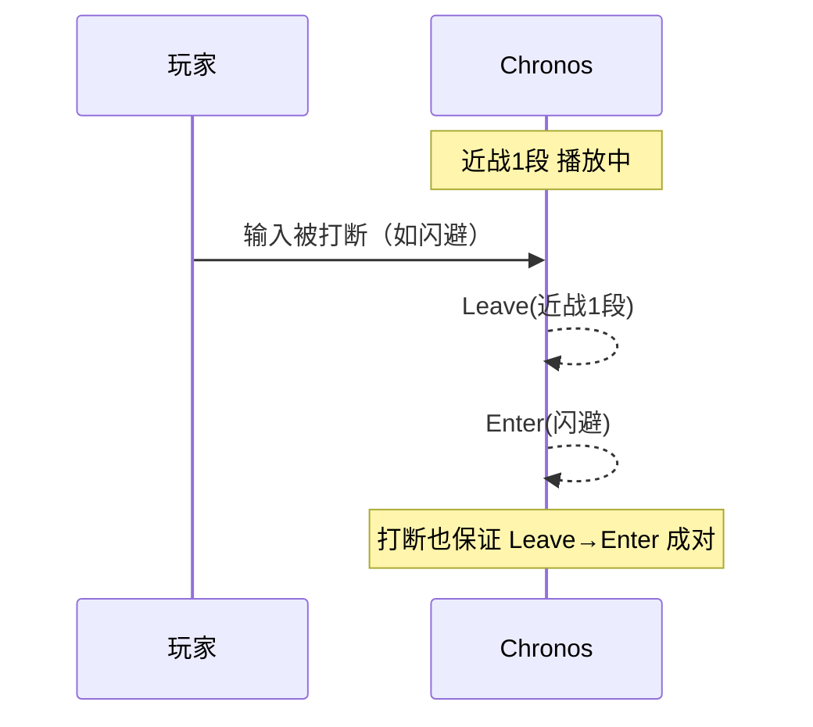

import { Callout } from 'fumadocs-ui/components/callout';
import { Card, Cards } from 'fumadocs-ui/components/card';

## 概述

Chronos 本身是一套由配置驱动的状态机：玩家的攻击、闪避、受击都跑在 `controllers/*.yml` 里。但真实的服务器可能不会只有 Chronos——你往往需要**让别的系统和它对接**：

- 职业插件切换职业时，顺手给玩家换一套动作控制器；
- 怪物的技能命中玩家时，把玩家打进"受击"状态；
- 记分板 / HUD 上实时显示玩家当前在放什么招、冷却还剩多久；
- 你自己的插件在玩家进入某个状态时播个音效、加个 buff。

利用 **Java API**、**Bukkit 事件**、**MythicMobs 机制**和 **PlaceholderAPI 占位符**就能接进来。本章按"我要做什么"来组织，而不是单纯罗列方法签名。

<Callout type="info">
本章的所有 Java 方法都对**未建档的玩家**（离线、重载空窗期、过早调用）做了统一判空——返回 `null` / `0` / 无操作，不会抛 `NullPointerException`。所以你可以放心调用，不必每次都先判断玩家是否已注册。
</Callout>

---

## 拿到 API 入口

一切从这一行开始，它是个静态方法，任何地方都能调：

```java
ChronosAPI api = ChronosAPI.getInstanceAPI();
```

拿到 `api` 之后，就可以调用下面这些方法了。完整接口如下（与源码一致）：

```java
public interface ChronosAPI {

    static ChronosAPI getInstanceAPI() {
        return ChronosPlugin.getChronosAPI();
    }

    Context getPlayerContext(Player player);                 // 玩家的 Aria 脚本上下文
    long    getPlayerCooldown(Player player, String group);  // 某冷却组剩余冷却[ms]

    @Nullable String getPlayerControllerId(Player player);   // 当前控制器ID
    void    setPlayerController(Player player, String id);    // 设置控制器
    void    removePlayerController(Player player);            // 移除控制器

    @Nullable String getPlayerStateId(Player player);         // 当前状态ID
    @Nullable String getPlayerStateGroupId(Player player);    // 当前状态所属组ID

    boolean tryEnterState(Player player, String stateId);                          // 尝试进入状态（走校验）
    void    tryEnterControlledState(Player player, String stateId, double duration); // 进入受控状态
    void    forceEnterStateFromRootChain(Player player, String stateId);           // 强制进入根节点状态
}
```

---

## 管理玩家的控制器

**控制器**就是玩家当前挂载的那套动作规则（对应 `controllers/` 下的一个 yml，也就是[服务端控制器](/docs/chronos/7_controller)）。切换控制器 = 换一整套动作、模型、动画。

| 方法                                | 作用                  | 返回                  |
|-----------------------------------|---------------------|---------------------|
| `getPlayerControllerId(player)`   | 玩家现在挂的是哪个控制器        | `String`，没有则 `null` |
| `setPlayerController(player, id)` | 给玩家挂上指定控制器          | `void`              |
| `removePlayerController(player)`  | 卸掉玩家的控制器（回到无动作系统状态） | `void`              |

最常见的用法：玩家切职业时，同步换一套动作。

```java
public void applyClass(Player player, String className) {
    ChronosAPI api = ChronosAPI.getInstanceAPI();
    switch (className) {
        case "战士"   -> api.setPlayerController(player, "warrior");
        case "法师"   -> api.setPlayerController(player, "mage");
        case "弓箭手" -> api.setPlayerController(player, "archer");
        default        -> api.removePlayerController(player); // 无职业时卸掉
    }
}
```

<Callout type="info">
`setPlayerController` 传入的 `id` 就是 `controllers/` 里的文件名（不含 `.yml`）。如果这个 id 不存在，玩家的控制器会被设为空（等同移除），不会报错——所以传参前最好确认 id 拼写正确。

如果你想让"手持某物品"或"某 PAPI 值"自动切控制器，通常不需要写 Java，用 [setting.yml 的 triggers](/docs/chronos/5_setting) 就够了，它是配置驱动、会周期性重判的。API 更适合"由事件精确触发一次切换"的场景。
</Callout>

---

## 查询玩家现在的状态

想知道玩家此刻在干什么（在放招？在受击？某个技能冷却好了没？），用这三个只读方法。它们不改变任何东西，适合放在条件判断、HUD 刷新里。

| 方法                                 | 作用                   | 返回                  |
|------------------------------------|----------------------|---------------------|
| `getPlayerStateId(player)`         | 当前**状态**ID（如 `近战1段`） | `String`，空闲时 `null` |
| `getPlayerStateGroupId(player)`    | 当前状态所属的**组**（如 `攻击`） | `String`，空闲时 `null` |
| `getPlayerCooldown(player, group)` | 指定冷却组还剩多少毫秒          | `long`，无冷却返回 `0`    |

判断"玩家是不是正在攻击"时，**优先看组而不是看具体状态ID**——组更稳定，加了新攻击动作也不用改判断逻辑：

```java
public boolean isAttacking(Player player) {
    ChronosAPI api = ChronosAPI.getInstanceAPI();
    return "攻击".equals(api.getPlayerStateGroupId(player));
}

// 冷却还剩几秒
public double dashCooldownSeconds(Player player) {
    long ms = ChronosAPI.getInstanceAPI().getPlayerCooldown(player, "闪避");
    return ms / 1000.0;
}
```

---

## 主动让玩家进入某个状态

这三个方法会**主动改变玩家的状态**，是外部系统"推玩家一把"的核心手段。它们的区别在于**校验强度**，按从严到松排列：

| 方法                                                   | 会检查什么                         | 用途                                                               |
|------------------------------------------------------|-------------------------------|------------------------------------------------------------------|
| `tryEnterState(player, stateId)`                     | 条件表达式、冷却、`blocked_group` 全走一遍 | 让玩家"合法地"触发一个动作，能被规则拦下（不进任何链，比如进入attack1，就算这个状态在连招链，玩家输入也不会进入下一段） |
| `tryEnterControlledState(player, stateId, duration)` | 只看**霸体**：玩家处于霸体窗口时会失败         | 打玩家进受击/硬直，且尊重霸体保护（同上）                                            |
| `forceEnterStateFromRootChain(player, stateId)`      | 什么都不查，直接进                     | 无视一切强行触发；状态**必须**是连招树根节点（进入链，输入可进行下一段）                           |

### tryEnterState — 走完整校验

返回 `boolean` 告诉你有没有成功。比如给玩家一个"外部触发的技能键"，但你希望它照样受冷却和条件约束：

```java
boolean ok = ChronosAPI.getInstanceAPI().tryEnterState(player, "战吼");
if (!ok) {
    player.sendMessage("§c战吼还在冷却或当前无法施放");
}
```

### tryEnterControlledState — 打玩家进受控状态

**受控状态**指受击、硬直、击飞这类"被动挨打"的状态。`duration` 是持续毫秒数（传 `-1` 用状态自带的时长）。关键点：**玩家正处于霸体窗口时，这次调用会被忽略**——这正是霸体的意义（放大招时不被小怪打断）。

```java
// 怪物近战命中玩家，让玩家硬直 500ms（霸体时自动无效）
public void onMonsterHit(Player player) {
    ChronosAPI.getInstanceAPI().tryEnterControlledState(player, "受击", 500);
}
```

### forceEnterStateFromRootChain — 无视一切强制进入

不检查条件、冷却、组——直接把玩家扔进指定状态。**约束：该状态必须是某条连招树的根节点**（`combo.<状态ID>` 顶层声明过），否则找不到入口。适合"过场处决""剧情强制动作"这种不容拒绝的场合。

```java
// 剧情杀：无视玩家当前在做什么，强制播放处决动作
ChronosAPI.getInstanceAPI().forceEnterStateFromRootChain(player, "处决");
```

<Callout type="warn">
**三者怎么选：**
- 想让规则说了算（该冷却就冷却、该被 block 就 block）→ `tryEnterState`
- 是"外界伤害/控制"打到玩家身上，且要尊重霸体 → `tryEnterControlledState`
- 就是要它发生、不接受失败 → `forceEnterStateFromRootChain`（记得把目标状态挂成连招根节点）
</Callout>

---

## 读写玩家的脚本上下文

每个玩家挂上控制器时，Chronos 会给他建一个独立的 **Aria 上下文**（就是 [Aria 脚本](/docs/chronos/8_aria/1_overview)里 `var.` 命名空间背后的东西）。`getPlayerContext(player)` 把这个上下文取出来，让你的 Java 代码和玩家的动作脚本**共享同一份变量**。

```java
Context ctx = ChronosAPI.getInstanceAPI().getPlayerContext(player);
if (ctx != null) {
    // ctx 就是玩家动作脚本读写 var. 变量所用的同一个上下文，
    // 你可以往里写数据，供 state 的 conditions/execute 表达式读取，
    // 反过来也能读脚本里存进去的值。
}
```

<Callout type="info">
玩家未挂控制器时 `ctx` 为 `null`。
</Callout>

---

## 监听状态事件

Chronos 通过标准 Bukkit 事件广播玩家的状态变化，一共**三个**，用 `@EventHandler` 监听即可。

<Callout type="warn">
这三个事件**都只能观测、不能取消**（它们不实现 `Cancellable`）。它们是"通知你发生了什么"，不是"让你否决它"。想阻止某个状态发生，请用 `conditions` / `blocked_group` / 冷却在配置层拦截，而不是在事件里。
</Callout>

### PlayerEnterStateEvent — 进入状态

```java
@EventHandler
public void onEnter(PlayerEnterStateEvent e) {
    Player player = e.getPlayer();
    String stateId = e.getStateId();
    if ("处决".equals(stateId)) {
        player.getWorld().playSound(player.getLocation(), Sound.ENTITY_PLAYER_ATTACK_CRIT, 1f, 1f);
    }
}
```

### PlayerLeaveStateEvent — 离开状态

```java
@EventHandler
public void onLeave(PlayerLeaveStateEvent e) {
    Player player = e.getPlayer();
    String stateId = e.getStateId(); // 可能为 null
}
```

<Callout type="info">
**Leave 与 Enter 严格成对。** 无论状态是自然播完、被打断、被强制清空，离开时都会补发一次 `PlayerLeaveStateEvent`。哪怕一个动作被另一个动作**打断覆盖**，Chronos 也会先给旧状态发 Leave、再给新状态发 Enter——所以你可以安心地用"Enter 时加特效、Leave 时清特效"这种配对逻辑，不用担心漏配对导致特效残留。`getStateId()` 可能为 `null`（例如控制器被移除时的收尾清空）。
</Callout>



### PlayerControllerChangeEvent — 切换控制器

```java
@EventHandler
public void onControllerChange(PlayerControllerChangeEvent e) {
    Player player = e.getPlayer();
    String controllerId = e.getControllerId(); // null = 控制器被移除
    if (controllerId != null) {
        player.sendMessage("§a已进入动作系统：" + controllerId);
    } else {
        player.sendMessage("§7已退出动作系统");
    }
}
```

`controllerId` 为 `null` 表示玩家的控制器被移除了（回到无动作系统状态）。

---

## 特别注意

Chronos 状态机的内部状态（当前状态、冷却表、上下文）**不是线程安全的**。所有 API 调用都必须在服务器主线程执行。如果你在异步任务里拿到了要处理的玩家，先回投主线程：


