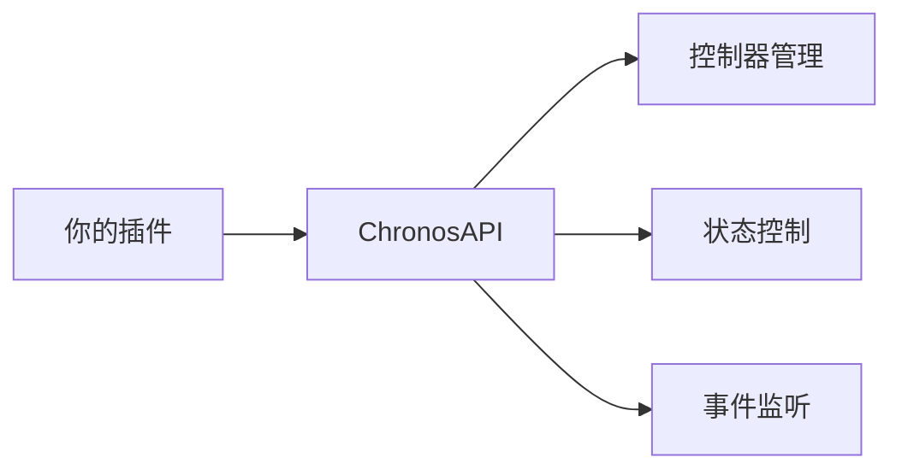

import { File, Folder, Files } from 'fumadocs-ui/components/files';
import { Callout } from 'fumadocs-ui/components/callout';
import { Step, Steps } from 'fumadocs-ui/components/steps';
import { Card, Cards } from 'fumadocs-ui/components/card';

## 概述

Chronos 提供了完整的 Java API，让你可以在自己的插件中集成和扩展动作系统功能。



---

## 获取 API

```java
ChronosAPI api = ChronosAPI.getInstanceAPI();

```

---

## API 接口

### ChronosAPI 完整接口

```java
public interface ChronosAPI {

    static ChronosAPI getInstanceAPI() {
        return ChronosPlugin.getChronosAPI();
    }

    // 获取玩家存档上下文
    Context getPlayerContext(Player player);

    // 获取玩家冷却组剩余冷却时间
    long getPlayerCooldown(Player player, String group);

    // 获取玩家当前控制器ID
    @Nullable
    String getPlayerControllerId(Player player);

    // 设置玩家当前控制器ID
    void setPlayerController(Player player, String controllerId);

    // 移除玩家当前控制器
    void removePlayerController(Player player);

    // 获取玩家当前状态ID
    @Nullable
    String getPlayerStateId(Player player);

    // 获取玩家当前状态组ID
    @Nullable
    String getPlayerStateGroupId(Player player);

    // 尝试进入状态，成功返回true，失败返回false
    boolean tryEnterState(Player player, String stateId);

    // 尝试进入受控状态，若玩家为霸体，该状态将进入失败
    void tryEnterControlledState(Player player, String controlledStateId, double duration);

    // 强行进入状态，不考虑任何条件，注意该状态必须在连招链的根节点声明
    void forceEnterStateFromRootChain(Player player, String stateId);

}
```

---

## API 方法详解

### 控制器管理

| 方法                                | 说明          | 返回值               |
|-----------------------------------|-------------|-------------------|
| `getPlayerControllerId(player)`   | 获取玩家当前控制器ID | `String` 或 `null` |
| `setPlayerController(player, id)` | 为玩家设置控制器    | `void`            |
| `removePlayerController(player)`  | 移除玩家的控制器    | `void`            |

**示例：根据职业设置控制器**

```java
public void setPlayerClass(Player player, String className) {
    ChronosAPI api = ChronosAPI.getInstanceAPI();
    
    switch (className) {
        case "战士":
            api.setPlayerController(player, "warrior");
            break;
        case "法师":
            api.setPlayerController(player, "mage");
            break;
        case "弓箭手":
            api.setPlayerController(player, "archer");
            break;
    }
}
```

---

### 状态查询

| 方法                                 | 说明            | 返回值               |
|------------------------------------|---------------|-------------------|
| `getPlayerStateId(player)`         | 获取玩家当前状态ID    | `String` 或 `null` |
| `getPlayerStateGroupId(player)`    | 获取玩家当前状态组ID   | `String` 或 `null` |
| `getPlayerCooldown(player, group)` | 获取冷却组剩余时间(ms) | `long`            |

**示例：检查玩家是否在攻击状态**

```java
public boolean isPlayerAttacking(Player player) {
    ChronosAPI api = ChronosAPI.getInstanceAPI();
    String group = api.getPlayerStateGroupId(player);
    return "攻击".equals(group);
}
```

---

### 状态控制

| 方法                                                   | 说明           | 返回值       |
|------------------------------------------------------|--------------|-----------|
| `tryEnterState(player, stateId)`                     | 尝试进入状态（检查条件） | `boolean` |
| `tryEnterControlledState(player, stateId, duration)` | 尝试进入受控状态     | `void`    |
| `forceEnterStateFromRootChain(player, stateId)`      | 强制进入状态       | `void`    |

**示例：让玩家进入受击状态**

```java
// MythicMobs 技能或其他插件中
public void onPlayerHit(Player player, double damage) {
    ChronosAPI api = ChronosAPI.getInstanceAPI();
    
    // 尝试让玩家进入受击状态，持续500ms
    // 如果玩家处于霸体状态，则不会进入
    api.tryEnterControlledState(player, "受击", 500);
}
```

**示例：强制触发技能**

```java
// 通过其他系统触发技能
public void castUltimate(Player player) {
    ChronosAPI api = ChronosAPI.getInstanceAPI();
    
    // 强制进入终极技能状态，无视所有条件
    // 注意：该状态必须在连招链的根节点声明
    api.forceEnterStateFromRootChain(player, "终极技能");
}
```

<Callout type="warn">
**`tryEnterState` vs `forceEnterStateFromRootChain`：**
- `tryEnterState`：会检查条件、冷却、blocked_group 等
- `forceEnterStateFromRootChain`：无视所有条件强制进入，但状态必须在 combo 根节点声明
</Callout>

---

### 上下文管理

| 方法                         | 说明                | 返回值       |
|----------------------------|-------------------|-----------|
| `getPlayerContext(player)` | 获取玩家的 Glimmer 上下文 | `Context` |

**示例：读取自定义变量**

```java
public int getPlayerComboCount(Player player) {
    ChronosAPI api = ChronosAPI.getInstanceAPI();
    Context ctx = api.getPlayerContext(player);

}
```

---

## 事件系统

Chronos 提供了三个核心事件，可以通过 Bukkit 事件系统监听。

### PlayerEnterStateEvent

玩家进入状态时触发。

```java
public class PlayerEnterStateEvent extends Event {

    @Getter
    private final Player player;

    @Getter
    private final String stateId;

}
```

**监听示例：**

```java
@EventHandler
public void onEnterState(PlayerEnterStateEvent event) {
    Player player = event.getPlayer();
    String stateId = event.getStateId();

}
```

---

### PlayerLeaveStateEvent

玩家离开状态时触发。

```java
public class PlayerLeaveStateEvent extends Event {

    @Getter
    private final Player player;

    @Getter @Nullable
    private final String stateId;

}
```

**监听示例：**

```java
@EventHandler
public void onLeaveState(PlayerLeaveStateEvent event) {
    Player player = event.getPlayer();
    String stateId = event.getStateId();

}
```

---

### PlayerControllerChangeEvent

玩家控制器切换时触发。

```java
public class PlayerControllerChangeEvent extends Event {

    @Getter
    private final Player player;

    @Getter @Nullable
    private final String controllerId;

}
```

**监听示例：**

```java
@EventHandler
public void onControllerChange(PlayerControllerChangeEvent event) {
    Player player = event.getPlayer();
    String controllerId = event.getControllerId();
    
    if (controllerId != null) {
        player.sendMessage("§a已切换到控制器: " + controllerId);
    } else {
        player.sendMessage("§c已移除控制器");
    }
}
```

---

## 集成示例

### 与 MythicMobs 集成

让怪物技能触发玩家受控状态：

```yaml
# MythicMobs 技能配置
击飞技能:
  Skills:
  - chronosControlledState{state=击飞;duration=800} @target
```

### 与职业插件集成

根据职业切换控制器：

```java
public class ClassChangeListener implements Listener {
    
    @EventHandler
    public void onClassChange(PlayerClassChangeEvent event) {
        Player player = event.getPlayer();
        String newClass = event.getNewClass();
        
        ChronosAPI api = ChronosAPI.getInstanceAPI();
        api.setPlayerController(player, newClass.toLowerCase());
    }
}
```

---

## 注意事项

<Callout type="warn">
**线程安全：** Chronos API 应该在主线程中调用。如果从异步任务中调用，请使用 `Bukkit.getScheduler().runTask()` 包装。
</Callout>

<Callout type="info">
**依赖声明：** 在你的 `plugin.yml` 中添加依赖：

```yaml
depend: [ArcartX_Chronos]
# 或者软依赖
softdepend: [ArcartX_Chronos]
```
</Callout>
