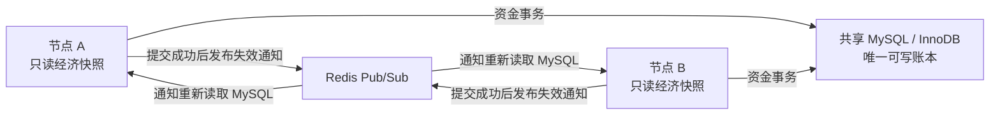

import { Callout } from 'fumadocs-ui/components/callout';

跨服模式使用共享 MySQL 保存余额，Redis 负责通知其他服务器刷新缓存。

## 架构



## 完整配置

所有子服必须使用相同 Rondo 版本、同一 MySQL 数据库、同一 Redis 逻辑库与通道：

```yaml
storage:
  type: mysql
  mysql:
    host: db.internal
    port: 3306
    database: rondo
    username: rondo
    password: "change-me"
    ssl-mode: VERIFY_IDENTITY
    allow-public-key-retrieval: false
    pool-size: 10

cross-server:
  enabled: true
  redis:
    host: redis.internal
    port: 6379
    username: rondo
    password: "change-me"
    database: 0
    ssl: true
    timeout-millis: 3000
    pool-size: 8
  sync-channel: "rondo:sync"
```

<Callout type="warn">
跨服模式必须使用 MySQL。所有节点需要使用相同版本、数据库和 Redis 通道。
</Callout>

---

## 常见故障

| 故障                  | 行为                           |
|---------------------|------------------------------|
| 启动时 MySQL/Redis 不可用 | 跨服模式不会启动                     |
| 运行中 Redis 不可用       | MySQL 仍可写入；失效通知异步发布并最多重试 5 次 |
| 运行中 MySQL 不可用       | 余额操作失败                       |

Redis 通知不承载余额，只让远端节点重新读取 MySQL。连续重试仍失败时，本次通知可能丢失；远端快照会等待后续同账户通知，或在 Redis 重新订阅后通过在线玩家校准恢复。控制台出现连续发布失败时应按故障处理，不应把 Redis 长时间离线视为正常降级模式。

部署后请在两台子服间测试余额刷新、转账和兑换确保验证联通成功。
