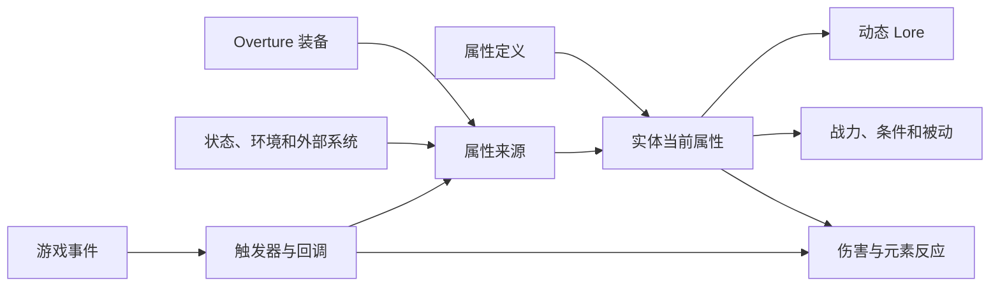

import { Callout } from 'fumadocs-ui/components/callout';

Symphony 是面向 Spigot/Paper 服务器的 RPG 属性与装备插件。服主可以用 YAML 配置属性、伤害类型、套装、词条、宝石、强化、物品技能和战力。

- 开源地址：[17Artist/Symphony](https://github.com/17Artist/Symphony)
- 开源协议：[Apache-2.0](https://github.com/17Artist/Symphony/blob/main/LICENSE)

成品物品由 Overture 创建。Symphony 读取物品中的 `symphony:*` 组件和实例数据，计算玩家当前属性，再把结果用于伤害、套装、技能、界面与动态 Lore。

## 各部分如何配合

| 名词              | 含义                                | 详细说明                                                     |
|-----------------|-----------------------------------|----------------------------------------------------------|
| 属性              | 可以参与计算的数值，例如物理攻击、暴击率或火焰抗性         | [属性模型](/docs/symphony/03_attribute_model)                |
| Modifier        | 对属性进行加法或倍率运算的一项数据                 | [属性模型](/docs/symphony/03_attribute_model#三种-modifier-运算) |
| 属性来源            | 一件装备、一个状态或外部插件写入的一组属性             | [装备与其它属性来源](/docs/symphony/04_attribute_sources)         |
| 伤害通道            | 独立结算的一类伤害，例如物理、火焰或奥术              | [伤害结算](/docs/symphony/15_damage_pipeline)                |
| 物品组件            | Overture 物品中以 `symphony:*` 命名的配置块 | [Overture 物品配置](/docs/symphony/08_overture_items)        |
| `LevelProvider` | 由其它插件实现的等级读取接口                    | [接入现有等级系统](/docs/symphony/21_level_providers)            |

## 建议阅读顺序

第一次配置时，按下面的顺序即可完成一件能参与战斗的装备：

1. [安装与快速开始](/docs/symphony/02_installation)
2. [属性模型](/docs/symphony/03_attribute_model)
3. [装备与其它属性来源](/docs/symphony/04_attribute_sources)
4. [触发器、条件与 Action](/docs/symphony/06_triggers_conditions_actions)
5. [回调与 Aria 脚本](/docs/symphony/07_callbacks_scripts)
6. [Overture 物品配置](/docs/symphony/08_overture_items)
7. [伤害结算](/docs/symphony/15_damage_pipeline)

