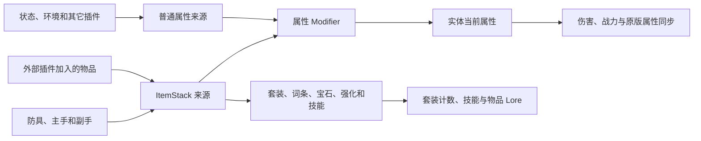

属性来源是一组可以整体更新或移除的数据。头盔、主手、状态效果和外部装备槽都会使用不同的来源，因此取下一件物品时，不会误删其它装备提供的属性。



## 自动读取的装备

Symphony 会读取下列位置：

| 位置 | 内部键                   |
|----|-----------------------|
| 头盔 | `equipment:head`      |
| 胸甲 | `equipment:chest`     |
| 护腿 | `equipment:legs`      |
| 靴子 | `equipment:feet`      |
| 主手 | `equipment:main_hand` |
| 副手 | `equipment:off_hand`  |

背包操作、切换快捷栏、交换主副手、物品损坏、死亡和重生都会触发装备检查。短时间内连续发生的操作会按 `equipment.coalesce-ticks` 合并

## 副手设置

`equipment.offhand.mode` 决定副手是否生效：

| 模式                | 属性数值                     | 套装与技能 |
|-------------------|--------------------------|-------|
| `disabled`        | 不读取                      | 不生效   |
| `full`            | 读取 100%                  | 完整生效  |
| `scaled`          | 按全局 `attribute-scale` 读取 | 完整生效  |
| `item-controlled` | 物品必须允许副手，并使用物品自己的比例      | 完整生效  |

物品自己的副手设置写在 Overture 组件中：

```yaml
components:
  symphony:offhand:
    enabled: true
    attribute-scale: 50%
```

比例只缩放 Modifier 数值。例如副手提供 `physical_damage +20`，读取比例为 25% 时，实际增加 `5`。套装件数和技能不会变成“四分之一个”；副手被允许后会完整计入。

## 外部 ItemStack

附属插件可以把额外装备槽、饰品栏或角色装备中的 ItemStack 加入 Symphony。外部物品与正常装备使用相同规则，可以包含：

- 固定属性；
- 词条与宝石；
- 强化等级；
- 套装部位；
- 一项或多项物品技能。

因此套装不只计算四件防具和主手。启用的副手以及任意数量的外部 ItemStack 都可以增加套装件数。

每个外部槽位应使用固定的 `AttributeSourceKey`：

```kotlin
val source = AttributeSourceKey("myplugin", "relic-slot-1")
api.sources.replaceSourceFromItem(player, source, itemStack)

// 槽位清空时使用相同的 key
api.sources.removeSource(player, source)
```

## 普通属性来源

不需要物品能力时，可以直接写入 Modifier，或使用文本格式：

```text
symphony:max_health ADD 100
symphony:critical_chance ADD 8%
symphony:movement_speed MULTIPLY_TOTAL 5%
```

文本每行格式为 `<完整属性 ID> <operation> <value>`。它只提供属性，不参与套装、词条、宝石、强化和物品技能。

API 写入结果分为：

| 结果          | 含义             |
|-------------|----------------|
| `Applied`   | 新内容已经生效        |
| `Unchanged` | 内容没有变化         |
| `Rejected`  | 内容无效，继续使用原来的数据 |

单个来源最多包含 1024 个 Modifier。文本接口最多接受 512 行，每行最多 512 个字符。

## 同步到原版属性

只有四项属性会同步到 Bukkit：

| Symphony 属性            | 同步方式               | 不接管时的值  |
|------------------------|--------------------|---------|
| `max_health`           | 调整到目标值             | 等于属性基础值 |
| `movement_speed`       | 调整到目标值             | 等于属性基础值 |
| `knockback_resistance` | 调整到目标值，并限制在 `0..1` | 等于属性基础值 |
| `attack_speed`         | 在现有攻击速度上乘算         | `1.0`   |

Symphony 只修改自己创建的 Bukkit Modifier，不会删除药水、原版装备或其它插件添加的数值。

### 攻击速度

`attack_speed: 1.0` 表示不改变当前攻击速度，`1.2` 表示在当前结果上乘以 `1.2`：

```yaml
components:
  symphony:attributes:
    attack_speed:
      operation: add
      value: 20%
      description: 攻击速度提高 20%
```

不要再用 Overture 的原版 `generic_attack_speed` 配置同一份加成，否则两套数值会同时生效。

### 物理防御

`physical_defense` 不会写入原版 armor。它只参与 Symphony 的物理减伤公式，详见[伤害结算](/docs/symphony/15_damage_pipeline#物理防御)。

## 物品显示何时更新

装备或外部 ItemStack 变化后，属性、套装和技能会一起重新读取。Overture 会刷新背包、装备栏和光标中的相关物品；套装件数与外部槽位的刷新规则统一在[套装显示](/docs/symphony/09_sets#显示与刷新)中说明。
