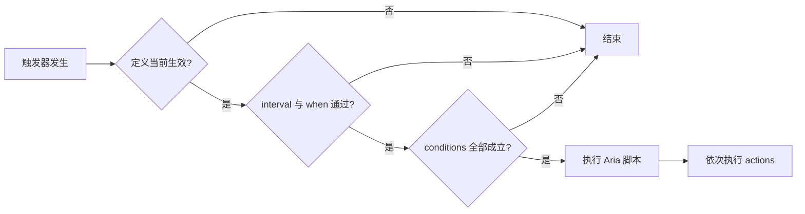

回调可以写在属性、词条、套装档位、物品技能、状态、共鸣、天赋或环境定义中。定义只有在对应物品或效果生效时，里面的回调才会参与触发。



触发器、条件和 Action 的可用类型见[触发器、条件与 Action](/docs/symphony/06_triggers_conditions_actions)。只有结构化配置无法表达的逻辑才需要 Aria。

## 回调的组成

```yaml
callbacks:
  arcane_notice:
    trigger: combat.damage_taken
    priority: 30
    when:
      role: victim
      channels:
        - arcane
      in_combat: true
    conditions:
      - type: attribute
        attribute: arcane_resistance
        operator: '>='
        value: 25%
        target: self
      - type: cooldown
        key: arcane_notice
        duration-ms: 2000
    actions:
      - type: message
        target: self
        message: '受到 {amount} 点伤害，来源 {attacker}'
```

回调至少需要 `script`、`file` 或非空 `actions` 中的一种。`script` 和 `file` 不能同时出现。

## 回调只在所有者生效时运行

相同配置放在不同定义中，激活规则不同：

| 所有者      | 何时视为激活                    |
|----------|---------------------------|
| 属性       | 正在计算这个属性；其它触发器中该属性定义始终可参与 |
| 套装 bonus | 对应套装档位已经激活                |
| 词条       | 实体某个有效物品来源中存在该词条          |
| 技能回调     | 本次触发的技能 ID 与定义一致          |
| 状态       | 实体当前具有该状态                 |
| 环境       | 实体当前满足该环境                 |
| 共鸣、天赋    | 对应被动条件当前满足                |

词条回调会额外注入生成物品时冻结的参数与 `level`；状态会注入 `stacks`；套装会注入 `setId`、`threshold`。定义存在但所有者未激活时，回调不会执行。

## `when` 与 `interval`

`when` 是回调级的快速筛选，只支持三个维度：

```yaml
when:
  role: attacker       # attacker、victim 或 self
  channels:
    - fire
    - arcane
  in_combat: true
```

- `role` 检查当前 `self` 在本次战斗中的角色。
- `channels` 与本次通道集合有任意交集即可。
- `in_combat` 比较实体当前战斗状态。

`interval` 使用 tick，按“回调 + 实体”限频，适合 `entity.timer`：

```yaml
callbacks:
  periodic_heal:
    trigger: entity.timer
    interval: 100
    actions:
      - type: heal
        amount: 5
        target: self
```

`performance.timer-bucket-ticks` 决定 timer 扫描频率，`interval` 决定某个回调实际允许执行的最短间隔。两者都不是精确到毫秒的实时计时器。

## 回调中可以使用的数据

`self` 永远存在，`target` 取决于触发器。属性计算、加入、离开和 entity.timer 等单实体触发器通常没有 target；当前 `status.tick` 会把 target 设为状态持有者自身。伤害、实体交互和单目标技能则可能提供另一个实体。

不要把注释中的裸 `target` 当作脚本变量。Aria 中使用 `ctx.target`：

```yaml
callbacks:
  calculate:
    trigger: attribute.calculate
    script: |-
      // 此触发器没有目标实体
      return ctx.standardValue + self.getAttribute("luck") * 0.1
```

| 变量                                            | 内容                                                           |
|-----------------------------------------------|--------------------------------------------------------------|
| `self`                                        | `ScriptSelfFacade`；读取属性、发消息、治疗、造成 Symphony 伤害、取得原始 Bukkit 实体 |
| `ctx.target`                                  | 可空的对方实体                                                      |
| `ctx.attacker` / `ctx.victim`                 | 本次战斗的攻击者和受击者                                                 |
| `ctx.amount` / `ctx.channel` / `ctx.channels` | 当前伤害数量与通道                                                    |
| `ctx.standardValue` / `ctx.attribute`         | 属性计算时的基础值和属性 ID                                              |
| `ctx.level` / `ctx.stacks`                    | 词条、物品技能或状态注入的数据                                              |
| `ctx.get(key)`                                | 读取该触发器额外提供的类型化值                                              |

消息和命令支持在长字符串中嵌入多个 `{placeholder}`。数值字段只接受数字、百分比或单独一个 `{placeholder}`，不能写算术表达式；复杂运算放到 Aria 中。

## Aria 文件与返回值

内联脚本写在 `script: |-`，外部脚本写在 `plugins/Symphony/scripts/` 并通过相对路径引用：

```yaml
callbacks:
  execute:
    trigger: combat.attack_prepare
    file: callbacks/weapon-check.aria
```

路径不能越出 scripts 目录，单个脚本最多 1 MiB。`/sym validate` 只检查回调 YAML 结构与相对路径；`/sym reload` 会读取并编译全部 Aria 文件。回调触发时不会临时编译脚本。

返回值由触发器策略决定：

- `attribute.calculate` 必须返回有限数字；最后一个非空数字成为计算值。
- 可取消触发器中返回 `false` 会取消本次操作。
- 通知型触发器通常忽略返回值。
- 技能主体脚本返回 `false` 时，不进入冷却，也不会发送确认事件。

结构化 actions 自身不生成布尔返回值，因此要主动取消 prepare 操作时，需要使用返回 `false` 的 Aria 脚本或 Bukkit 可取消事件。

## 执行顺序、递归与故障隔离

同一触发器的回调按 `priority`、所有者定义 ID 和完整回调 ID 排序。数字越小越先执行。

系统保护包括：

- 同一回调不能在自己的调用栈中再次进入；
- 触发器递归深度最多 8 层；
- 一次触发最多调用 256 个回调；
- 伤害回调还受 `combat.max-transaction-depth` 限制；
- 慢于 `scripts.slow-callback-warning-ms` 的 Aria 回调写入警告日志；
- 默认 60 秒内失败 5 次会自动停用对应完整回调 ID。

使用 `/sym callback failures` 查看失败，用 `/sym callback enable <完整回调ID>` 清除熔断并启用，或用 `/sym callback disable <完整回调ID>` 手动停用。
