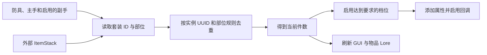

套装定义放在 `items/sets/`。定义中需要写出套装名称、每个部位的名称，以及达到不同件数时获得的效果。

Overture 物品通过 `symphony:set` 指定自己属于哪个套装和部位：

```yaml
components:
  symphony:set:
    id: elemental_vanguard
    piece: main_hand
    amount: 1
```

`piece` 必须在套装的 `display.pieces` 中存在。

## 件数如何计算



`counting.mode: active_item_sources` 会统计：

- 四件防具；
- 主手；
- 按配置启用的副手；
- 通过 `replaceSourceFromItem` 加入的任意数量外部物品。

所以套装可以超过传统的四件或五件。四件防具、主手和三个外部徽记可以组成八件套。

两个去重选项控制异常重复：

| 配置                                | 作用                       |
|-----------------------------------|--------------------------|
| `duplicate-instance: once`        | 同一个物品实例 UUID 被重复加入时只计算一次 |
| `allow-duplicate-piece-id: false` | 不允许多个物品重复计算同一个部位 ID      |

## 完整定义

```yaml
schema: 1
id: elemental_vanguard

display:
  name: 元素先锋
  pieces:
    head: 先锋冠冕
    chest: 先锋胸甲
    legs: 先锋护腿
    feet: 先锋战靴
    main_hand: 元素长刃
    sigil_fire: 炎之先锋徽记
    sigil_ice: 霜之先锋徽记
    sigil_storm: 雷之先锋徽记

counting:
  mode: active_item_sources
  duplicate-instance: once
  allow-duplicate-piece-id: false

bonuses:
  2:
    display:
      name: 三相守御
      description:
        - 火焰、冰霜与雷电抗性各提高 10%
    modifiers:
      fire_resistance:
        operation: add
        value: 10%
      ice_resistance:
        operation: add
        value: 10%
      lightning_resistance:
        operation: add
        value: 10%

  4:
    display:
      name: 元素壁垒
      description:
        - 获得 80 点护盾容量
        - 元素精通提高 60 点
    modifiers:
      shield_capacity:
        operation: add
        value: 80
      elemental_mastery:
        operation: add
        value: 60

  6:
    display:
      name: 元素反制
      description:
        - 格挡后对攻击者造成冰霜伤害并施加元素暴露
    callbacks:
      elemental_counter:
        trigger: combat.block_confirmed
        conditions:
          - type: cooldown
            key: elemental_counter
            duration-ms: 3000
        actions:
          - type: damage
            channel: ice
            amount: 18
            target: attacker
```

`display.pieces` 左侧是物品配置使用的部位 ID，右侧是玩家看到的名称。每个 `bonuses.<件数>.display` 都需要名称和说明，GUI 与 Lore 会用它们解释该档效果。

## 档位效果

玩家达到一个档位后，该档的 Modifier 和回调都会生效。高档位不会替换低档位：

- 2 件时启用 2 件效果；
- 4 件时同时启用 2 件和 4 件效果；
- 件数降到 3 时只保留 2 件效果。

如果一次装备变化跨过多个档位，`SourceUpdateResult.setThresholdChanges` 会列出全部变化，附属插件可以据此播放提示或动画。

## 显示与刷新

在 Overture Lore 中加入：

```yaml
lore:
  - '<symphony:set...>'
```

该标签显示套装名称、当前件数、部位名称和各档效果，不会显示内部 ID。能够取得玩家数据时显示实时件数；只生成物品模板时显示“穿戴后显示进度”。具体行格式在 `display.yml` 的 `set` 区域配置。

下面这些变化都会刷新套装显示：

- 穿上、取下或替换普通装备；
- 切换主手或副手；
- 加入、替换或移除外部 ItemStack；
- 从地上拾取套装物品；
- 套装物品停留在光标上时，玩家的总件数发生变化。
