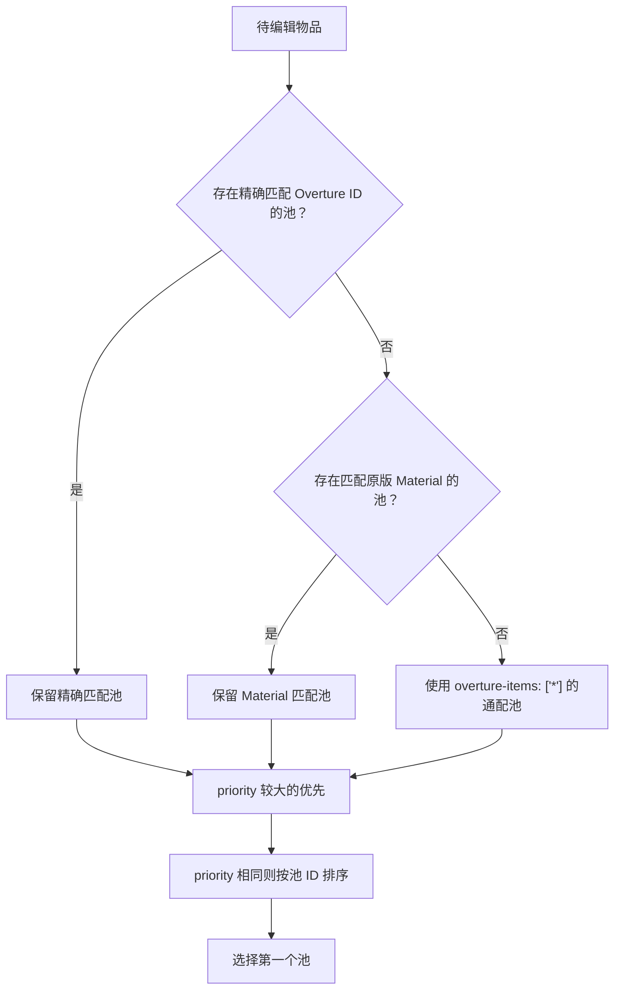

词条由两部分组成：词条定义写明抽到后的数值与效果，词条池决定可抽取的物品、权重、等级范围、数量上限和材料消耗。抽取结果会保存在物品上，战斗时不会重新随机。

## 词条定义

```yaml
schema: 1
id: thunder_strike
name: 雷霆一击
rarity: rare
category: weapon
max-level: 3
tags:
  - offense
  - lightning
exclusive-group: elemental_strike
display:
  description:
    - '被动：每次普通攻击附带 {damage|number} 点雷电伤害。'
    - '命中后有 {chance|percent} 几率再追加 {damage|number} 点雷电伤害，冷却 2 秒。'
levels:
  1:
    chance: 0.10
    damage: 15
  2:
    chance: 0.15
    damage: 25
  3:
    chance: 0.20
    damage: 40
passive:
  lightning_damage:
    operation: add
    value: '{damage}'
callbacks:
  strike:
    trigger: combat.attack_confirmed
    conditions:
      - type: chance
        value: '{chance}'
      - type: cooldown
        key: thunder_strike
        duration-ms: 2000
    actions:
      - type: damage
        channel: lightning
        amount: '{damage}'
        target: target
```

`levels` 中除保留字段 `modifiers` 外，其它键必须是有限数字，会在抽取时保存进实例的 `parameters`。`{chance}`、`{damage}` 等占位符随后可以用于 passive、conditions 和 actions。

`display.description` 是玩家看到的词条效果说明。每一行都可以读取这件物品已经保存的词条参数，并可用格式后缀控制输出：

- `{damage|number}` 输出普通数字；
- `{chance|percent}` 把 `0.15` 输出为 `15%`；
- `{level|integer}` 输出词条等级整数；
- 不写后缀时等同于 `number`。

描述引用的参数必须存在于每一个 `levels` 档位，否则 `/sym validate` 会拒绝定义。这样不会出现一级词条能显示、三级词条却把 `{damage}` 原样漏给玩家的情况。`display.description` 会同时进入 Overture 动态 Lore、词条位置卡和操作预览。

`passive` 是词条在持有者身上持续提供的 modifier。如果没有全局 passive，也可以在每个等级中使用 `modifiers`，让不同等级拥有完全不同的属性结构。

`tags` 会进入物品实例，可用于宝石/共鸣等数据驱动条件。`exclusive-group` 表示互斥组；一个物品不会同时生成两个相同互斥组的词条。

## 生成后为什么不会跟着定义改变

抽取时会把以下数据写入 Overture 实例：

- 完整词条 ID 和友好名称；
- 词条等级；
- 这一等级的参数数字；
- tags；
- 已解析的 modifier；
- 锁定状态。

之后修改 `levels.2.damage` 不会改写已经生成的二级词条。要使用新数值，需要替换或重新生成词条。修改 `display.description` 只会改变显示文字；旧物品重建 Lore 后会使用新文字，但数值仍取自物品保存的参数。

## 词条池

```yaml
schema: 1
id: default_weapon
priority: 20
applies-to:
  overture-items:
    - arcane_blade
    - frost_blade
  materials:
    - NETHERITE_SWORD
max-affixes: 3
cost:
  material: LAPIS_LAZULI
  amount: 3
entries:
  - affix: thunder_strike
    weight: 3
    min-level: 1
    max-level: 2
  - affix: arcane_echo
    weight: 1
    min-level: 2
    max-level: 3
```

词条池按下图选择：



每次只选择一个词条池，不会把多个池合并。`weight` 只在该池的可抽取词条之间比较，不是百分比；3 和 1 表示约 75% 与 25%。

已经存在的词条 ID 和互斥组会从抽取范围中排除。没有可抽取词条时，操作会被拒绝，也不会扣除材料。

## 工坊操作

词条界面提供：

| 操作    | 目标                                 | 是否使用词条池 |
|-------|------------------------------------|---------|
| 添加    | 在第一个可用空位置加入随机词条，不能超过 `max-affixes` | 是       |
| 替换    | 替换玩家当前选择的未锁定词条                     | 是       |
| 锁定/解锁 | 切换玩家当前选择位置的锁定状态                    | 否       |
| 移除    | 删除玩家当前选择的未锁定词条                     | 否       |

替换会先触发旧词条的 `AffixRemoveEvent`，再触发新词条的 `AffixApplyEvent`。任一事件取消都会终止操作。添加只触发 Apply，移除只触发 Remove。

右侧位置卡覆盖词条池允许的全部容量。添加时必须选择紧接现有列表之后的第一个空位置；替换、锁定和移除则直接使用当前选择的位置。删除一个词条后，后续实例会向前补位。

材料需要放入词条界面的操作材料槽，系统不会扫描整个背包。服务端会在确认时重新检查物品、词条池、互斥组、数量上限和材料；失败时不会修改目标物品或扣除材料。通用工坊操作流程见[GUI 与物品编辑界面](/docs/symphony/25_gui#一次操作如何完成)。

## 调试

`/sym item inspect` 会列出词条数量；词条编辑页显示每个位置的名称、等级、锁定状态和效果说明。需要确认概率回调是否触发时，可结合 `/sym callback failures`、伤害观察器和对应触发器提供的数据排查。
