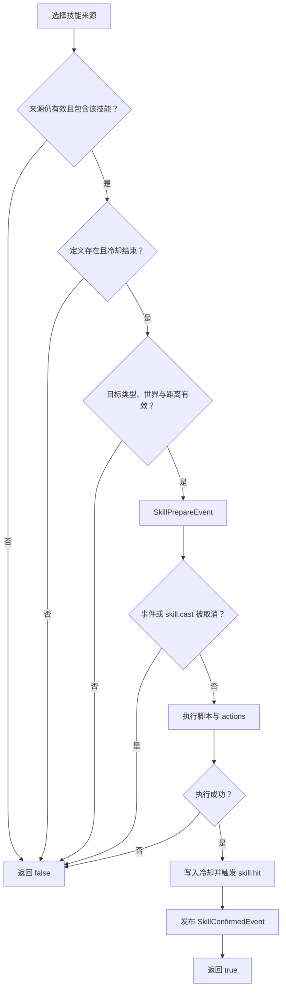

物品技能随装备来源一起生效。实体当前有效的 ItemStack 来源带有 `symphony:skills` 组件时，便会获得对应技能；物品离开来源后，技能也随之失效。技能可以绑定右键等内置操作，也可以由回调或附属插件通过 API 施放。

## 定义技能

文件放在 `skills/`：

```yaml
schema: 1
id: prismatic_burst
provider: symphony:aria
name: 三相爆发
description: 连续造成火焰、冰霜与雷电伤害，并施加元素暴露
cooldown-ms: 8000
max-level: 3
targeting:
  type: single_enemy
  range: 16
activation:
  input: right_click
  source: main_hand
  cancel-event: on_success
  priority: 100
actions:
  - type: damage
    channel: fire
    amount: 12
    target: target
  - type: damage
    channel: ice
    amount: 12
    target: target
  - type: damage
    channel: lightning
    amount: 12
    target: target
  - type: status
    status: elemental_exposure
    stacks: 2
    duration-ms: 8000
    target: target
  - type: particle
    particle: ELECTRIC_SPARK
    count: 20
    offset-x: 0.4
    offset-y: 0.8
    offset-z: 0.4
    target: target
```

`provider` 是定义元数据，默认 `symphony:aria`。当前执行体由预编译 Aria 脚本和结构化 actions 组成。若同时配置脚本和 actions，脚本先运行；脚本返回 false 时整次施放失败，actions 不执行，也不写入冷却。

## 玩家如何触发

`activation` 是可选配置。不写时，技能不会占用任何玩家按键，只能由 `SkillService.cast`、其它回调 action 或附属插件触发。

```yaml
activation:
  input: sneak_right_click
  source: any
  cancel-event: on_success
  priority: 90
```

字段含义：

| 字段             | 可用值                               | 行为                                                             |
|----------------|-----------------------------------|----------------------------------------------------------------|
| `input`        | `right_click`、`sneak_right_click` | 普通右键，或按住潜行时右键                                                  |
| `source`       | `main_hand`                       | 只有当前主手来源提供该技能时匹配主手右键                                           |
| `source`       | `off_hand`                        | 只有当前副手来源提供该技能时匹配副手右键                                           |
| `source`       | `any`                             | 技能可来自防具、手持物或 API 注入的任意有效 ItemStack 来源；一次手势只从主手交互事件处理，避免双手各施放一次 |
| `cancel-event` | `never`                           | 不取消原本的 Bukkit 交互                                               |
| `cancel-event` | `on_success`                      | 仅技能成功施放时取消原交互                                                  |
| `cancel-event` | `always`                          | 技能匹配后，即使冷却、缺少目标或施放失败也取消原交互                                     |
| `priority`     | 整数                                | 多个技能争用同一输入时，数字更大的先取得该次输入                                       |

同一次操作匹配多个技能时，先按 `priority` 从高到低排序，再按装备位置和技能 ID 确定顺序，只触发第一项。该技能仍在冷却时会提示剩余时间，不会改为触发低优先级技能。

`self` 直接以施法者为目标。对着生物右键时，会尝试把该实体作为 `single_enemy` 或 `single_ally`；对空气或方块右键时，会在 `targeting.range` 内沿玩家视线寻找实体。找到后仍会检查目标类型、所在世界和距离。

## 绑定到 Overture 物品

```yaml
components:
  symphony:skills:
    prismatic_burst:
      level: 3
```

技能等级保存在对应物品数据中，脚本和触发器可以通过 `level` 读取。删除或替换该物品后，技能立即失效。

四件防具、主手、副手和 `replaceSourceFromItem` 注入的额外物品都能提供技能。多个来源可提供同一个技能，它们分别拥有冷却。

## 施放顺序

`SkillService.cast` 必须在 Bukkit 主线程调用。一次施放会经过以下检查：



功能开关关闭时也会直接返回 `false`。施放过程中不会读取或扣除法力。

## 精确指定来源

只按技能 ID 施放时，服务会选择排序后的第一个有效来源。需要区分两把同技能武器时，应使用带 source 的重载：

```kotlin
val source = AttributeSourceKey("equipment", "main_hand")
val skill = NamespacedKey("symphony", "prismatic_burst")
val success = api.skills.cast(player, source, skill, target)
```

`SkillPrepareEvent` 与 `SkillConfirmedEvent` 都能取得 source、技能等级和 Overture item ID，附属插件可以据此扣除自己的资源、播放 UI 或记录统计。若技能需要消耗其它插件的资源，应在调用 `cast` 前预先检查并暂扣；`cast` 返回 false 时再归还。

## 冷却与显示

冷却只存在于运行时内存，key 为实体 UUID、属性来源和技能 ID。插件关闭时清除。

`/sym menu attributes` 的“物品技能”分区显示当前有效技能的说明、来源类型、等级、目标、内置触发方式和冷却；没有 `activation` 时明确显示“仅能由 API 或其它插件施放”。界面本身不直接施法，也不显示内部物品 ID。

Overture Lore 使用 `<symphony:skills...>`。`display.yml` 可分别配置 `skill.line`、`skill.description` 和 `skill.activation`，玩家拿到物品时便能知道技能效果以及应当如何触发。
