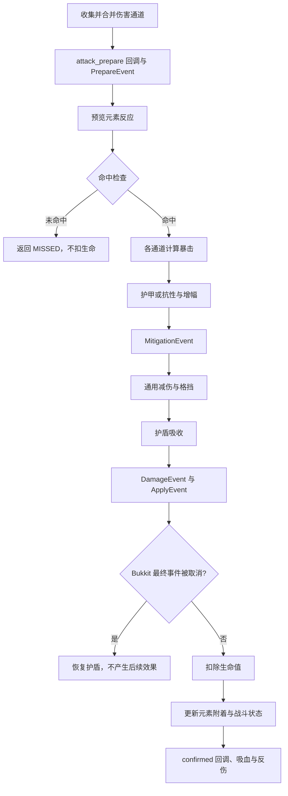

import { Callout } from 'fumadocs-ui/components/callout';

Symphony 通过 Bukkit `EntityDamageEvent` 接入伤害，最终结果仍会交给 Bukkit 应用，因此其它插件可以取消伤害。被接管的攻击不会再叠加原版护甲减伤；物理防御完全使用 Symphony 自己的公式。

## 哪些伤害会被接管

下面这些伤害会直接进入 Symphony：

- `api.damage.attack(...)` 发起的普通攻击；
- `api.damage.damage(...)`；
- 回调中的 `damage` Action；
- Symphony 物品技能；
- MythicMobs 的 `symphonydamage` mechanic。

普通近战、投射物等 Bukkit 伤害只在攻击者或受击者已经拥有 Symphony 属性来源时接管。两个纯原版实体之间仍按原版规则处理。

摔落、溺水、饥饿、虚空和窒息等环境伤害默认不接管。如有需要，可以把 Bukkit DamageCause 映射到指定通道：

```yaml
combat:
  environmental-causes:
    FIRE: fire
    FIRE_TICK: fire
    POISON: poison
```

## 伤害通道

`damage/*.yml` 决定一个通道读取哪些攻击与防御属性：

```yaml
schema: 1
channels:
  arcane:
    name: 奥术
    color: '§5'
    damage-attribute: arcane_damage
    resistance-attribute: arcane_resistance
    amplification-attribute: arcane_amplification
    can-crit: false
    element: false
```

| 字段                        | 用途                       |
|---------------------------|--------------------------|
| `damage-attribute`        | 普通攻击从攻击者读取的面板伤害          |
| `resistance-attribute`    | 受击者对该通道的抗性，限制在 0% 至 100% |
| `amplification-attribute` | 攻击者对该通道的增幅，最低为 -100%     |
| `mitigation: armor`       | 使用物理防御与穿透公式              |
| `element: true`           | 允许参与元素附着和反应              |
| `can-crit`                | 允许该通道暴击                  |

普通近战或投射物会读取全部通道，把大于 0 的 `damage-attribute` 放进同一次攻击。例如武器同时提供物理、火焰、冰霜和雷电伤害时，四个通道都会结算。

API、技能和 `damage` Action 已经明确给出通道，不会再次附加武器面板中的其它伤害。

## 完整结算顺序



| 阶段   | 主要内容                                     | 可干预事件                           |
|------|------------------------------------------|---------------------------------|
| 准备   | 合并同名通道，执行 `combat.attack_prepare`，预览元素反应 | `SymphonyDamagePrepareEvent`    |
| 命中   | 根据命中率与闪避率决定是否继续                          | `SymphonyHitCheckEvent`         |
| 通道计算 | 暴击、元素反应、护甲或抗性、增幅                         | `SymphonyDamageMitigationEvent` |
| 总伤害  | 通用减伤、格挡、护盾、最低伤害                          | `SymphonyDamageEvent`           |
| 应用   | 写入 Bukkit 事件并等待其它插件处理                    | `SymphonyDamageApplyEvent`      |
| 确认   | 元素附着、战斗状态、回调、吸血和反伤                       | `SymphonyDamageConfirmedEvent`  |

逐通道明细、克制分类和监听示例见[主动伤害与伤害事件](/docs/symphony/33_damage_api_events)。

## 命中与闪避

最终闪避率为：

```text
clamp(dodge - (accuracy - 1), 0, 0.9)
```

例如攻击者 `accuracy = 1.2`、目标 `dodge = 0.25`，最终闪避率为 5%。`SymphonyHitCheckEvent` 可以读取随机值和最终结果，也可以强制命中或未命中。

未命中时会返回 `DamageOutcome.MISSED`，不触发主 `SymphonyDamageEvent`，也不会扣除护盾和生命。需要统计所有攻击或显示“闪避”的附属插件，应监听 `SymphonyHitCheckEvent`。

<Callout type="info">
词条中的 `chance` 只控制回调是否执行。例如“18% 几率追加雷电伤害”只影响额外伤害，不会让武器面板上的元素伤害变成概率触发。
</Callout>

## 物理防御

使用 `mitigation: armor` 的通道采用：

```text
effectiveDefense = max(0, defense × (1 - percentPenetration) - flatPenetration)
afterArmor = input × K / (K + effectiveDefense)
```

默认 `K = 100`。100 点物防、没有穿透时，10 点物理伤害变为 5；50% 穿透时有效防御为 50，结果约为 6.67。

`physical_defense` 不会映射到原版 armor，也不会在护甲公式之后再套一层元素抗性。

## 抗性与增幅

不使用护甲的通道采用：

```text
output = inputAfterReaction
       × (1 - clamp(resistance, 0, 1))
       × (1 + max(amplification, -1))
```

20 点奥术伤害命中 30% 奥术抗性的目标，攻击者有 50% 奥术增幅时：

```text
20 × 0.70 × 1.50 = 21
```

## 通用减伤、格挡与护盾

通道计算完成后，按下面的顺序处理：

1. `damage_reduction` 降低总伤害，最多减免 90%；
2. 根据 `block_chance` 判断格挡，成功时按 `block_power` 降低伤害；
3. 当前护盾吸收剩余伤害；
4. 仍大于 0 时应用 `combat.minimum-damage`。

`block_multiplier` 目前不参与结算，实际格挡强度由 `block_power` 决定。

`shield_capacity` 是护盾上限。实体第一次读取护盾时会按当前上限初始化为满值；之后提高上限不会自动补满。`shield` Action 或 `DamageService.setShield` 可以修改当前护盾。护盾只保存在内存中，实体数据清理或插件停止后不会保留。

## 伤害被取消时

Prepare、Damage 或 Apply 阶段取消，或者最终 Bukkit 事件被其它插件取消时：

- 不扣除生命值；
- 已经预扣的护盾会恢复；
- 不消耗旧元素附着，也不添加新附着；
- 不触发 confirmed 回调、吸血、反伤和战斗状态。

只有 Bukkit 最终确认实际造成伤害后，才会在 `confirmation-delay-ticks` 之后执行这些后续效果。

## 多通道算例

一次攻击包含：

| 通道          | 条件                       | 结果   |
|-------------|--------------------------|------|
| 10 physical | 目标有 100 物防               | 5    |
| 20 arcane   | 30% 抗性，攻击者有 50% 增幅       | 21   |
| 10 fire     | 元素反应 ×2.5、25% 火抗、20% 火增幅 | 22.5 |

没有通用减伤、格挡和护盾时，总伤害为 `5 + 21 + 22.5 = 48.5`。

`/sym damage test <玩家> <数量> <通道>` 适合测试单个通道；多通道测试可使用公共伤害 API。
