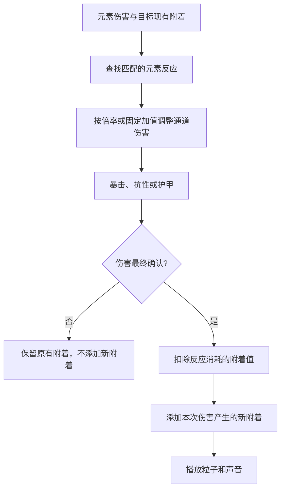

元素克制由伤害通道、目标已有的元素附着和元素反应规则共同决定。配置中的 `aura` 表示目标身上已有的元素附着，`gauge` 表示该元素的附着值；这两个英文名称只在配置字段和 API 标识中保留。你可以自由配置火焰、冰霜、雷电或自定义元素之间的反应，不受固定克制表限制。

## 元素通道

只有伤害通道写了 `element: true`，才会在目标身上留下元素附着，也才能写入反应规则的 `trigger` 或 `aura` 字段：

```yaml
channels:
  fire:
    name: 火焰
    damage-attribute: fire_damage
    resistance-attribute: fire_resistance
    amplification-attribute: fire_amplification
    can-crit: false
    element: true
```

`arcane` 等自定义通道可以有抗性和增幅，但如果 `element: false`，它不会附着，也不能用于元素反应。

## 反应定义

```yaml
schema: 1
id: overload
trigger: fire
aura: lightning
type: amplify
multiplier: 2.5
gauge-consume: 0.5
effects:
  particle: EXPLOSION_NORMAL
  sound: entity.generic.explode
```

这表示 `fire` 伤害命中带有 `lightning` 元素附着的目标时，把 `fire` 通道输入乘以 2.5，并在伤害确认后消耗 0.5 点 `lightning` 附着值。

另一种 `add` 会给通道输入加固定量；字段名称仍是 `multiplier`：

```yaml
schema: 1
id: charged_arc
trigger: lightning
aura: fire
type: add
multiplier: 12
gauge-consume: 0.25
effects:
  particle: ELECTRIC_SPARK
  sound: entity.lightning_bolt.impact
```

`add` 的实际公式是 `input + multiplier`，所以这里增加 12 点，不是乘 12。

## 反应与附着顺序



反应调整发生在暴击、抗性和护甲之前。

例如 10 点 `fire` 伤害命中 `lightning` 附着，反应倍率为 2.5，目标火焰抗性为 25%，攻击者火焰增幅为 20%：

```text
10 × 2.5 × (1 - 0.25) × (1 + 0.20) = 22.5
```

## 元素附着的持续与移除

伤害确认后，本次请求中的每个元素通道都会增加 1 点同名元素附着值：

- 每种元素的附着值上限固定为 4；
- 持续时间固定为 10 秒；
- 再次附着会增加附着值并刷新持续时间；
- 当前配置不能修改附着值上限、每次伤害增加的附着值或持续时间；
- 玩家退出或插件关闭会清除全部元素附着；这些数据只存在于运行时内存。

伤害被闪避或取消时，不消耗原有附着，也不增加新附着。只有伤害最终确认后，才会按照上图更新附着并播放表现。

## 多条反应同时匹配

所有元素反应规则按完整 ID 排序。每条规则读取同一份伤害确认前附着状态，但会在前一条规则已经调整过的通道伤害上继续执行 `amplify` 或 `add`。

如果多条规则消耗同一种元素附着，它们都可以在本次伤害准备阶段匹配，确认时再依次扣除附着值，最低为 0。因此配置互相重叠的规则时，要明确是否允许一次命中触发多条反应。

## 双向克制需要两个文件

`fire` 伤害命中 `ice` 附着，与 `ice` 伤害命中 `fire` 附着，是两个不同方向：

```yaml
schema: 1
id: melt_fire_on_ice
trigger: fire
aura: ice
type: amplify
multiplier: 2
gauge-consume: 1
```

```yaml
schema: 1
id: melt_ice_on_fire
trigger: ice
aura: fire
type: amplify
multiplier: 1.5
gauge-consume: 1
```

这样可以表达非对称克制，而不是被固定枚举限制。

## 表现失败不撤销伤害

粒子和声音在伤害确认之后播放。旧版粒子名中的 `EXPLOSION_NORMAL`、`EXPLOSION_LARGE`、`EXPLOSION_HUGE`、`SPELL_MOB`、`REDSTONE` 有兼容映射；其它名称取决于目标服务端版本。

表现名称无法识别时会记录错误，但已经生效的伤害与元素附着不会因此撤销。粒子、声音和实体表现取决于服务端版本与客户端资源。
