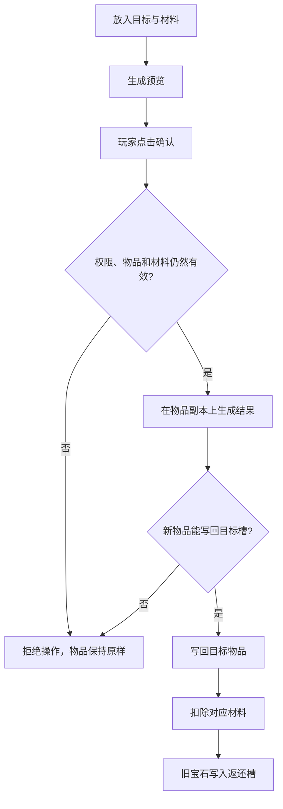

输入 `/sym menu` 可以查看全部入口。

## 界面清单

| 命令                          | 用途                  |
|-----------------------------|---------------------|
| `/sym menu attributes [玩家]` | 查看属性、装备、技能、套装和状态    |
| `/sym menu detail <属性>`     | 查看一个属性的基础值、装备加成和最终值 |
| `/sym menu affix`           | 添加、替换、锁定或移除指定位置的词条  |
| `/sym menu socket`          | 选择孔位并镶嵌宝石或增加孔位      |
| `/sym menu unsocket`        | 使用拆卸道具取出指定宝石        |
| `/sym menu enhance`         | 放入强化材料和两类保护道具进行强化   |
| `/sym menu admin [玩家]`      | 查看配置版本、缓存、伤害记录和回调错误 |

普通界面显示玩家可读的名称，不显示 Overture item ID、角色 ID、套装 ID 或类别 ID。`admin` 是面向管理员的诊断页面，可以显示技术信息。

## 属性页面

| 区域     | 显示内容                    |
|--------|-------------------------|
| 属性一览   | 属性名称、分类和当前值；点击后打开详情     |
| 装备属性来源 | 防具、主手、副手和外部 ItemStack   |
| 物品技能   | 技能说明、等级、触发方式和冷却         |
| 套装     | 当前件数、部位名称和各档效果          |
| 当前状态   | 护盾、战斗状态、状态效果、元素附着、共鸣和天赋 |

## 工坊布局

| 界面 | 输入内容               | 输出或操作                |
|----|--------------------|----------------------|
| 词条 | 目标物品、词条材料          | 选择任意词条位置后添加、替换、锁定或移除 |
| 镶嵌 | 目标物品、宝石或打孔器        | 选择孔位后插入、替换或增加孔位      |
| 拆卸 | 目标物品、拆卸道具          | 选择孔位，拆下的宝石进入返还槽      |
| 强化 | 目标、强化材料、保级道具、防销毁道具 | 预览结果后确认强化            |

## 哪些物品可以放入

目标物品需要同时满足：

- 是单件 Overture 物品；
- 至少包含一个 Symphony 组件或已有实例数据；
- 组件可以正常解析。

原版物品、没有 Symphony 功能的 Overture 物品和堆叠物品会显示“物品不符合要求”，不会在控制台抛出异常。空槽只显示放入物品的说明。

按配置生成但尚无实例 UUID 的物品也可以进入工坊。第一次成功修改后才会创建 `symphony.instance.uuid` 和 revision；打开界面、预览或失败操作不会改写物品。

## 一次操作如何完成

服务端会在确认时重新检查权限、目标物品、材料、保护道具、返还槽和当前配置。任何一步失败，目标物品和材料都保持原样。快速重复点击也只能完成一次有效操作。

返还槽只允许取出物品。槽内已有无法合并的宝石时，新的替换或拆卸会被拒绝，不会把宝石塞入背包或掉到地上。

## 放入与取回物品

- Shift 点击会把物品放入第一个兼容的空输入槽；
- 普通点击、数字键交换和单槽拖拽可以操作输入槽；
- 跨多个工坊槽拖拽、双击收集和向返还槽投放物品会被拒绝；
- 关闭界面、打开另一个工坊、退出、被踢、死亡或插件关闭时，暂存物品会返回背包；
- 背包已满时，无法返还的物品会掉落在玩家脚下并显示提示。

## 各工坊的规则

本页只说明界面操作，具体配置分别位于：

- [随机词条与词条池](/docs/symphony/10_affixes)：词条位置、互斥组、权重、等级和材料；
- [宝石、类别槽位与打孔器](/docs/symphony/11_gems_sockets)：孔位类别、打孔器和拆卸道具；
- [装备强化](/docs/symphony/12_enhancement)：概率、倍率、保级与防销毁；
- [套装显示](/docs/symphony/09_sets#显示与刷新)：装备和外部槽位变化后的 Lore 更新。

强化后若只显示等级而属性数值不变，请确认 Overture Display 同时包含 `<symphony:attributes...>` 与 `<symphony:enhancement...>`。

## 布局文件与权限

| 文件                         | 对应界面 |
|----------------------------|------|
| `gui/attributes.yml`       | 角色属性 |
| `gui/attribute-detail.yml` | 属性详情 |
| `gui/affix-editor.yml`     | 词条   |
| `gui/socket.yml`           | 镶嵌   |
| `gui/unsocket.yml`         | 拆卸   |
| `gui/enhancement.yml`      | 强化   |
| `gui/admin.yml`            | 管理   |

界面标题、按钮和说明文字来自 `language.yml`。槽位、图标和材质可以在界面布局文件中调整，但不能删除功能所需的槽位。命令权限见[命令与权限](/docs/symphony/24_commands_permissions#gui)。
