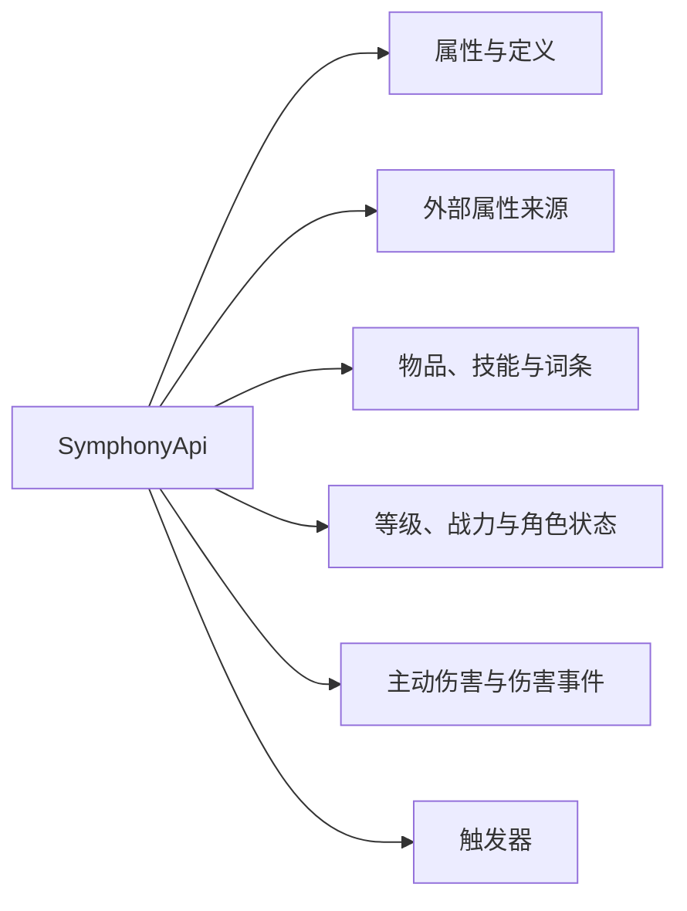

Symphony 通过 Bukkit `ServicesManager` 注册 `SymphonyApi`。附属插件应把 API 设为 `compileOnly`，不要把 Symphony 类打进自己的 JAR。

```kotlin
val api = Bukkit.getServicesManager().load(SymphonyApi::class.java)
    ?: error("属性服务尚未就绪")
```

必须安装 Symphony 时，在 `plugin.yml` 中使用 `depend`；仅在存在时启用兼容功能，则使用 `softdepend` 并处理服务为空的情况。

## 选择需要的服务



| 服务            | 用途                                 | 详细说明                                                                                              |
|---------------|------------------------------------|---------------------------------------------------------------------------------------------------|
| `attributes`  | 读取、解释、失效和重算属性；注册 AttributeProvider | [属性 API](/docs/symphony/29_attribute_api)                                                         |
| `sources`     | 添加、替换或移除属性与 ItemStack              | [属性来源 API](/docs/symphony/30_source_api)                                                          |
| `definitions` | 注册属性定义，读取套装和被动定义                   | [属性定义](/docs/symphony/29_attribute_api#注册属性定义)；[套装与被动定义](/docs/symphony/32_character_api#套装与被动定义) |
| `items`       | 检查和重建 Overture 物品                  | [物品 API](/docs/symphony/31_item_api#物品检查与重建)                                                      |
| `skills`      | 查看和施放当前装备提供的技能                     | [物品 API](/docs/symphony/31_item_api#物品技能)                                                         |
| `levels`      | 注册 LevelProvider 并读取等级             | [角色数据 API](/docs/symphony/32_character_api#等级)                                                    |
| `combatPower` | 读取战力与计算详情                          | [角色数据 API](/docs/symphony/32_character_api#战力)                                                    |
| `metadata`    | 读取战斗状态、元素附着、套装和被动                  | [角色数据 API](/docs/symphony/32_character_api#战斗状态)                                                  |
| `affixes`     | 读取当前生效的词条                          | [物品 API](/docs/symphony/31_item_api#词条)                                                           |
| `damage`      | 主动造成伤害、读取伤害记录和操作护盾                 | [伤害 API 与事件](/docs/symphony/33_damage_api_events)                                                 |
| `triggers`    | 注册触发器和回调，读取错误停用状态                  | [回调与 Aria 脚本](/docs/symphony/07_callbacks_scripts)                                                |

## 可运行的附属示例

源码仓库提供两个独立插件：

- [简单等级插件](https://github.com/17Artist/Symphony/tree/main/example/level-provider)：注册、刷新和注销 `LevelProvider`；
- [外置符文系统](https://github.com/17Artist/Symphony/tree/main/example/runes)：注册外部属性，维护稳定来源，并响应等级变化。

示例目录各自包含构建、配置、命令和安装说明。

## 注册项的清理

`registerProvider`、`registerAttribute` 等方法会返回 `RegistrationHandle`。附属插件应保存这些对象，并在停用时调用 `close()`。

`close` 可以重复调用。即使忘记手动关闭，Symphony 也会在提供注册项的插件停用时移除它们；主动关闭仍能让重载过程更清晰。

## 主要事件

| 类型 | 事件                                                                |
|----|-------------------------------------------------------------------|
| 属性 | `AttributeSnapshotPrepareEvent`、`AttributeSnapshotCommittedEvent` |
| 套装 | `SetCountsChangedEvent`                                           |
| 词条 | `AffixApplyEvent`、`AffixRemoveEvent`、`AffixTriggerEvent`          |
| 宝石 | `GemInsertEvent`、`GemRemoveEvent`、`SocketDrillEvent`              |
| 强化 | `EnhanceEvent`                                                    |
| 技能 | `SkillPrepareEvent`、`SkillConfirmedEvent`                         |
| 等级 | `LevelChangeEvent`                                                |
| 伤害 | `SymphonyHitCheckEvent` 与五个伤害阶段事件                                 |

伤害事件的选择和字段较多，单独见[主动伤害与伤害事件](/docs/symphony/33_damage_api_events)。

## 线程规则

- 实体、物品栏、Bukkit 事件、伤害、技能、等级刷新和来源写入都应在合法 Bukkit 主线程调用；
- AttributeProvider 与 LevelProvider 不应等待数据库或网络；
- `combatPower.cached(UUID)` 可以供异步只读调用，缓存不存在时不要在异步线程强制计算实体；
- Symphony 不支持 Folia，本节规则不适用于 RegionScheduler。

## Java 调用

公开接口可以从 Java 直接使用。按攻击者当前属性发起普通攻击时，可以省略伤害倍率，也可以显式传入倍率：

```java
api.getDamage().attack(attacker, victim);
api.getDamage().attack(attacker, victim, 1.5D);
```

固定数值的单通道伤害提供四参数和五参数重载：

```java
api.getDamage().damage(
    attacker,
    victim,
    "arcane",
    15.0,
    "myplugin:spell"
);
```

等级与属性 Provider 都是普通接口，Java 和 Kotlin 附属插件均可实现。
