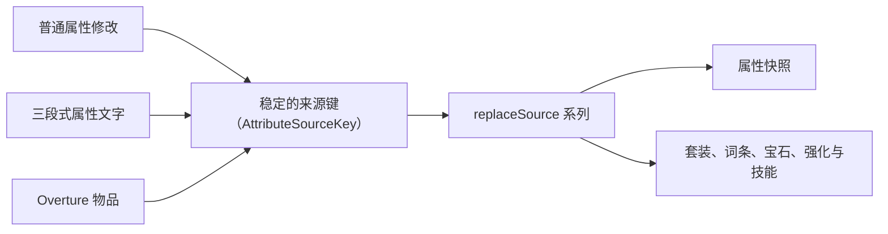

`sources` 管理参与属性计算的外部数据。每个来源由 `AttributeSourceKey` 唯一标识；使用相同的键更新，会完整替换旧内容。



## 写入普通属性

```kotlin
val source = AttributeSourceKey("myplugin", "temporary-blessing")

val result = api.sources.replaceSource(
    player,
    source,
    listOf(
        AttributeModifier(
            id = "blessing.attack",
            attribute = AttributeKey.symphony("attack_damage"),
            operation = AttributeOperation.ADD,
            value = 12.0,
            description = "祝福提供的攻击力"
        )
    )
)
```

效果消失时，使用原来的来源键移除：

```kotlin
api.sources.removeSource(player, source)
```

不要为每次刷新生成随机来源键，否则旧数据无法替换，也无法在槽位清空或插件停用时准确移除。

## 从文字读取

已有系统如果保存的是三段式文字，可以直接交给解析器。每行依次写完整属性 ID、运算方式和数值：

```kotlin
api.sources.replaceSourceFromLines(
    player,
    AttributeSourceKey("myplugin", "legacy-panel"),
    listOf(
        "symphony:attack_damage add 15",
        "symphony:arcane_resistance add 20%"
    )
)
```

空行和以 `#` 开头的注释会被忽略。新系统更适合直接构造 `AttributeModifier`，这样能同时携带优先级、有效期和说明。

## 从 ItemStack 写入

外部装备栏可以把 Overture 物品登记为完整来源：

```kotlin
val result = api.sources.replaceSourceFromItem(
    player,
    AttributeSourceKey("myplugin", "extra-slot:ring-1"),
    ringItem
)
```

物品中的属性、套装部件、词条、宝石、强化和技能会一起读取。套装数量会合并普通装备栏、主副手和所有外部物品来源。

外部槽位清空时，必须使用同一个来源键调用 `removeSource`。需要查看已经登记的外部物品时，可读取：

```kotlin
val currentItems = api.sources.itemSources(player)
```

普通原版物品和没有 Symphony 组件的 Overture 物品不会产生有效内容。传入空气物品相当于清空该来源。

## 套装显示更新

外部物品改变套装数量后会触发 `SetCountsChangedEvent`。外部背包或额外装备界面应监听该事件，更新自己持有物品的 Lore：

```kotlin
@EventHandler
fun onSetCountsChanged(event: SetCountsChangedEvent) {
    extraInventory.refreshSetLore(event.entity.uniqueId, event.counts)
}
```

普通背包中的显示由 Symphony 与 Overture 更新；不在 Bukkit 物品栏中的副本，由保存该副本的外部系统负责重建。显示规则见[套装](/docs/symphony/09_sets#显示与刷新)。

## 处理写入结果

四个写入方法都返回 `SourceUpdateResult`：

| 结果          | 含义                                  |
|-------------|-------------------------------------|
| `Applied`   | 来源已经改变，结果中包含实体修订号、受影响属性和套装档位变化      |
| `Unchanged` | 新旧内容相同，没有产生新的属性快照                   |
| `Rejected`  | 输入无法解析或不符合要求，可读取 `reason` 和 `cause` |

写入失败时不要自行修改 Symphony 的 NBT，也不要假定部分数据已经生效。

## 来源键的约定

`namespace` 应使用附属插件自己的小写名称，`value` 用来定位具体槽位或数据项，例如：

```text
myplugin:extra-slot:ring-1
myplugin:extra-slot:ring-2
myplugin:temporary-blessing
```

来源值最长 256 个字符，不能包含换行和空字符。多个独立槽位不能共用同一个键，否则后写入的物品会覆盖前一个。

## 线程要求

写入与移除来源必须在 Bukkit 主线程调用。数据库或网络读取应由附属插件提前完成，再把已经准备好的结果提交给 `sources`。

自动装备栏和副手的读取规则见[属性来源](/docs/symphony/04_attribute_sources)，属性快照的读取方式见[属性 API](/docs/symphony/29_attribute_api)。
