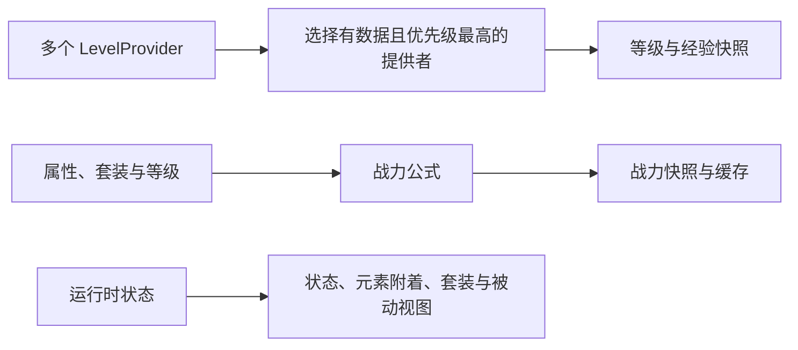

`levels`、`combatPower` 和 `metadata` 提供角色当前的只读数据。它们不负责保存等级，也不会让调用方直接修改套装、状态或元素附着。

## 等级

查询当前生效的等级提供者：

```kotlin
val level = api.levels.snapshot(player)
player.sendMessage(level?.level?.toString() ?: "没有等级数据")
```

外部插件的等级、角色或经验发生变化后，应刷新数据：

```kotlin
api.levels.refresh(player, "myplugin:level_up")
```

`refresh` 会重新选择优先级最高且能够提供数据的 `LevelProvider`，必要时发布等级变化事件，并使依赖等级的属性重新计算。注册方法与完整示例见[等级提供者](/docs/symphony/21_level_providers)。

## 战力

```kotlin
val result = api.combatPower.snapshot(player)

if (result.successful) {
    player.sendMessage("战力：${result.formatted}")
} else {
    plugin.logger.warning(result.error)
}
```

`CombatPowerSnapshot` 同时提供原始值、边界和取整后的值、格式化文本、公式变量及属性修订号。只需要数值时可调用 `value(entity)`。

```kotlin
val cached = api.combatPower.cached(player.uniqueId)
api.combatPower.invalidate(player.uniqueId)
```

`cached(UUID)` 是线程安全的只读快照，但在首次计算前可能为 `null`。`invalidate` 只丢弃已计算结果，不会立即访问实体。公式变量、缓存时机和 PlaceholderAPI 变量见[战力](/docs/symphony/20_combat_power)。

## 战斗状态

`metadata` 用于读取角色当前的战斗状态：

```kotlin
val combat = api.metadata.combatState(player)
val statuses = api.metadata.statuses(player)
val auras = api.metadata.auras(player)
val sets = api.metadata.activeSets(player)
val passives = api.metadata.activePassives(player)
```

| 方法               | 返回内容          |
|------------------|---------------|
| `combatState`    | 是否处于战斗中以及剩余时间 |
| `statuses`       | 状态 ID、层数与剩余时间 |
| `auras`          | 元素通道、附着量与剩余时间 |
| `activeSets`     | 套装 ID 与当前有效件数 |
| `activePassives` | 当前生效的被动效果 ID  |

这些结果用于界面、占位符和附属系统判断。改变状态、元素附着或被动效果应通过对应机制或触发器完成，不要修改返回集合。

## 套装与被动定义

制作浏览界面时，可以读取所有已加载定义：

```kotlin
val sets = api.definitions.sets()
val passives = api.definitions.passives()
```

套装视图提供显示名称、部件名称和各档效果说明；被动视图提供 ID、类别与显示名称。定义视图表示“服务器中有哪些配置”，`metadata.activeSets` 和 `activePassives` 才表示“这个角色当前启用了什么”。

## 数据选择关系



## 线程要求

等级查询与刷新、战力首次计算以及所有接收 `LivingEntity` 的元数据查询，应在合法的 Bukkit 实体线程调用。只有 `combatPower.cached(UUID)` 可在异步只读场景使用；缓存为空时，应回到实体线程完成首次计算。
